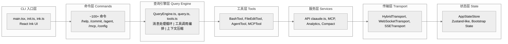
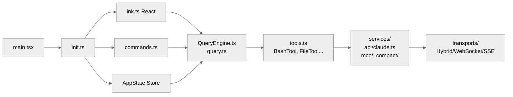

# Claude Code 源码分析：工程架构

## 1. 项目概述

Claude Code 是一个基于 Claude API 的命令行工具，采用 **模块化单体架构 (Modular Monolith)** 设计，主要使用 TypeScript/TSX 开发，运行在 Bun 运行时上。

## 2. 核心目录结构

```text
src/
├── commands/           # CLI 命令实现 (~100+ 个命令)
│   ├── agents/        # Agent 相关命令
│   ├── plugin/        # 插件管理命令
│   ├── mcp/          # MCP 服务器命令
│   └── ...
├── bridge/            # 远程控制桥接系统
│   ├── bridgeMain.ts         # 桥接主入口
│   ├── remoteBridgeCore.ts   # 远程桥接核心
│   ├── replBridge.ts         # REPL 桥接
│   ├── replBridgeTransport.ts # 传输层
│   └── ...
├── cli/               # CLI 基础设施
│   ├── handlers/      # CLI 事件处理器
│   ├── transports/    # 通信传输层
│   │   ├── HybridTransport.ts    # 混合传输 (WS + HTTP)
│   │   ├── WebSocketTransport.ts # WebSocket 传输
│   │   └── SSETransport.ts       # SSE 传输
│   └── ...
├── tools/            # 工具实现 (~30+ 工具)
│   ├── AgentTool/    # Agent 工具
│   ├── BashTool/     # Bash 执行工具
│   ├── FileEditTool/ # 文件编辑工具
│   ├── FileReadTool/ # 文件读取工具
│   └── ...
├── services/        # 服务层
│   ├── api/          # API 调用 (claude.ts)
│   ├── compact/      # 上下文压缩
│   ├── mcp/          # MCP 协议实现
│   ├── analytics/    # 分析服务
│   └── ...
├── state/           # 状态管理
│   ├── AppStateStore.ts  # 应用状态存储
│   └── store.ts          # Redux-like 状态库
├── buddy/           # Buddy 伴侣系统
├── components/      # React UI 组件
├── types/           # 类型定义
├── utils/           # 工具函数
│   ├── hooks/       # Hook 系统
│   ├── permissions/ # 权限系统
│   └── ...
├── entrypoints/     # 程序入口点
│   ├── init.ts      # 初始化入口
│   └── agentSdkTypes.ts # SDK 类型
├── bootstrap/       # 引导程序
│   └── state.ts     # 引导状态
└── query.ts         # 查询引擎核心
```

## 3. 架构层次图



## 4. 关键模块详解

### 4.1 命令系统 (commands.ts)

**位置**: `src/commands.ts`

命令系统是 Claude Code 的交互入口，支持三种类型的命令：

```typescript
// 命令类型
type CommandType = 'prompt' | 'local' | 'local-jsx' | 'builtin'

// 示例命令注册
export const COMMANDS = memoize((): Command[] => [
  addDir,
  advisor,
  agents,
  branch,
  // ... 100+ commands
])
```

**命令注册流程**:
1. 内置命令直接导入
2. 技能命令从 `~/.claude/commands/` 目录加载
3. 插件命令从已安装插件加载
4. 工作流命令动态创建

**命令来源**:
```typescript
// 优先级: bundled > builtinPlugin > skillDir > workflow > plugin > 内置
const allCommands = [
  ...bundledSkills,
  ...builtinPluginSkills,
  ...skillDirCommands,
  ...workflowCommands,
  ...pluginCommands,
  ...COMMANDS(), // 内置命令
]
```

### 4.2 查询引擎 (QueryEngine)

**位置**: `src/QueryEngine.ts`, `src/query.ts`

QueryEngine 是核心对话处理引擎：

```typescript
export class QueryEngine {
  private config: QueryEngineConfig
  private mutableMessages: Message[]
  private abortController: AbortController
  private permissionDenials: SDKPermissionDenial[]
  private totalUsage: NonNullableUsage
  private readFileState: FileStateCache

  async *submitMessage(
    prompt: string | ContentBlockParam[],
  ): AsyncGenerator<SDKMessage, void, unknown> {
    // 处理用户输入
    // 执行查询循环
    // 处理工具调用
    // 管理状态
  }
}
```

**查询循环核心逻辑** (`query.ts`):
```typescript
async function* queryLoop(params: QueryParams) {
  while (true) {
    // 1. 上下文压缩 (snip, microcompact, autocompact)
    // 2. 调用 Claude API (streaming)
    // 3. 处理工具调用
    // 4. 执stop hooks
    // 5. 检查终止条件
  }
}
```

### 4.3 工具系统 (Tools)

**位置**: `src/tools.ts`, `src/Tool.ts`

工具是 Claude Code 执行操作的核心：

```typescript
// Tool 接口定义
export type Tool<
  Input extends AnyObject = AnyObject,
  Output = unknown,
  P extends ToolProgressData = ToolProgressData,
> = {
  name: string
  call(args, context, canUseTool, parentMessage, onProgress): Promise<ToolResult<Output>>
  description(input, options): Promise<string>
  inputSchema: Input
  isConcurrencySafe(input): boolean
  isReadOnly(input): boolean
  // ... 更多方法
}

// 内置工具
const baseTools = [
  AgentTool,      // Agent 调用
  BashTool,       // Bash 命令执行
  FileEditTool,   // 文件编辑
  FileReadTool,   // 文件读取
  FileWriteTool,  // 文件写入
  GlobTool,       // Glob 匹配
  GrepTool,       // 文本搜索
  WebSearchTool,  // Web 搜索
  // ... 30+ 工具
]
```

### 4.4 传输层 (Transport)

**位置**: `src/cli/transports/`

Claude Code 支持多种传输模式：

```typescript
// HybridTransport: WebSocket 读 + HTTP POST 写
// 写流程:
// write(stream_event) → 100ms 缓冲 → uploader.enqueue()
// write(other) → 立即 flush 缓冲 → POST

class HybridTransport extends WebSocketTransport {
  private uploader: SerialBatchEventUploader<StdoutMessage>
  private streamEventBuffer: StdoutMessage[] = []

  async write(message: StdoutMessage): Promise<void> {
    if (message.type === 'stream_event') {
      // 缓冲 100ms
      this.streamEventBuffer.push(message)
      if (!this.streamEventTimer) {
        this.streamEventTimer = setTimeout(
          () => this.flushStreamEvents(),
          BATCH_FLUSH_INTERVAL_MS
        )
      }
      return
    }
    // 立即 flush + POST
    await this.uploader.enqueue([...this.takeStreamEvents(), message])
  }
}
```

### 4.5 桥接系统 (Bridge)

**位置**: `src/bridge/`

桥接系统支持远程控制 Claude Code：

```typescript
// 远程桥接核心 (无环境层)
export async function initEnvLessBridgeCore(params: EnvLessBridgeParams) {
  // 1. 创建会话: POST /v1/code/sessions
  // 2. 获取凭证: POST /bridge → worker_jwt
  // 3. 创建传输: createV2ReplTransport
  // 4. 调度刷新: createTokenRefreshScheduler
  // 5. 处理消息: handleIngressMessage
}

// 消息流程:
// 本地事件 → writeMessages() → FlushGate → writeBatch() → POST → server
// server ← SSE/WS ← handleIngressMessage() ← 远程事件
```

### 4.6 状态管理 (AppState)

**位置**: `src/state/AppStateStore.ts`

```typescript
export type AppState = DeepImmutable<{
  // 设置
  settings: SettingsJson
  verbose: boolean
  mainLoopModel: ModelSetting

  // 状态指示器
  statusLineText: string | undefined
  expandedView: 'none' | 'tasks' | 'teammates'

  // 工具权限
  toolPermissionContext: ToolPermissionContext

  // 桥接状态
  replBridgeEnabled: boolean
  replBridgeConnected: boolean
  replBridgeSessionActive: boolean

  // 任务状态
  tasks: TaskState[]

  // MCP 状态
  mcp: {
    clients: MCPServerConnection[]
    tools: Tools
  }

  // ... 更多字段
}>
```

## 5. 模块依赖图



## 6. 关键设计模式

### 6.1 工具构建器模式

```typescript
// 使用 buildTool 工厂函数创建工具
export function buildTool<D extends AnyToolDef>(def: D): BuiltTool<D> {
  return {
    ...TOOL_DEFAULTS,  // 默认实现
    userFacingName: () => def.name,
    ...def,            // 用户定义
  } as BuiltTool<D>
}

// 默认值设置
const TOOL_DEFAULTS = {
  isEnabled: () => true,
  isConcurrencySafe: (_input?: unknown) => false,
  isReadOnly: (_input?: unknown) => false,
  checkPermissions: (input, _ctx) =>
    Promise.resolve({ behavior: 'allow', updatedInput: input }),
}
```

### 6.2 异步生成器模式

```typescript
// 查询使用异步生成器实现流式处理
async function* query(
  params: QueryParams,
): AsyncGenerator<StreamEvent | Message, Terminal> {
  // 流式 yield 事件
  yield { type: 'stream_request_start' }

  for await (const message of deps.callModel({...})) {
    if (message.type === 'assistant') {
      yield message
      assistantMessages.push(message)
    }
    // 处理工具调用
    for await (const update of runTools(...)) {
      yield update.message
    }
  }
}
```

### 6.3 状态快照模式

```typescript
// 使用不可变状态更新
setAppState(prev => {
  const updated = updater(prev.fileHistory)
  if (updated === prev.fileHistory) return prev
  return { ...prev, fileHistory: updated }
})
```

## 7. 特性开关系统

使用 `feature()` 函数控制代码引入：

```typescript
import { feature } from 'bun:bundle'

// 条件编译
const proactive = feature('PROACTIVE') || feature('KAIROS')
  ? require('./commands/proactive.js').default
  : null

const ultraplan = feature('ULTRAPLAN')
  ? require('./commands/ultraplan.js').default
  : null

// 运行时检查
if (feature('HISTORY_SNIP')) {
  const snipResult = snipModule!.snipCompactIfNeeded(messages)
}
```

## 8. 入口点

**主入口**: `src/ink.ts` (React Ink 应用)
**初始化**: `src/entrypoints/init.ts`
**SDK 入口**: `src/entrypoints/sdk/`
**MCP 服务器入口**: `src/entrypoints/mcp.ts`

## 9. 架构设计判断

### 9.1 "受控汇聚"而非纯粹分层

三个超大文件——`main.tsx`、`REPL.tsx`（5000+ 行）、`query.ts`（1700+ 行）——是刻意的汇聚点，而不是组织不善。它们分别承担 CLI 入口、交互控制中心、请求状态机的角色。拆分会引入跨文件状态传递的复杂度，得不偿失。

### 9.2 四个统一抽象

整个系统围绕四个核心抽象运转：`Message`、`Tool`、`Command`、`ToolUseContext`。无论是内置工具、MCP 外部工具、Agent 子代理，还是 slash 命令、技能命令、插件命令，最终都归约到这四种类型。这种统一使得权限、遥测、持久化管线只需实现一次。

### 9.3 三层门控系统

代码中存在三层能力门控：
1. **编译时** feature flags：`feature('FLAG_NAME')` 全部返回 false，后面的代码是死代码
2. **用户类型门控**：`process.env.USER_TYPE === 'ant'` 区分内部与外部用户
3. **远程配置**：GrowthBook/Statsig 运行时特性开关

### 9.4 缓存稳定性是一等公民

大量设计决策服务于 Prompt Cache 命中率：
- 系统 prompt 有显式的 `SYSTEM_PROMPT_DYNAMIC_BOUNDARY` 标记，静态部分跨组织复用
- 工具池组装时内置工具形成连续前缀，MCP 工具追加在后
- settings 临时文件路径使用内容哈希（不是随机 UUID），影响 Bash sandbox 列表进而影响 prompt cache key
- Beta headers 使用 sticky latch 模式，一旦发送就整个会话保持，避免缓存键变化

### 9.5 代码规模参考

| 组件 | 文件数 | 说明 |
|------|--------|------|
| src/ 顶层目录 | 44 个子目录 | ~1200+ 文件 |
| services/api/ | 22 个文件 | claude.ts 126KB 是最大单文件 |
| services/mcp/ | 23 个文件 | auth.ts 88KB, client.ts 119KB |
| tools/ | 56 个工具目录 | 每个工具独立目录 |
| commands/ | 15 文件 + 93 子目录 | ~108 个命令 |
| components/ | 113 个文件 | React/Ink UI |
| utils/ | 310 个文件 | 最大的工具库 |

---

*文档版本: 1.1*
*分析日期: 2026-04-02*
