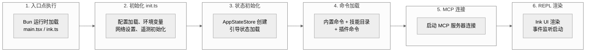
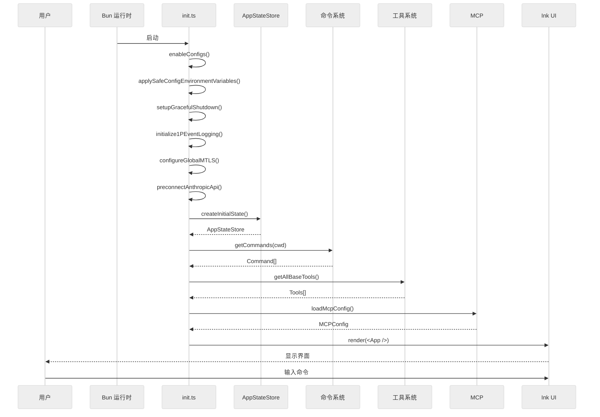

# Claude Code 源码分析：启动流程

## 1. 启动流程概览

Claude Code 的启动流程分为以下几个阶段：



## 2. 详细启动流程

### 2.1 入口点 (main.tsx / ink.ts)

Bun 运行时会首先加载入口文件：

```typescript
// ink.ts - React Ink 应用入口
import { render } from 'ink'
import React from 'react'
import { App } from './components/App.js'

const app = render(React.createElement(App, {
  // 初始 props
}))

// 监听退出事件
app.waitUntilExit()
```

### 2.2 初始化模块 (entrypoints/init.ts)

**位置**: `src/entrypoints/init.ts`

初始化函数 `init()` 执行以下操作：

```typescript
export const init = memoize(async (): Promise<void> => {
  // 1. 启用配置系统
  enableConfigs()

  // 2. 应用安全的环境变量
  applySafeConfigEnvironmentVariables()

  // 3. 应用 CA 证书
  applyExtraCACertsFromConfig()

  // 4. 设置优雅关闭
  setupGracefulShutdown()

  // 5. 初始化遥测
  void Promise.all([
    import('../services/analytics/firstPartyEventLogger.js'),
    import('../services/analytics/growthbook.js'),
  ]).then(([fp, gb]) => {
    fp.initialize1PEventLogging()
    gb.onGrowthBookRefresh(() => {...})
  })

  // 6. 填充 OAuth 信息
  void populateOAuthAccountInfoIfNeeded()

  // 7. JetBrains IDE 检测
  void initJetBrainsDetection()

  // 8. GitHub 仓库检测
  void detectCurrentRepository()

  // 9. 远程托管设置
  if (isEligibleForRemoteManagedSettings()) {
    initializeRemoteManagedSettingsLoadingPromise()
  }

  // 10. 策略限制
  if (isPolicyLimitsEligible()) {
    initializePolicyLimitsLoadingPromise()
  }

  // 11. 配置 mTLS
  configureGlobalMTLS()

  // 12. 配置全局代理
  configureGlobalAgents()

  // 13. 预连接 Anthropic API
  preconnectAnthropicApi()

  // 14. 上游代理 (CCR 模式)
  if (isEnvTruthy(process.env.CLAUDE_CODE_REMOTE)) {
    await initUpstreamProxy()
  }

  // 15. 设置 Windows Git Bash
  setShellIfWindows()
})
```

### 2.3 引导状态 (bootstrap/state.ts)

**位置**: `src/bootstrap/state.ts`

```typescript
// Session ID 管理
let sessionId: string | undefined

export function getSessionId(): string {
  if (!sessionId) {
    sessionId = generateSessionId()
  }
  return sessionId
}

// 会话持久化控制
let sessionPersistenceDisabled = false
export function isSessionPersistenceDisabled(): boolean {
  return sessionPersistenceDisabled
}

// 附加目录管理
let additionalDirectoriesForClaudeMd: string[] = []
export function getAdditionalDirectoriesForClaudeMd(): string[] {
  return additionalDirectoriesForClaudeMd
}
```

### 2.4 应用状态 (AppStateStore)

**位置**: `src/state/AppStateStore.ts`

创建全局应用状态：

```typescript
// 初始状态工厂函数
const createInitialState = (): AppState => ({
  // 设置
  settings: getInitialSettings(),
  verbose: false,
  mainLoopModel: 'claude-sonnet-4-5',
  mainLoopModelForSession: 'claude-sonnet-4-5',

  // 视图状态
  expandedView: 'none',
  isBriefOnly: false,
  coordinatorTaskIndex: -1,

  // 工具权限上下文
  toolPermissionContext: getEmptyToolPermissionContext(),

  // 任务状态
  tasks: [],

  // MCP 状态
  mcp: {
    clients: [],
    commands: [],
    tools: [],
    resources: {},
    installationErrors: [],
  },

  // 桥接状态
  replBridgeEnabled: false,
  replBridgeConnected: false,
  replBridgeSessionActive: false,
  replBridgeReconnecting: false,

  // ... 更多字段
})

// 创建 Store
const appStore = createStore(createInitialState)
```

### 2.5 命令加载 (commands.ts)

**位置**: `src/commands.ts`

```typescript
// 命令注册 - 使用 memoize 缓存
const COMMANDS = memoize((): Command[] => [
  // 内置命令
  addDir,
  advisor,
  agents,
  branch,
  btw,
  chrome,
  clear,
  // ... 100+ 命令
])

// 异步加载所有命令源
const loadAllCommands = memoize(async (cwd: string): Promise<Command[]> => {
  const [
    { skillDirCommands, pluginSkills, bundledSkills, builtinPluginSkills },
    pluginCommands,
    workflowCommands,
  ] = await Promise.all([
    getSkills(cwd),           // 技能目录
    getPluginCommands(),      // 插件命令
    getWorkflowCommands(),    // 工作流命令
  ])

  return [
    ...bundledSkills,         // 捆绑技能
    ...builtinPluginSkills,   // 内置插件技能
    ...skillDirCommands,      // 技能目录命令
    ...workflowCommands,      // 工作流命令
    ...pluginCommands,        // 插件命令
    ...pluginSkills,          // 插件技能
    ...COMMANDS(),            // 内置命令
  ]
})

// 获取可用命令
export async function getCommands(cwd: string): Promise<Command[]> {
  const allCommands = await loadAllCommands(cwd)

  // 按可用性过滤
  const baseCommands = allCommands.filter(
    _ => meetsAvailabilityRequirement(_) && isCommandEnabled(_)
  )

  // 动态技能处理
  const dynamicSkills = getDynamicSkills()
  // ... 合并动态技能
}
```

### 2.6 工具加载 (tools.ts)

**位置**: `src/tools.ts`

```typescript
// 所有基础工具
export function getAllBaseTools(): Tools {
  return [
    AgentTool,
    TaskOutputTool,
    BashTool,
    // 条件编译的工具
    ...(feature('MONITOR_TOOL') ? [MonitorTool] : []),
    ...(feature('WORKFLOW_SCRIPTS') ? [WorkflowTool] : []),
    ...(feature('HISTORY_SNIP') ? [SnipTool] : []),
    // ... 更多工具
  ]
}

// 工具过滤
export function getTools(tools: ToolPreset | string[]): Tools {
  if (tools === 'default') {
    return getAllBaseTools().filter(t => t.isEnabled())
  }
  // 按名称过滤
  return getAllBaseTools().filter(t => tools.includes(t.name))
}
```

### 2.7 MCP 连接

**位置**: `src/services/mcp/`

```typescript
// MCP 客户端初始化
async function initMCP() {
  // 1. 加载 MCP 配置
  const mcpConfig = loadMcpConfig()

  // 2. 启动每个配置的服务器
  for (const server of mcpConfig.servers) {
    const connection = await connectToMCPServer(server)

    // 3. 获取可用工具
    const tools = await connection.listTools()

    // 4. 注册到状态
    appStore.setState(prev => ({
      mcp: {
        ...prev.mcp,
        clients: [...prev.mcp.clients, connection],
        tools: [...prev.mcp.tools, ...tools],
      }
    }))
  }
}
```

### 2.8 REPL 渲染 (ink.ts)

**位置**: `src/ink.ts`

```typescript
import { render, Box, Text } from 'ink'
import React from 'react'
import { App } from './components/App.js'

export async function startREPL() {
  // 创建 React 元素
  const app = render(
    <Box flexDirection="column">
      <StatusBar />
      <MainContent />
      <PromptInput />
    </Box>
  )

  // 监听 Ctrl+C
  process.on('SIGINT', () => {
    handleInterrupt()
  })

  // 等待退出
  await app.waitUntilExit()
}
```

## 3. 启动时序图



## 4. 关键初始化时间点

| 阶段 | 操作 | 重要性 |
|------|------|--------|
| init() | 配置系统启用 | 必须 |
| init() | 遥测初始化 | 分析 |
| init() | mTLS/代理配置 | 网络 |
| AppStateStore | 状态创建 | 必须 |
| getCommands() | 命令加载 | 必须 |
| getAllBaseTools() | 工具注册 | 必须 |
| MCP 连接 | 服务连接 | 可选 |
| Ink render() | UI 渲染 | 必须 |

## 5. 启动优化

Claude Code 使用以下优化策略：

### 5.1 懒加载

```typescript
// 遥测延迟加载
void Promise.all([
  import('../services/analytics/firstPartyEventLogger.js'),
  import('../services/analytics/growthbook.js'),
]).then(([fp, gb]) => {...})
```

### 5.2 Memoization

```typescript
const COMMANDS = memoize((): Command[] => [...])
const loadAllCommands = memoize(async (cwd) => [...])
```

### 5.3 条件编译

```typescript
// bun:bundle 特性开关
const proactive = feature('PROACTIVE') || feature('KAIROS')
  ? require('./commands/proactive.js').default
  : null
```

### 5.4 预连接

```typescript
// API 预连接
preconnectAnthropicApi()
```

## 6. 补充：启动阶段的隐藏复杂度

### 6.1 三个启动窗口

启动过程实际上分为三个时间窗口，每个窗口有不同的能力边界：

1. **Import 阶段（进程启动到首行执行）**：MDM 和 keychain 读取在 import 级别就开始了，不是懒加载的。这是最早的副作用。

2. **Setup 阶段（init() 到首屏渲染）**：配置加载、trust 对话、OAuth 验证。此阶段完成后用户才能看到界面。

3. **First Turn 阶段（首屏渲染到首次查询）**：延迟预取（deferred prefetch）在此窗口运行。包括 API 预连接、MCP 服务器连接、技能发现等。首屏渲染 ≠ 首轮查询能力就绪。

### 6.2 Trust 对话的门控范围

Trust 对话不只是 UI 装饰，它实际上门控约 10 种能力：
- Bash 工具执行
- 所有 hooks 运行
- 危险环境变量注入（endpoint URLs、auth tokens）
- MCP 服务器连接
- 项目配置加载
- shell-execution settings（apiKeyHelper、awsAuthRefresh 等）

Trust 来源有三种：home 目录自动信任、.claude/.project.json 显式标记、用户交互确认。

### 6.3 Worktree 创建时机

Worktree 创建必须在 getCommands() 之前完成。否则 /eject 等命令无法正确工作，因为它们依赖工作目录已经切换到 worktree 路径。

### 6.4 MDM 策略轮询

企业托管策略（MDM）不是一次性读取。初始读取发生在 import 阶段，之后每 30 分钟轮询一次更新。策略变更可以在运行时生效，通过 ConfigChange hooks 通知。

### 6.5 Terminal 恢复逻辑

启动时会备份当前终端状态（iTerm2、Terminal.app）。这说明 Claude Code 是一个"侵入式 TUI 产品"——它会修改终端设置，退出时需要恢复。如果进程异常退出，终端可能处于异常状态。

---

*文档版本: 1.1*
*分析日期: 2026-04-02*
