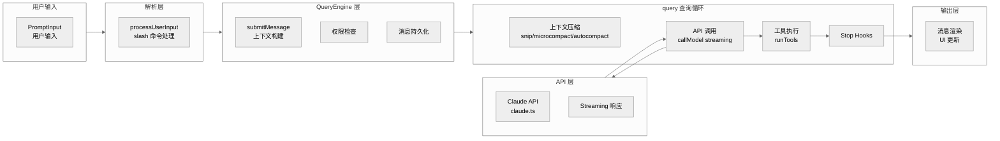
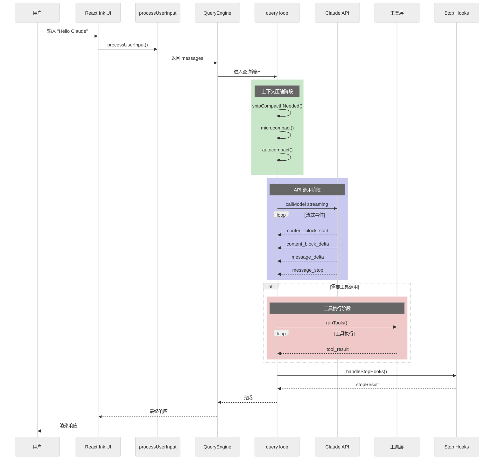
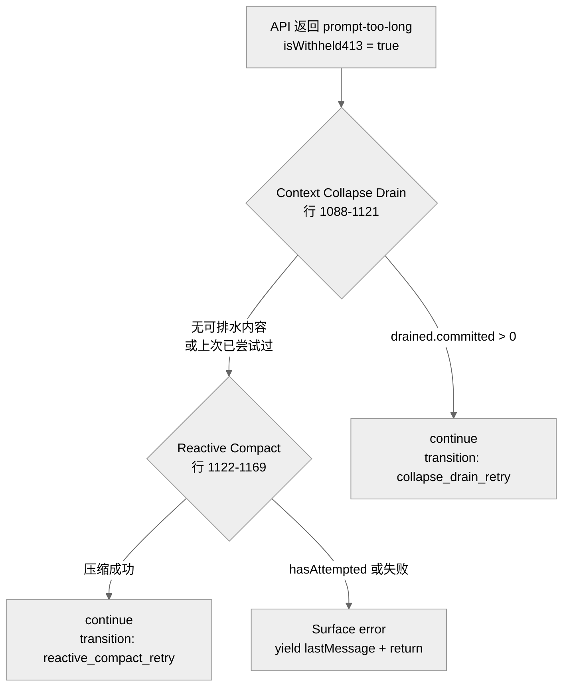
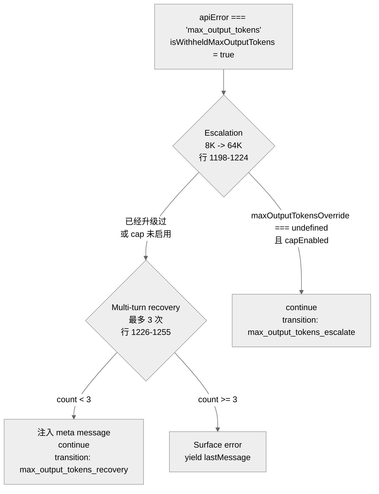
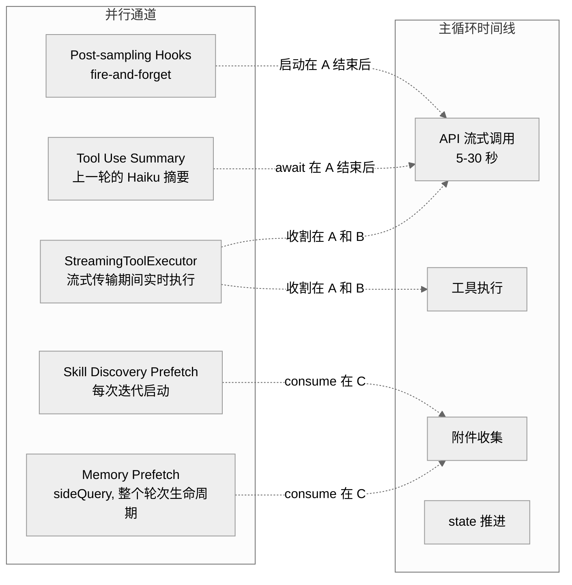

# Claude Code 源码分析：请求流程

## 1. 请求流程概览

当用户在 Claude Code 中输入一条消息时，请求经过以下处理流程：



## 2. 用户输入处理

### 2.1 processUserInput()

**位置**: `src/utils/processUserInput/processUserInput.ts`

处理用户输入的核心函数：

```typescript
export async function processUserInput({
  input,                      // 用户输入
  mode,                       // 'prompt' | 'bash' | 'local-jsx'
  setToolJSX,
  context,
  messages,
  uuid,
  isMeta,
  querySource,
}: ProcessUserInputParams): Promise<ProcessUserInputResult> {

  // 1. 检测 slash 命令
  if (input.startsWith('/')) {
    const { command, args } = parseSlashCommand(input)

    // 执行 slash 命令
    return await processSlashCommand(command, args, context)
  }

  // 2. 创建用户消息
  const userMessage = createUserMessage({
    content: typeof input === 'string' ? input : input[0].text,
    isMeta,
    uuid,
  })

  // 3. 添加工具结果附件
  const attachments = await getAttachmentMessages(...)

  // 4. 返回处理结果
  return {
    messages: [userMessage, ...attachments],
    shouldQuery: true,
    allowedTools: [],
    model: undefined,
    resultText: undefined,
  }
}
```

### 2.2 Slash 命令处理

**位置**: `src/utils/processUserInput/processSlashCommand.tsx`

```typescript
export async function processSlashCommand(
  commandName: string,
  args: string,
  context: ProcessUserInputContext,
): Promise<ProcessUserInputResult> {

  // 1. 查找命令
  const command = findCommand(commandName, context.options.commands)

  // 2. 根据类型处理
  switch (command.type) {
    case 'prompt':
      // 技能类型 - 展开为文本
      const prompt = await command.getPromptForCommand({ args }, context)
      return {
        messages: [createUserMessage({ content: prompt })],
        shouldQuery: true,
        ...
      }

    case 'local':
      // 本地命令 - 立即执行
      const result = await executeLocalCommand(command, args, context)
      return {
        messages: [createLocalCommandResultMessage(result)],
        shouldQuery: false,
        resultText: result,
      }

    case 'local-jsx':
      // JSX 命令 - 渲染 UI
      const jsxResult = await command.getJsx({ args }, context)
      return {
        messages: [],
        shouldQuery: false,
        setToolJSX: jsxResult,
      }
  }
}
```

## 3. 查询引擎 (QueryEngine)

### 3.1 submitMessage()

**位置**: `src/QueryEngine.ts`

QueryEngine 是对话管理的核心类：

```typescript
export class QueryEngine {
  private mutableMessages: Message[]
  private abortController: AbortController
  private permissionDenials: SDKPermissionDenial[]
  private readFileState: FileStateCache

  async *submitMessage(
    prompt: string | ContentBlockParam[],
    options?: { uuid?: string; isMeta?: boolean },
  ): AsyncGenerator<SDKMessage, void, unknown> {

    // 1. 构建工具使用上下文
    const toolUseContext = this.buildToolUseContext()

    // 2. 获取系统提示
    const { systemPrompt, userContext, systemContext } =
      await fetchSystemPromptParts({...})

    // 3. 处理用户输入
    const { messages: messagesFromUserInput, shouldQuery } =
      await processUserInput({
        input: prompt,
        mode: 'prompt',
        context: toolUseContext,
        ...
      })

    // 4. 持久化消息
    if (persistSession) {
      await recordTranscript(messages)
    }

    // 5. 如果不需要查询 (如 slash 命令)，返回结果
    if (!shouldQuery) {
      yield { type: 'result', subtype: 'success', result: resultText }
      return
    }

    // 6. 进入查询循环
    for await (const message of query({
      messages,
      systemPrompt,
      userContext,
      systemContext,
      canUseTool: wrappedCanUseTool,
      toolUseContext,
    })) {
      yield* this.normalizeAndYield(message)
    }

    // 7. 返回最终结果
    yield { type: 'result', subtype: 'success', ... }
  }
}
```

### 3.2 查询循环 (query.ts)

**位置**: `src/query.ts`

核心查询循环使用异步生成器实现：

```typescript
export async function* query(
  params: QueryParams,
): AsyncGenerator<StreamEvent | Message, Terminal> {

  let state: State = {
    messages: params.messages,
    toolUseContext: params.toolUseContext,
    turnCount: 1,
    ...
  }

  while (true) {
    // ═══════════════════════════════════════════════════════════
    // 阶段 1: 上下文压缩
    // ═══════════════════════════════════════════════════════════

    // 1.1 Snip (历史裁剪)
    if (feature('HISTORY_SNIP')) {
      const snipResult = snipModule!.snipCompactIfNeeded(messages)
      messages = snipResult.messages
    }

    // 1.2 Microcompact (微压缩)
    const microcompactResult = await deps.microcompact(messages, ...)
    messages = microcompactResult.messages

    // 1.3 Autocompact (自动压缩)
    const { compactionResult } = await deps.autocompact(messages, ...)
    if (compactionResult) {
      messages = buildPostCompactMessages(compactionResult)
    }

    // ═══════════════════════════════════════════════════════════
    // 阶段 2: API 调用 (流式)
    // ═══════════════════════════════════════════════════════════

    for await (const message of deps.callModel({
      messages: prependUserContext(messages, userContext),
      systemPrompt,
      signal: abortController.signal,
    })) {

      // 流式处理消息
      if (message.type === 'assistant') {
        yield message
        assistantMessages.push(message)

        // 提取工具调用
        const toolUseBlocks = message.message.content.filter(
          c => c.type === 'tool_use'
        )
        toolUseBlocks.push(...toolUseBlocks)
        needsFollowUp = toolUseBlocks.length > 0
      }

      // 流式工具执行
      if (streamingToolExecutor) {
        for (const result of streamingToolExecutor.getCompletedResults()) {
          yield result.message
        }
      }
    }

    // ═══════════════════════════════════════════════════════════
    // 阶段 3: 工具执行
    // ═══════════════════════════════════════════════════════════

    if (needsFollowUp) {
      const toolUpdates = streamingToolExecutor
        ? streamingToolExecutor.getRemainingResults()
        : runTools(toolUseBlocks, assistantMessages, canUseTool, context)

      for await (const update of toolUpdates) {
        yield update.message
      }
    }

    // ═══════════════════════════════════════════════════════════
    // 阶段 4: 附件处理
    // ═══════════════════════════════════════════════════════════

    // 获取队列中的命令附件
    for await (const attachment of getAttachmentMessages(...)) {
      yield attachment
    }

    // 内存预取附件
    const memoryAttachments = await pendingMemoryPrefetch.promise
    for (const att of memoryAttachments) {
      yield createAttachmentMessage(att)
    }

    // ═══════════════════════════════════════════════════════════
    // 阶段 5: 检查终止条件
    // ═══════════════════════════════════════════════════════════

    if (!needsFollowUp) {
      // 执行 stop hooks
      const stopHookResult = yield* handleStopHooks(...)
      if (stopHookResult.preventContinuation) {
        return { reason: 'completed' }
      }
      return { reason: 'completed' }
    }

    // 继续下一轮
    state = {
      ...state,
      messages: [...messages, ...assistantMessages, ...toolResults],
      turnCount: turnCount + 1,
    }
  }
}
```

## 4. API 调用 (claude.ts)

**位置**: `src/services/api/claude.ts`

### 4.1 API 请求构建

```typescript
async function* callModel(params: CallModelParams) {
  const {
    messages,
    systemPrompt,
    tools,
    signal,
  } = params

  // 构建请求
  const request: AnthropicMessageRequest = {
    model: params.model || getMainLoopModel(),
    messages: normalizeMessagesForAPI(messages),
    system: systemPrompt,
    tools: tools.map(t => ({
      name: t.name,
      description: t.description,
      input_schema: t.inputSchema,
    })),
    max_tokens: calculateMaxTokens(tools),
    stream: true,
  }

  // 发送请求
  const response = await client.messages.create(request, { signal })

  // 流式处理响应
  for await (const event of response.streamEventIterator) {
    yield* handleStreamEvent(event)
  }
}
```

### 4.2 流式事件处理

```typescript
function* handleStreamEvent(event: StreamEvent): Generator<SDKMessage> {
  switch (event.type) {
    case 'message_start':
      yield {
        type: 'stream_event',
        event: { type: 'message_start', message: event.message }
      }
      break

    case 'content_block_start':
      yield {
        type: 'assistant',
        message: { content: [event.content_block] }
      }
      break

    case 'content_block_delta':
      if (event.delta.type === 'text_delta') {
        yield {
          type: 'assistant',
          message: { content: [{ type: 'text', text: event.delta.text }] }
        }
      } else if (event.delta.type === 'thinking_delta') {
        yield {
          type: 'assistant',
          message: { content: [{ type: 'thinking', thinking: event.delta.thinking }] }
        }
      }
      break

    case 'message_delta':
      yield {
        type: 'stream_event',
        event: { type: 'message_delta', usage: event.usage, delta: event.delta }
      }
      break

    case 'message_stop':
      yield { type: 'stream_event', event: { type: 'message_stop' } }
      break
  }
}
```

## 5. 工具执行

### 5.1 runTools()

**位置**: `src/services/tools/toolOrchestration.ts`

```typescript
export async function* runTools(
  toolUseBlocks: ToolUseBlock[],
  assistantMessages: AssistantMessage[],
  canUseTool: CanUseToolFn,
  toolUseContext: ToolUseContext,
): AsyncGenerator<ToolUpdate> {

  // 按顺序执行工具
  for (const toolBlock of toolUseBlocks) {
    // 1. 查找工具
    const tool = findToolByName(tools, toolBlock.name)

    // 2. 检查权限
    const permissionResult = await canUseTool(
      tool,
      toolBlock.input,
      toolUseContext,
      assistantMessage,
      toolBlock.id,
    )

    if (permissionResult.behavior === 'deny') {
      yield {
        message: createToolRejectedMessage(toolBlock.id, permissionResult)
      }
      continue
    }

    // 3. 执行工具
    try {
      const result = await tool.call(
        toolBlock.input,
        toolUseContext,
        canUseTool,
        assistantMessage,
        (progress) => {
          yield { type: 'progress', toolUseID: toolBlock.id, data: progress }
        }
      )

      // 4. 返回结果
      yield {
        message: createToolResultMessage(toolBlock.id, result)
      }
    } catch (error) {
      yield {
        message: createToolErrorMessage(toolBlock.id, error)
      }
    }
  }
}
```

### 5.2 工具调用上下文

```typescript
export type ToolUseContext = {
  options: {
    commands: Command[]
    debug: boolean
    mainLoopModel: string
    tools: Tools
    mcpClients: MCPServerConnection[]
    isNonInteractiveSession: boolean
  }
  abortController: AbortController
  readFileState: FileStateCache
  getAppState(): AppState
  setAppState(f: (prev: AppState) => AppState): void
  // ... 更多字段
}
```

## 6. 消息类型系统

### 6.1 核心消息类型

**位置**: `src/types/message.ts`

```typescript
// 消息类型
type Message =
  | AssistantMessage
  | UserMessage
  | SystemMessage
  | ProgressMessage
  | AttachmentMessage
  | TombstoneMessage

interface AssistantMessage {
  type: 'assistant'
  uuid: string
  message: {
    role: 'assistant'
    content: ContentBlock[]
    stop_reason?: string
    usage?: Usage
  }
}

interface UserMessage {
  type: 'user'
  uuid: string
  message: {
    role: 'user'
    content: string | ContentBlock[]
  }
  isMeta?: boolean
  isCompactSummary?: boolean
}

interface SystemMessage {
  type: 'system'
  subtype: 'local_command' | 'compact_boundary' | 'api_error' | ...
  content: string
  ...
}
```

## 7. 请求流程时序图



## 8. 错误处理与恢复

### 8.1 API 错误恢复

```typescript
// prompt-too-long 恢复
if (isPromptTooLongMessage(lastMessage)) {
  // 1. 尝试 context collapse 排水
  if (contextCollapse) {
    const drained = contextCollapse.recoverFromOverflow(...)
    if (drained.committed > 0) {
      continue // 重试
    }
  }

  // 2. 尝试 reactive compact
  if (reactiveCompact) {
    const compacted = await reactiveCompact.tryReactiveCompact(...)
    if (compacted) {
      continue // 重试
    }
  }
}

// max_output_tokens 恢复
if (isWithheldMaxOutputTokens(lastMessage)) {
  // 增加 max_tokens 重试
  if (maxOutputTokensRecoveryCount < MAX_OUTPUT_TOKENS_RECOVERY_LIMIT) {
    maxOutputTokensOverride = ESCALATED_MAX_TOKENS
    continue
  }
}
```

### 8.2 工具错误处理

```typescript
try {
  const result = await tool.call(input, context, ...)
  yield { type: 'tool_result', content: result }
} catch (error) {
  if (error instanceof PermissionDeniedError) {
    yield { type: 'tool_result', is_error: true, content: 'Permission denied' }
  } else if (error instanceof ToolExecutionError) {
    yield { type: 'tool_result', is_error: true, content: error.message }
  }
}
```

## 9. query() 完整状态结构

`query.ts` 行 204-217 定义了 `State` 类型，它是主循环跨迭代携带的可变状态容器。每次循环开始时解构读取，每个 continue 站点整体写入 `state = { ... }`，而不是逐字段赋值——这是一个有意为之的设计选择，避免了 9 个字段的零散更新。

```typescript
// query.ts 行 204-217
type State = {
  messages: Message[]                    // 当前对话消息数组
  toolUseContext: ToolUseContext          // 工具执行上下文（每次迭代内可重赋值）
  autoCompactTracking: AutoCompactTrackingState | undefined  // 自动压缩追踪
  maxOutputTokensRecoveryCount: number   // max_output_tokens 恢复计数（0-3）
  hasAttemptedReactiveCompact: boolean   // 防止 reactive compact 无限循环的哨兵
  maxOutputTokensOverride: number | undefined  // 升级后的 max_tokens 值（64K）
  pendingToolUseSummary: Promise<ToolUseSummaryMessage | null> | undefined
  stopHookActive: boolean | undefined    // stop hook 是否正在生效
  turnCount: number                      // 当前轮次计数
  transition: Continue | undefined       // 上一次迭代为什么 continue（首轮为 undefined）
}
```

几个值得注意的字段：

**`maxOutputTokensRecoveryCount`**：max_output_tokens 错误的多轮恢复计数器。上限为 `MAX_OUTPUT_TOKENS_RECOVERY_LIMIT = 3`（行 164）。每次正常 `next_turn` 续轮时重置为 0（行 1722），只在 max_output_tokens 恢复路径中递增。

**`hasAttemptedReactiveCompact`**：一个布尔哨兵，确保 reactive compact 在单个用户轮次内最多触发一次。设为 `true` 后（行 1160），即使后续仍然 413 也不再重试——这防止了"压缩 -> 依然太长 -> 再压缩 -> ..."的死循环。在 `next_turn` 续轮时重置为 `false`（行 1724），但在 `stop_hook_blocking` 续轮时特意保留（行 1300），因为 stop hook 注入的额外 token 可能导致 compact 后再次 413。

**`pendingToolUseSummary`**：上一轮工具执行完毕后，Haiku 异步生成的摘要 Promise。在下一轮循环的 streaming 完成后被 await（行 1058-1063）。这利用了模型流式输出（5-30 秒）的时间窗口来并行完成摘要生成（约 1 秒）。

**`transition`**：记录上一次迭代为什么 continue，让测试可以断言恢复路径是否触发，而不需要检查消息内容。7 种 transition reason 见第 10 节。

## 10. 主循环 28 阶段精确序列

`queryLoop()` 函数（行 241-1732）的 `while(true)` 循环体可以精确划分为以下 28 个阶段。每个阶段标注了对应的源码行号和 `queryCheckpoint` 埋点名称。

```mermaid
---
config:
  theme: neutral
---
flowchart TD
    subgraph Phase1["Phase 1: 循环入口与状态解构"]
        S01["01 解构 state（行 311-321）"]
        S02["02 Skill discovery prefetch 启动（行 331-335）"]
        S03["03 yield stream_request_start（行 337）"]
        S04["04 queryCheckpoint query_fn_entry（行 339）"]
        S05["05 查询链追踪初始化（行 347-363）"]
    end

    subgraph Phase2["Phase 2: 消息预处理"]
        S06["06 applyToolResultBudget（行 379-394）"]
        S07["07 History Snip（行 401-410）"]
        S08["08 Microcompact（行 413-426）"]
        S09["09 Context Collapse（行 440-447）"]
        S10["10 Autocompact（行 453-543）"]
    end

    subgraph Phase3["Phase 3: API 调用准备"]
        S11["11 更新 toolUseContext.messages（行 546-549）"]
        S12["12 StreamingToolExecutor 初始化（行 561-568）"]
        S13["13 模型选择与 blocking limit 检查（行 570-648）"]
    end

    subgraph Phase4["Phase 4: API 流式调用"]
        S14["14 callModel streaming（行 653-866）"]
        S15["15 Backfill tool_use inputs（行 747-788）"]
        S16["16 Withholding 模式判断（行 790-827）"]
        S17["17 StreamingToolExecutor 实时收割（行 850-865）"]
        S18["18 Cached microcompact boundary（行 873-895）"]
    end

    subgraph Phase5["Phase 5: 错误处理与恢复"]
        S19["19 FallbackTriggeredError 处理（行 896-956）"]
        S20["20 Post-sampling hooks（行 1002-1012）"]
        S21["21 Abort 处理（行 1018-1055）"]
    end

    subgraph Phase6["Phase 6: 无工具调用路径"]
        S22["22 Prompt-too-long 恢复（行 1065-1186）"]
        S23["23 Max output tokens 恢复（行 1191-1259）"]
        S24["24 Stop hooks 执行（行 1270-1309）"]
    end

    subgraph Phase7["Phase 7: 有工具调用路径"]
        S25["25 工具执行 runTools/getRemainingResults（行 1363-1411）"]
        S26["26 附件收集（行 1583-1631）"]
        S27["27 MCP 工具刷新（行 1663-1674）"]
        S28["28 maxTurns 检查 + state 推进（行 1708-1731）"]
    end

    Phase1 --> Phase2 --> Phase3 --> Phase4
    Phase4 --> Phase5 --> Phase6
    Phase4 --> Phase5 --> Phase7
    Phase7 --> Phase1
```



下面逐阶段展开说明：

### Phase 1: 循环入口与状态解构（行 307-363）

| 阶段 | 行号 | 说明 |
|------|------|------|
| 01 | 311-321 | 从 `state` 解构出 `messages`, `toolUseContext`, `autoCompactTracking` 等 10 个变量。其中 `toolUseContext` 用 `let` 声明因为迭代内会重赋值，其余用 `const` |
| 02 | 331-335 | 启动 Skill discovery prefetch。`findWritePivot` 守卫让非写操作迭代提前返回 |
| 03 | 337 | yield `stream_request_start` 事件通知 UI 层新一轮请求开始 |
| 04 | 339 | `queryCheckpoint('query_fn_entry')` 性能埋点 |
| 05 | 347-363 | 初始化或递增 `queryTracking`（chainId + depth），更新 `toolUseContext` |

### Phase 2: 消息预处理流水线（行 365-549）

这是 5 步压缩流水线，顺序执行，每步的输出都是下一步的输入：

| 阶段 | 行号 | 说明 |
|------|------|------|
| 06 | 379-394 | `applyToolResultBudget`：对单条工具结果的大小施加限制。在 microcompact 之前运行，因为 MC 按 `tool_use_id` 操作，不会检查 content，两者互不干扰 |
| 07 | 401-410 | History Snip（`feature('HISTORY_SNIP')`）：裁剪历史消息，释放 token。`snipTokensFreed` 传递给后续的 autocompact 阈值计算 |
| 08 | 413-426 | Microcompact：微压缩，处理工具结果的缓存编辑。`pendingCacheEdits` 的 boundary message 延迟到 API 响应后 yield |
| 09 | 440-447 | Context Collapse（`feature('CONTEXT_COLLAPSE')`）：投影折叠上下文视图。在 autocompact 之前运行，如果折叠就能降到阈值以下，则 autocompact 不触发，保留粒度更细的上下文 |
| 10 | 453-543 | Autocompact：自动压缩。成功时 yield `postCompactMessages`、重置 tracking、更新 `taskBudgetRemaining`。失败时传播 `consecutiveFailures` 供断路器使用 |

### Phase 3: API 调用准备（行 546-648）

| 阶段 | 行号 | 说明 |
|------|------|------|
| 11 | 546-549 | 将压缩后的 `messagesForQuery` 挂到 `toolUseContext.messages` |
| 12 | 561-568 | 根据 `config.gates.streamingToolExecution` 初始化 `StreamingToolExecutor` |
| 13 | 570-648 | 确定 `currentModel`（考虑 plan 模式和 200k token 阈值），执行 `blocking_limit` 检查。这个检查只在 autocompact 关闭且 reactive compact 关闭时生效——否则会预 empt 掉恢复路径 |

### Phase 4: API 流式调用（行 652-895）

| 阶段 | 行号 | 说明 |
|------|------|------|
| 14 | 653-866 | `deps.callModel()` 流式调用。外层 `while(attemptWithFallback)` 循环处理 fallback 重试。内层 `for await` 消费流式事件 |
| 15 | 747-788 | Backfill tool_use inputs：对流式 yield 出去的 assistant message 做 clone，补填 `backfillObservableInput` 添加的字段。只 clone 有新增字段的情况，避免修改原始对象（影响 prompt caching 的字节匹配） |
| 16 | 790-827 | Withholding 模式：对可恢复的错误消息（prompt-too-long、max-output-tokens、media-size-error）先扣留不 yield，push 进 `assistantMessages` 供后续恢复逻辑检测 |
| 17 | 840-865 | StreamingToolExecutor 实时收割：在流式输出过程中，已完成的工具结果立即 yield 并收集到 `toolResults` |
| 18 | 873-895 | Cached microcompact boundary message：利用 API 返回的 `cache_deleted_input_tokens` 计算实际删除量，取代客户端估算 |

### Phase 5: 错误处理（行 896-1063）

| 阶段 | 行号 | 说明 |
|------|------|------|
| 19 | 896-956 | `FallbackTriggeredError` 捕获：Opus -> Sonnet 降级。清空累积器，tombstone 孤立消息，strip thinking signatures，切换 `currentModel`，`continue` 重试 |
| 20 | 1002-1012 | 执行 `executePostSamplingHooks`（fire-and-forget，不阻塞主循环） |
| 21 | 1018-1055 | Abort 处理：消费 StreamingToolExecutor 残余结果，yield 中断消息，返回 `aborted_streaming` |

### Phase 6: 无工具调用路径 —— `!needsFollowUp`（行 1065-1361）

| 阶段 | 行号 | 说明 |
|------|------|------|
| 22 | 1065-1186 | Prompt-too-long 恢复三步：Context Collapse drain -> Reactive compact -> Surface error。详见第 11 节 |
| 23 | 1191-1259 | Max output tokens 恢复三步：Escalate 8K->64K -> Multi-turn recovery x3 -> Surface error。详见第 11 节 |
| 24 | 1270-1309 | Stop hooks 执行。如果有 `blockingErrors`，将错误注入消息并 `continue`（transition: `stop_hook_blocking`）。如果 `preventContinuation`，返回 `stop_hook_prevented` |

### Phase 7: 有工具调用路径 —— `needsFollowUp`（行 1362-1731）

| 阶段 | 行号 | 说明 |
|------|------|------|
| 25 | 1363-1411 | 工具执行：如果有 StreamingToolExecutor 就消费剩余结果，否则 `runTools()` 串行执行。处理 `hook_stopped_continuation` 附件 |
| 26 | 1583-1631 | 附件收集：queued commands snapshot、memory prefetch consume、skill discovery prefetch consume。注意命令队列是 process-global 单例，按 agentId 过滤 |
| 27 | 1663-1674 | MCP 工具刷新：调用 `refreshTools()` 让新连接的 MCP server 在下一轮可用 |
| 28 | 1708-1731 | maxTurns 检查（超限返回 `max_turns`），构建 `next` State（transition: `next_turn`），`state = next` 进入下一轮 |

## 11. 错误恢复策略详解

### 11.1 Prompt Too Long (413) 三步恢复

当 API 返回 prompt-too-long 错误时，流式循环中的 withholding 模式（行 802-815）会将错误消息扣留，不立即 yield 给上层。然后在 `!needsFollowUp` 分支中依次尝试三个恢复阶段：



**第一步：Context Collapse Drain（行 1088-1121）**

```typescript
// 行 1093-1095：防止重复排水
if (state.transition?.reason !== 'collapse_drain_retry') {
  const drained = contextCollapse.recoverFromOverflow(
    messagesForQuery, querySource,
  )
  if (drained.committed > 0) {
    // 构建新 state，transition: 'collapse_drain_retry'
    state = next; continue
  }
}
```

关键逻辑：检查上一次 transition 是否已经是 `collapse_drain_retry`——如果是，说明排水后重试仍然 413，不再重复，直接落入下一步。`recoverFromOverflow` 会将所有已暂存的折叠提交，减少 context 大小。

**第二步：Reactive Compact（行 1122-1169）**

```typescript
if ((isWithheld413 || isWithheldMedia) && reactiveCompact) {
  const compacted = await reactiveCompact.tryReactiveCompact({
    hasAttempted: hasAttemptedReactiveCompact,
    // ...
  })
  if (compacted) {
    // yield postCompactMessages
    // state.hasAttemptedReactiveCompact = true
    // transition: 'reactive_compact_retry'
    state = next; continue
  }
}
```

`tryReactiveCompact` 内部会检查 `hasAttempted` 参数——如果已经尝试过，直接返回 null，不再重试。成功时将 `hasAttemptedReactiveCompact` 设为 `true`，确保同一用户轮次内只触发一次。

**第三步：Surface error（行 1176-1178）**

```typescript
yield lastMessage                    // 释放扣留的错误消息
void executeStopFailureHooks(...)    // fire-and-forget 通知 hooks
return { reason: 'prompt_too_long' } // 终止循环
```

注意这里故意不走 stop hooks 的正常路径（行 1270），因为模型从未产生有效响应——在错误消息上运行 hooks 会创造死循环：error -> hook blocking -> retry -> error -> ...。

### 11.2 Max Output Tokens 三步恢复

当模型输出被 `max_output_tokens` 截断时，`isWithheldMaxOutputTokens`（行 175-179）检测到 `apiError === 'max_output_tokens'`，同样先扣留。



**第一步：Escalation 8K -> 64K（行 1198-1224）**

```typescript
const capEnabled = getFeatureValue_CACHED_MAY_BE_STALE('tengu_otk_slot_v1', false)
if (capEnabled && maxOutputTokensOverride === undefined
    && !process.env.CLAUDE_CODE_MAX_OUTPUT_TOKENS) {
  // transition: 'max_output_tokens_escalate'
  // maxOutputTokensOverride: ESCALATED_MAX_TOKENS (64_000)
  state = next; continue
}
```

这一步的前提条件：`tengu_otk_slot_v1` 实验启用（3P 默认关闭），且 `maxOutputTokensOverride` 还是 `undefined`（未升级过），且用户没有通过环境变量手动设置。满足条件时，将 `maxOutputTokensOverride` 设为 `ESCALATED_MAX_TOKENS`（64,000），用同样的请求重试一次——不注入 meta message，不增加 recovery count。

**第二步：Multi-turn recovery，最多 3 次（行 1226-1255）**

```typescript
if (maxOutputTokensRecoveryCount < MAX_OUTPUT_TOKENS_RECOVERY_LIMIT) {
  const recoveryMessage = createUserMessage({
    content: 'Output token limit hit. Resume directly -- no apology, ' +
             'no recap of what you were doing. Pick up mid-thought if ' +
             'that is where the cut happened. Break remaining work into ' +
             'smaller pieces.',
    isMeta: true,
  })
  // messages: [...messagesForQuery, ...assistantMessages, recoveryMessage]
  // maxOutputTokensRecoveryCount + 1
  // transition: 'max_output_tokens_recovery'
  state = next; continue
}
```

注入一条 meta user message 指示模型从截断处继续。`isMeta: true` 标记让这条消息在 UI 中不可见。recovery count 递增，上限 3 次（`MAX_OUTPUT_TOKENS_RECOVERY_LIMIT`，行 164）。

**第三步：Recovery 耗尽（行 1257-1259）**

```typescript
yield lastMessage  // 释放扣留的错误消息
```

3 次恢复全部用尽后，错误消息被 yield 出去。注意这里没有 `return`——代码会继续往下走到 stop hooks 路径，但因为 `lastMessage.isApiErrorMessage` 为 true（行 1265），会跳过 stop hooks 直接返回 `{ reason: 'completed' }`。

### 11.3 消息扣留模式 (Withholding Pattern)

行 790-827 实现了一个精巧的"先扣留，后决定"模式。这是整个错误恢复机制的基础：

```typescript
let withheld = false

// Context Collapse 扣留 prompt-too-long
if (feature('CONTEXT_COLLAPSE')) {
  if (contextCollapse?.isWithheldPromptTooLong(message, isPromptTooLongMessage, querySource)) {
    withheld = true
  }
}

// Reactive Compact 扣留 prompt-too-long
if (reactiveCompact?.isWithheldPromptTooLong(message)) {
  withheld = true
}

// Reactive Compact 扣留 media size error
if (mediaRecoveryEnabled && reactiveCompact?.isWithheldMediaSizeError(message)) {
  withheld = true
}

// 扣留 max_output_tokens
if (isWithheldMaxOutputTokens(message)) {
  withheld = true
}

if (!withheld) {
  yield yieldMessage     // 正常消息直接 yield
}
// 无论是否扣留，都 push 到 assistantMessages（行 828-830）
```

设计要点：

1. **多个 withhold 检查互相独立**——任何一个子系统的扣留就足够了，关掉一个不会破坏另一个的恢复路径
2. **扣留的消息仍然 push 到 `assistantMessages`**——后续恢复逻辑通过 `assistantMessages.at(-1)` 找到它
3. **扣留的消息要么在恢复成功后被丢弃（continue 重试会重建新的 assistantMessages），要么在恢复失败后被 yield 出去**
4. `mediaRecoveryEnabled` 在流循环开始前被提升（hoisted）到循环外（行 627-628），确保 withholding 和 recovery 使用同一个判断值——如果在 5-30 秒的流式传输中 feature flag 翻转，扣留了但不恢复，消息就丢了

### 11.4 FallbackTriggeredError

行 897-954 处理模型降级（典型场景：Opus 过载，降级到 Sonnet）：

```typescript
} catch (innerError) {
  if (innerError instanceof FallbackTriggeredError && fallbackModel) {
    currentModel = fallbackModel

    // 1. 为孤立的 tool_use blocks 生成缺失的 tool_result
    yield* yieldMissingToolResultBlocks(assistantMessages, 'Model fallback triggered')

    // 2. 清空所有累积器
    assistantMessages.length = 0
    toolResults.length = 0
    toolUseBlocks.length = 0
    needsFollowUp = false

    // 3. 重建 StreamingToolExecutor（丢弃旧 executor 的待处理结果）
    if (streamingToolExecutor) {
      streamingToolExecutor.discard()
      streamingToolExecutor = new StreamingToolExecutor(...)
    }

    // 4. 更新 toolUseContext 的模型
    toolUseContext.options.mainLoopModel = fallbackModel

    // 5. Strip thinking signatures（模型绑定，不同模型不兼容）
    if (process.env.USER_TYPE === 'ant') {
      messagesForQuery = stripSignatureBlocks(messagesForQuery)
    }

    // 6. yield 警告消息 + continue（还在 attemptWithFallback 循环内）
    yield createSystemMessage(`Switched to ${renderModelName(...)}...`, 'warning')
    continue
  }
  throw innerError
}
```

这里有一个容易忽略的细节：`FallbackTriggeredError` 可能发生在流式传输过程中——此时 `assistantMessages` 可能已经有部分内容。需要 tombstone 这些孤立消息（行 712-728 处理了 `streamingFallbackOccured` 的同一场景），然后用 `yieldMissingToolResultBlocks` 确保 API 协议的完整性（每个 `tool_use` 必须有对应的 `tool_result`）。

## 12. 并行执行通道

`query()` 主循环在一个用户轮次内同时维护着 5 个并行通道，利用模型流式输出的时间窗口（5-30 秒）来隐藏 I/O 延迟：



### 通道 1: Memory Prefetch（行 301-304）

```typescript
using pendingMemoryPrefetch = startRelevantMemoryPrefetch(
  state.messages, state.toolUseContext,
)
```

整个 `queryLoop` 生命周期只启动一次（在循环外）。利用 `using` 声明（TC39 Explicit Resource Management）确保所有退出路径都触发 dispose。消费点在行 1602-1617，只在 `settledAt !== null` 且 `consumedOnIteration === -1` 时消费（零等待），如果没准备好就跳过，下一轮迭代再试。

### 通道 2: Skill Discovery Prefetch（行 331-335）

```typescript
const pendingSkillPrefetch = skillPrefetch?.startSkillDiscoveryPrefetch(
  null, messages, toolUseContext,
)
```

每次迭代启动。内部有 `findWritePivot` 守卫，非写操作迭代直接返回。消费点在行 1623-1631。

### 通道 3: StreamingToolExecutor（行 562-568）

```typescript
let streamingToolExecutor = useStreamingToolExecution
  ? new StreamingToolExecutor(toolUseContext.options.tools, canUseTool, toolUseContext)
  : null
```

在流式传输期间，每当收到一个完整的 `tool_use` block，立即调用 `addTool()` 开始执行（行 844-846）。`getCompletedResults()` 实时收割已完成的工具结果（行 854-865）。流式结束后，`getRemainingResults()` 收割剩余（行 1383-1384）。这意味着工具执行和模型流式输出是重叠的——当模型还在生成第二个工具调用时，第一个工具可能已经执行完毕。

### 通道 4: Tool Use Summary（行 1414-1485）

```typescript
nextPendingToolUseSummary = generateToolUseSummary({
  tools: toolInfoForSummary,
  signal: toolUseContext.abortController.signal,
  // ...
}).then(summary => summary ? createToolUseSummaryMessage(summary, toolUseIds) : null)
  .catch(() => null)
```

在本轮工具执行完毕后启动 Haiku 摘要生成（约 1 秒），赋值给 `nextPendingToolUseSummary`，传入下一轮的 `state.pendingToolUseSummary`。下一轮流式完成后 await（行 1058-1063）。只对主线程（非 subagent）触发。

### 通道 5: Post-sampling Hooks（行 1002-1012）

```typescript
if (assistantMessages.length > 0) {
  void executePostSamplingHooks(
    [...messagesForQuery, ...assistantMessages],
    systemPrompt, userContext, systemContext, toolUseContext, querySource,
  )
}
```

`void` 前缀表明 fire-and-forget，不阻塞主循环。

## 13. 终止条件完整列表

`queryLoop()` 的 `while(true)` 循环有 10 种终止条件（`return { reason: ... }`），每种对应不同的退出语义：

| Terminal Reason | 行号 | 触发条件 | 退出语义 |
|----------------|------|----------|----------|
| `blocking_limit` | 646 | token 数达到硬限制（autocompact 关闭时） | 预防性终止，不消耗 API 调用 |
| `image_error` | 980, 1178 | `ImageSizeError` / `ImageResizeError`，或 media error 恢复失败 | 用户需要缩小图片 |
| `model_error` | 999 | `callModel` 抛出未处理异常 | 已 yield 错误消息和缺失的 tool_result |
| `aborted_streaming` | 1054 | 流式传输期间 `abortController.signal.aborted` | 用户 Ctrl+C，已清理 StreamingToolExecutor |
| `prompt_too_long` | 1178, 1185 | 413 恢复全部失败 | Context Collapse drain 和 Reactive compact 均无效 |
| `completed` | 1267, 1360 | 模型正常完成（无工具调用且非 API 错误） | 正常退出路径，stop hooks 已执行 |
| `stop_hook_prevented` | 1282 | stop hook 返回 `preventContinuation` | hook 判定应该停止 |
| `aborted_tools` | 1518 | 工具执行期间 `abortController.signal.aborted` | 用户 Ctrl+C，中途中断 |
| `hook_stopped` | 1523 | 工具执行时 hook 返回 `hook_stopped_continuation` | 类似 `stop_hook_prevented`，但发生在工具执行阶段 |
| `max_turns` | 1714 | `nextTurnCount > maxTurns` | 轮次上限保护，常用于 SDK/HFI 模式 |

同时，`queryLoop` 还有 7 种 `continue` 条件（transition reason），每种对应一条恢复或续轮路径：

| Continue Reason | 行号 | 触发条件 |
|----------------|------|----------|
| `collapse_drain_retry` | 1113 | Context Collapse 成功排水 |
| `reactive_compact_retry` | 1165 | Reactive compact 成功压缩 |
| `max_output_tokens_escalate` | 1220 | 8K -> 64K token 升级 |
| `max_output_tokens_recovery` | 1249 | 注入 meta message 续写 |
| `stop_hook_blocking` | 1305 | stop hook 返回阻塞错误 |
| `token_budget_continuation` | 1341 | token budget 未用完，继续 |
| `next_turn` | 1728 | 正常工具调用续轮 |

---

*文档版本: 2.0*
*分析日期: 2026-04-02*
