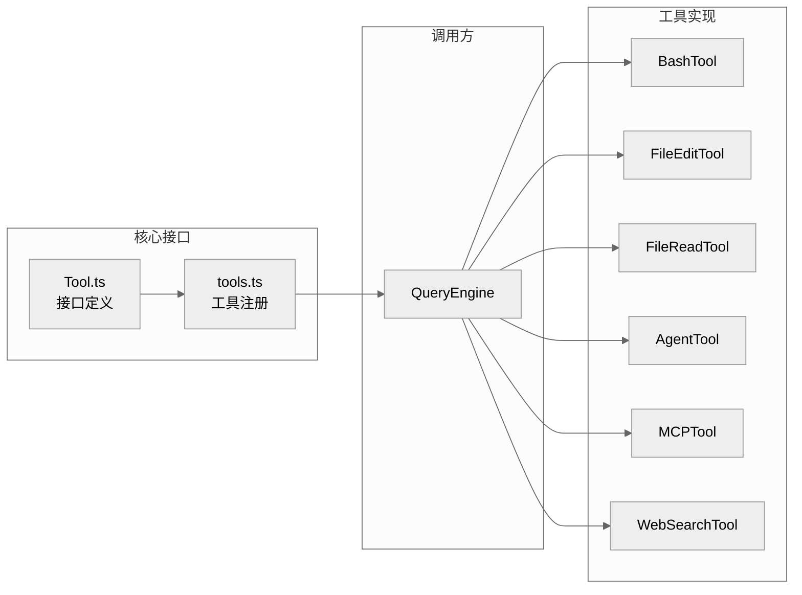
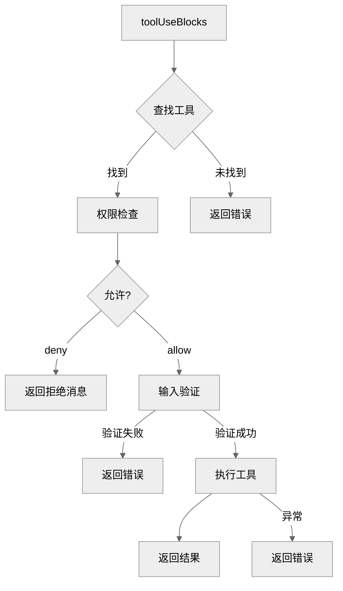
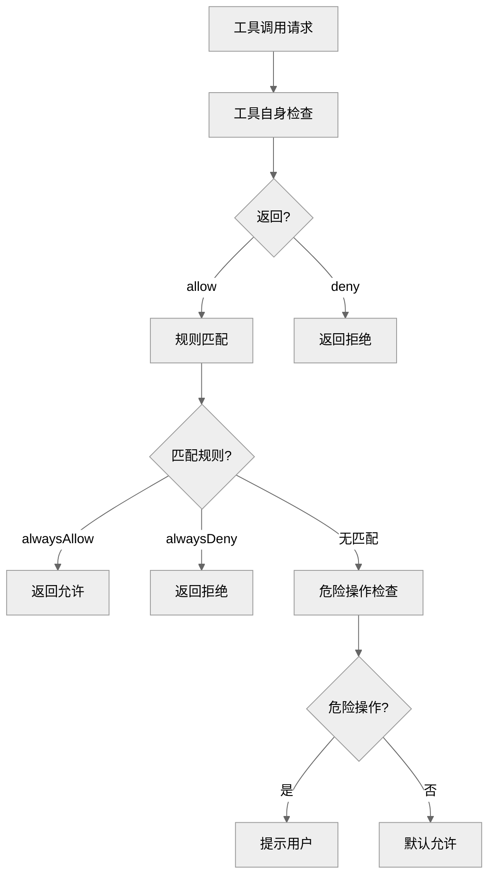
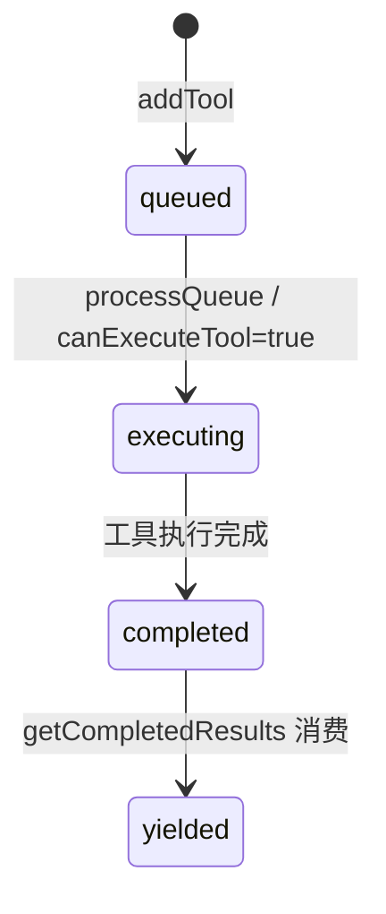
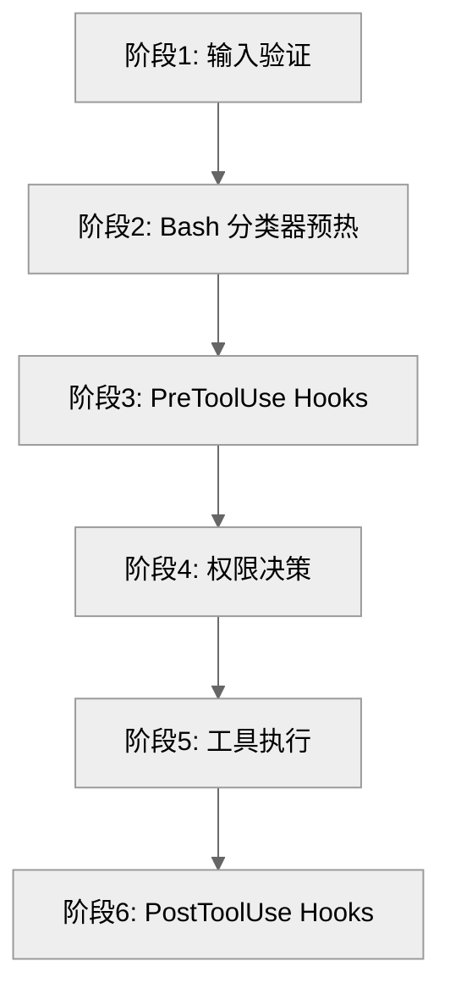

# Claude Code 源码分析：工具系统

## 1. 工具系统概述

工具系统是 Claude Code 与外部世界交互的核心机制，提供了文件操作、代码执行、Web 搜索等能力。



## 2. 工具接口定义

**位置**: `src/Tool.ts`

### 2.1 Tool 类型定义

```typescript
export type Tool<
  Input extends AnyObject = AnyObject,
  Output = unknown,
  P extends ToolProgressData = ToolProgressData,
> = {
  // 工具标识
  name: string
  aliases?: string[]  // 向后兼容的别名

  // 核心方法
  call(
    args: z.infer<Input>,
    context: ToolUseContext,
    canUseTool: CanUseToolFn,
    parentMessage: AssistantMessage,
    onProgress?: ToolCallProgress<P>,
  ): Promise<ToolResult<Output>>

  description(
    input: z.infer<Input>,
    options: {
      isNonInteractiveSession: boolean
      toolPermissionContext: ToolPermissionContext
      tools: Tools
    },
  ): Promise<string>

  // 输入输出模式
  inputSchema: Input
  inputJSONSchema?: ToolInputJSONSchema  // MCP JSON Schema 格式
  outputSchema?: z.ZodType<unknown>

  // 工具属性
  isConcurrencySafe(input: z.infer<Input>): boolean
  isReadOnly(input: z.infer<Input>): boolean
  isDestructive?(input: z.infer<Input>): boolean
  isEnabled(): boolean

  // 工具分类
  isMcp?: boolean
  isLsp?: boolean
  shouldDefer?: boolean  // 是否延迟加载 (ToolSearch)
  alwaysLoad?: boolean    // 始终加载，不受 ToolSearch 影响

  // 权限
  checkPermissions(
    input: z.infer<Input>,
    context: ToolUseContext,
  ): Promise<PermissionResult>

  // 渲染方法
  renderToolResultMessage(
    content: Output,
    progressMessagesForMessage: ProgressMessage<P>[],
    options: {...}
  ): React.ReactNode

  renderToolUseMessage(
    input: Partial<z.infer<Input>>,
    options: { theme: ThemeName; verbose: boolean; commands?: Command[] }
  ): React.ReactNode
}
```

### 2.2 ToolUseContext

工具执行的上下文环境：

```typescript
export type ToolUseContext = {
  options: {
    commands: Command[]
    debug: boolean
    mainLoopModel: string
    tools: Tools
    verbose: boolean
    thinkingConfig: ThinkingConfig
    mcpClients: MCPServerConnection[]
    isNonInteractiveSession: boolean
    agentDefinitions: AgentDefinitionsResult
  }
  abortController: AbortController
  readFileState: FileStateCache
  getAppState(): AppState
  setAppState(f: (prev: AppState) => AppState): void
  setToolJSX?: SetToolJSXFn
  addNotification?: (notif: Notification) => void
  sendOSNotification?: (opts: {...}) => void
  agentId?: AgentId
  agentType?: string
  messages: Message[]
  // ... 更多字段
}
```

### 2.3 工具构建器

```typescript
// 工具工厂函数
export function buildTool<D extends AnyToolDef>(def: D): BuiltTool<D> {
  return {
    ...TOOL_DEFAULTS,  // 默认实现
    userFacingName: () => def.name,
    ...def,
  } as BuiltTool<D>
}

// 默认值
const TOOL_DEFAULTS = {
  isEnabled: () => true,
  isConcurrencySafe: (_input?: unknown) => false,
  isReadOnly: (_input?: unknown) => false,
  isDestructive: (_input?: unknown) => false,
  checkPermissions: (input, _ctx) =>
    Promise.resolve({ behavior: 'allow', updatedInput: input }),
  toAutoClassifierInput: (_input?: unknown) => '',
  userFacingName: (_input?: unknown) => '',
}
```

## 3. 内置工具详解

### 3.1 工具列表

**位置**: `src/tools.ts`

```typescript
export function getAllBaseTools(): Tools {
  return [
    // 核心工具
    AgentTool,           // Agent 调用
    TaskOutputTool,       // 任务输出
    BashTool,            // Bash 执行
    FileEditTool,        // 文件编辑
    FileReadTool,        // 文件读取
    FileWriteTool,       // 文件写入
    GlobTool,            // Glob 匹配
    GrepTool,            // 文本搜索
    WebSearchTool,      // Web 搜索
    NotebookEditTool,    // Jupyter 编辑

    // 任务管理
    TaskStopTool,       // 停止任务
    TaskCreateTool,     // 创建任务
    TaskGetTool,        // 获取任务
    TaskUpdateTool,     // 更新任务
    TaskListTool,       // 列出任务

    // 其他工具
    WebFetchTool,       // Web 获取
    TodoWriteTool,      // Todo 写入
    LSPTool,            // LSP 语言服务
    ToolSearchTool,     // 工具搜索
    EnterPlanModeTool,  // 进入计划模式
    ExitPlanModeV2Tool, // 退出计划模式

    // 条件编译工具
    ...(feature('MONITOR_TOOL') ? [MonitorTool] : []),
    ...(feature('WORKFLOW_SCRIPTS') ? [WorkflowTool] : []),
    ...(feature('HISTORY_SNIP') ? [SnipTool] : []),
    ...(feature('AGENT_TRIGGERS') ? cronTools : []),
  ]
}
```

### 3.2 BashTool

**位置**: `src/tools/BashTool/BashTool.ts`

BashTool 是执行 Shell 命令的核心工具：

```typescript
export const BashTool = buildTool({
  name: 'Bash',
  description: async (input, options) => {
    // 返回工具描述
  },
  inputSchema: BashInputSchema,
  maxResultSizeChars: 10000,  // 默认 10k 字符限制

  async call(input: BashInput, context, canUseTool, parentMessage, onProgress) {
    const {
      command,
      timeout,
      workingDirectory,
      agentId,
    } = input

    // 1. 权限检查
    const permission = await canUseTool(this, input, context, parentMessage, toolUseId)
    if (permission.behavior === 'deny') {
      return { data: null, ... }
    }

    // 2. 创建 AbortController
    const childAbort = new AbortController()
    const timeoutId = setTimeout(() => childAbort.abort(), timeout || defaultTimeout)

    // 3. 执行命令
    try {
      const result = await execFile(command, {
        cwd: workingDirectory || context.options.cwd,
        signal: childAbort.signal,
        timeout,
      })

      // 4. 处理输出
      return {
        data: {
          stdout: result.stdout,
          stderr: result.stderr,
          exitCode: result.exitCode,
        }
      }
    } finally {
      clearTimeout(timeoutId)
    }
  },

  isConcurrencySafe: (input) => false,  // Bash 不是并发安全的
  isReadOnly: (input) => isReadOnlyBashCommand(input.command),

  // 分类 (用于自动模式安全分类器)
  toAutoClassifierInput: (input) => {
    if (isReadOnlyBashCommand(input.command)) {
      return ''  // 只读命令跳过
    }
    return input.command  // 返回命令用于分类
  }
})
```

### 3.3 FileEditTool

**位置**: `src/tools/FileEditTool/FileEditTool.ts`

文件编辑工具：

```typescript
export const FileEditTool = buildTool({
  name: 'Edit',
  aliases: ['Edit_file'],  // 向后兼容

  inputSchema: EditSchema,

  async call(input: EditInput, context, canUseTool, parentMessage, onProgress) {
    const { file_path, old_string, new_string, ... } = input

    // 1. 读取文件
    const content = await readFile(file_path)

    // 2. 验证 old_string 存在
    if (!content.includes(old_string)) {
      throw new Error(`old_string not found in file`)
    }

    // 3. 应用替换
    const newContent = content.replace(old_string, new_string)

    // 4. 写回文件
    await writeFile(file_path, newContent)

    return {
      data: {
        success: true,
        diff: computeDiff(content, newContent),
      }
    }
  },

  isConcurrencySafe: (input) => false,  // 文件编辑不是并发安全的
  isReadOnly: () => false,
  isDestructive: () => false,  // Edit 是非破坏性的 (总是创建备份)

  // 渲染
  renderToolResultMessage(content, progress, options) {
    return <EditResult diff={content.diff} />
  }
})
```

### 3.4 AgentTool

**位置**: `src/tools/AgentTool/AgentTool.ts`

Agent 工具用于启动子 Agent：

```typescript
export const AgentTool = buildTool({
  name: 'Agent',
  description: '启动一个 Agent 来帮助你完成任务',

  inputSchema: AgentInputSchema,

  async call(input: AgentInput, context, canUseTool, parentMessage, onProgress) {
    const {
      agentType,
      prompt,
      model,
      maxTurns,
      tools: allowedTools,
    } = input

    // 1. 加载 Agent 定义
    const agentDef = loadAgentDefinition(agentType)

    // 2. 创建子 Agent 上下文
    const subagentContext = createSubagentContext(context, {
      agentId: generateAgentId(),
      agentType,
    })

    // 3. 启动子 Agent 查询
    const subagentEngine = new QueryEngine({
      ...config,
      agentId: subagentContext.agentId,
      parentAgentId: context.agentId,
    })

    // 4. 流式处理结果
    for await (const message of subagentEngine.submitMessage(prompt)) {
      // 转发进度
      onProgress?.({ type: 'agent', message })
    }

    return {
      data: {
        agentId: subagentContext.agentId,
        result: extractResult(subagentEngine.getMessages()),
      }
    }
  }
})
```

### 3.5 WebSearchTool

**位置**: `src/tools/WebSearchTool/WebSearchTool.ts`

Web 搜索工具：

```typescript
export const WebSearchTool = buildTool({
  name: 'WebSearch',
  aliases: ['Search', 'Bing'],

  inputSchema: WebSearchSchema,

  async call(input: WebSearchInput, context, canUseTool, parentMessage, onProgress) {
    const { query, recency_days, num_results } = input

    // 1. 调用搜索 API
    const results = await searchAPI({
      query,
      recency_days,
      num_results: num_results || 10,
    })

    // 2. 格式化结果
    const formatted = results.map(r => ({
      title: r.title,
      url: r.url,
      snippet: r.snippet,
    }))

    return {
      data: {
        results: formatted,
        query,
      }
    }
  },

  isSearchOrReadCommand: () => ({ isSearch: true }),

  maxResultSizeChars: 15000,
})
```

## 4. 工具执行机制

### 4.1 工具编排 (toolOrchestration.ts)

**位置**: `src/services/tools/toolOrchestration.ts`



### 4.2 流式工具执行

**位置**: `src/services/tools/StreamingToolExecutor.ts`

对于支持流式输出的工具：

```typescript
export class StreamingToolExecutor {
  private pendingTools: ToolUseBlock[] = []
  private completedResults: ToolResult[] = []

  addTool(toolBlock: ToolUseBlock, assistantMessage: AssistantMessage) {
    this.pendingTools.push({ toolBlock, assistantMessage })

    // 异步执行
    this.executeTool(toolBlock, assistantMessage)
  }

  private async executeTool(
    toolBlock: ToolUseBlock,
    assistantMessage: AssistantMessage,
  ) {
    const tool = this.toolMap.get(toolBlock.name)

    try {
      // 流式执行
      for await (const progress of tool.call(
        toolBlock.input,
        this.context,
        this.canUseTool,
        assistantMessage,
        (p) => this.onProgress(toolBlock.id, p)
      )) {
        // 实时 yield 进度
        this.completedResults.push(progress)
      }
    } catch (error) {
      // 处理错误
      this.completedResults.push(createToolErrorMessage(toolBlock.id, error))
    }
  }

  getCompletedResults(): ToolResult[] {
    const results = this.completedResults
    this.completedResults = []
    return results
  }
}
```

## 5. 工具权限系统

### 5.1 权限检查流程

**位置**: `src/utils/permissions/permissions.ts`



### 5.2 权限模式

```typescript
export type PermissionMode =
  | 'default'      // 默认 - 询问危险操作
  | 'bypass'       // 绕过 - 所有操作自动允许
  | 'plan'          // 计划模式 - 更严格的检查
  | 'auto'          // 自动模式 - 无询问

// 权限上下文
export type ToolPermissionContext = {
  mode: PermissionMode
  additionalWorkingDirectories: Map<string, AdditionalWorkingDirectory>
  alwaysAllowRules: ToolPermissionRulesBySource
  alwaysDenyRules: ToolPermissionRulesBySource
  alwaysAskRules: ToolPermissionRulesBySource
  isBypassPermissionsModeAvailable: boolean
  shouldAvoidPermissionPrompts?: boolean
}
```

## 6. MCP 工具集成

### 6.1 MCP 工具包装

**位置**: `src/services/mcp/`

MCP 服务器提供的工具被包装为 Claude Code 工具：

```typescript
// 从 MCP 服务器加载工具
async function loadMCPTools(connection: MCPServerConnection): Promise<Tool[]> {
  const tools = await connection.listTools()

  return tools.map(mcpTool => {
    // 包装为 Claude Code Tool
    return buildTool({
      name: `mcp__${connection.name}__${mcpTool.name}`,
      description: mcpTool.description,
      inputSchema: convertJSONSchemaToZod(mcpTool.inputSchema),

      async call(input, context, canUseTool, parentMessage, onProgress) {
        // 1. 调用 MCP 服务器
        const result = await connection.callTool(mcpTool.name, input)

        // 2. 格式化结果
        return {
          data: result,
          mcpMeta: {
            _meta: result._meta,
            structuredContent: result.structuredContent,
          }
        }
      },

      isMcp: true,
      mcpInfo: { serverName: connection.name, toolName: mcpTool.name },
    })
  })
}
```

### 6.2 MCP 资源读取

```typescript
// ListMcpResourcesTool
export const ListMcpResourcesTool = buildTool({
  name: 'ListMcpResources',
  description: '列出 MCP 服务器提供的资源',

  async call(input, context, canUseTool) {
    const resources: ServerResource[] = []

    // 从所有 MCP 连接收集资源
    for (const client of context.options.mcpClients) {
      const clientResources = await client.listResources()
      resources.push(...clientResources)
    }

    return { data: { resources } }
  }
})

// ReadMcpResourceTool
export const ReadMcpResourceTool = buildTool({
  name: 'ReadMcpResource',
  description: '读取 MCP 服务器上的资源',

  async call(input: { uri: string }, context, canUseTool) {
    // 解析 URI 找到对应的 MCP 连接
    const { serverName, resourcePath } = parseResourceUri(input.uri)
    const client = findMCPClient(context.options.mcpClients, serverName)

    // 读取资源
    const content = await client.readResource(input.uri)

    return { data: { content, mimeType: content.mimeType } }
  }
})
```

## 7. 工具搜索 (ToolSearch)

### 7.1 延迟加载机制

```typescript
// 当工具设置了 shouldDefer: true 时
export const HeavyTool = buildTool({
  name: 'HeavyTool',
  shouldDefer: true,  // 不在初始提示中加载

  // 模型需要先调用 ToolSearch 来启用这个工具
})
```

### 7.2 ToolSearchTool

```typescript
export const ToolSearchTool = buildTool({
  name: 'ToolSearch',
  description: '搜索可用的工具',

  async call(input: { query: string }, context) {
    // 搜索所有标记为 shouldDefer 的工具
    const deferredTools = tools.filter(t => t.shouldDefer)

    const matches = deferredTools.filter(t =>
      matchesQuery(t.name, t.description, input.query)
    )

    return {
      data: {
        tools: matches.map(t => ({
          name: t.name,
          description: t.description,
          // 返回使工具可调用的信息
        }))
      }
    }
  }
})
```

## 8. 工具结果渲染

### 8.1 渲染方法

```typescript
// 每个工具可以自定义渲染
renderToolResultMessage(
  content: Output,
  progressMessagesForMessage: ProgressMessage<P>[],
  options: {
    style?: 'condensed'
    theme: ThemeName
    tools: Tools
    verbose: boolean
    isTranscriptMode?: boolean
  }
): React.ReactNode

// 示例: BashTool 渲染
renderToolResultMessage(content, progress, options) {
  const { stdout, stderr, exitCode } = content

  return (
    <Box flexDirection="column">
      {stdout && <Text>{stdout}</Text>}
      {stderr && <Text color="red">{stderr}</Text>}
      <Text dimColor>Exit code: {exitCode}</Text>
    </Box>
  )
}
```

## 11. StreamingToolExecutor 完整机制

**位置**: `src/services/tools/StreamingToolExecutor.ts`

StreamingToolExecutor 是流式场景下的工具执行引擎。当 API 响应尚在流入时，工具调用就开始排队执行，而不是等到整个响应结束。这和 `toolOrchestration.ts` 中的 `runTools` 是两条并行的执行路径——`runTools` 处理非流式（或流式回退后的）批量执行，StreamingToolExecutor 处理流式场景。

### 11.1 核心方法

| 方法 | 职责 |
|------|------|
| `addTool(block, assistantMessage)` | 流式解析出一个 `tool_use` block 后立即调用。查找工具定义，判断并发安全性，推入 `tools` 队列，触发 `processQueue` |
| `getCompletedResults()` | **同步生成器**，按工具入队顺序依次 yield 已完成的结果。遇到未完成的非并发安全工具时停止——保证串行工具的结果顺序 |
| `getRemainingResults()` | **异步生成器**，等待所有未完成工具执行结束，边等边 yield。内部通过 `Promise.race` 同时监听工具完成和进度事件 |
| `discard()` | 流式回退时调用。设置 `discarded = true`，后续所有队列中和执行中的工具收到 `streaming_fallback` 合成错误，不再产出结果 |

### 11.2 并发控制：canExecuteTool

这是整个并发调度的核心判断，逻辑非常简洁：

```typescript
private canExecuteTool(isConcurrencySafe: boolean): boolean {
  const executingTools = this.tools.filter(t => t.status === 'executing')
  return (
    executingTools.length === 0 ||
    (isConcurrencySafe && executingTools.every(t => t.isConcurrencySafe))
  )
}
```

翻译成人话就是：**要么没有工具在执行，要么当前工具并发安全且所有正在执行的工具也都并发安全**。这意味着：

- 多个 Read/Glob/Grep 可以并行跑
- 一旦队列中出现 Bash 或 Edit（非并发安全），必须等前面的工具全部完成
- 非并发安全工具之间严格串行

`processQueue` 遍历工具列表时，如果碰到一个无法执行的非并发安全工具，直接 `break`——后面的工具不管安不安全都不会启动，因为要保证非并发安全工具的执行顺序。

### 11.3 TrackedTool 状态机



每个工具通过 `TrackedTool` 结构跟踪状态：

```typescript
type TrackedTool = {
  id: string
  block: ToolUseBlock
  assistantMessage: AssistantMessage
  status: 'queued' | 'executing' | 'completed' | 'yielded'
  isConcurrencySafe: boolean
  promise?: Promise<void>
  results?: Message[]
  pendingProgress: Message[]       // 进度消息单独存放，立即 yield
  contextModifiers?: Array<...>    // 上下文修改器，仅非并发安全工具生效
}
```

值得注意的是 `pendingProgress` 和 `results` 的分离设计：进度消息（如 Bash 的实时输出行）不等工具完成就立即通过 `getCompletedResults` yield 出去，而最终结果严格按顺序。`progressAvailableResolve` 是一个信号量，进度到达时唤醒 `getRemainingResults` 的等待循环。

### 11.4 Bash 错误级联

错误处理有一个关键的不对称设计：**只有 Bash 工具的错误会取消兄弟工具**。

```typescript
if (isErrorResult) {
  thisToolErrored = true
  if (tool.block.name === BASH_TOOL_NAME) {
    this.hasErrored = true
    this.erroredToolDescription = this.getToolDescription(tool)
    this.siblingAbortController.abort('sibling_error')
  }
}
```

设计理由在源码注释中说得很清楚：Bash 命令之间经常有隐式依赖链（比如 `mkdir` 失败了，后续命令就没意义了），而 Read/WebFetch 等工具是独立的——一个失败不应该影响其他。

`siblingAbortController` 是 `toolUseContext.abortController` 的子控制器。abort 它不会 abort 父控制器（查询不会因此结束），只是让其他正在跑的子进程提前终止。被取消的工具收到 `sibling_error` 合成错误消息：`"Cancelled: parallel tool call Bash(mkdir -p foo...) errored"`。

但如果是权限拒绝导致的 abort（通过 `toolAbortController`），则需要冒泡到父级，否则会出现回归问题（如 ExitPlanMode 的 `clear context + auto` 场景会发送 REJECT_MESSAGE 给模型而不是终止 turn）。

## 12. 批处理策略

**位置**: `src/services/tools/toolOrchestration.ts`

`runTools` 是非流式场景下的工具批处理入口。它先用 `partitionToolCalls` 把工具调用分组，然后逐批执行。

### 12.1 partitionToolCalls 分区算法

```typescript
function partitionToolCalls(
  toolUseMessages: ToolUseBlock[],
  toolUseContext: ToolUseContext,
): Batch[] {
  return toolUseMessages.reduce((acc, toolUse) => {
    const isConcurrencySafe = /* 解析输入，调用 tool.isConcurrencySafe() */
    if (isConcurrencySafe && acc[acc.length - 1]?.isConcurrencySafe) {
      acc[acc.length - 1].blocks.push(toolUse)  // 合并到前一个安全批次
    } else {
      acc.push({ isConcurrencySafe, blocks: [toolUse] })  // 新建批次
    }
    return acc
  }, [])
}
```

算法很直觉：遍历工具列表，**连续的并发安全工具合并为一批，非并发安全工具各自独占一批**。

以 `[Read, Read, Bash, Edit, Read]` 为例：

| 批次 | 工具 | 类型 | 执行方式 |
|------|------|------|----------|
| 1 | Read, Read | 安全 | 并行（`Promise.all` via `all()` 辅助函数） |
| 2 | Bash | 不安全 | 串行 |
| 3 | Edit | 不安全 | 串行 |
| 4 | Read | 安全 | 并行（虽然只有一个） |

### 12.2 执行方式

- **安全批**：`runToolsConcurrently` 使用一个自定义的 `all()` 异步生成器合并函数，上限为 `getMaxToolUseConcurrency()`（默认 10，可通过环境变量 `CLAUDE_CODE_MAX_TOOL_USE_CONCURRENCY` 覆盖）。上下文修改器在整批执行完后按工具顺序逐个应用。
- **不安全批**：`runToolsSerially` 逐个执行，每个工具执行完后立即应用上下文修改器，确保后续工具能看到前一个工具对上下文的修改。

## 13. 执行管线 6 阶段

**位置**: `src/services/tools/toolExecution.ts` — `checkPermissionsAndCallTool`

每次工具调用都经过以下 6 个阶段：



### 阶段 1：输入验证

分两步：先用 Zod schema 做结构验证（`inputSchema.safeParse`），失败返回格式化的错误消息。如果工具是 deferred 类型且 schema 没有被发送到 API（ToolSearch 机制），会追加一个提示让模型先调用 ToolSearch 加载 schema。然后调用 `tool.validateInput()` 做语义验证（比如文件路径是否合法）。

### 阶段 2：Bash 分类器预热

仅对 Bash 工具生效。在权限检查之前就 **投机性地** 启动 allow 分类器（`startSpeculativeClassifierCheck`），让它和后续的 Hooks、权限对话框并行运行。关键细节：此时 **不设置** UI 上的 "classifier running" 指示器——只在权限检查返回 `ask` 且存在 `pendingClassifierCheck` 时才显示，避免对自动允许的命令闪烁提示。

### 阶段 3：PreToolUse Hooks

遍历所有注册的 PreToolUse hooks（`runPreToolUseHooks`），每个 hook 可以：
- 产出消息（附件消息或进度消息）
- 返回权限决策（`hookPermissionResult`）覆盖默认权限流程
- 修改工具输入（`hookUpdatedInput`）
- 阻止后续执行（`preventContinuation`）
- 直接终止（`stop`）

Hook 超过 500ms 时，会在工具结果下方内联显示各 hook 的执行耗时。

### 阶段 4：权限决策

调用 `resolveHookPermissionDecision`，如果 hook 已经给出决策则直接使用，否则走标准的 `canUseTool` 流程（即 `hasPermissionsToUseTool`，详见第 14 节）。决策结果记录到 OTel 遥测事件 `tool_decision`。

如果权限被拒绝（behavior 不是 `allow`），生成错误消息返回。对 auto 模式的分类器拒绝，还会运行 `PermissionDenied` hooks，如果 hook 说可以重试（`retry: true`），会追加一条消息告诉模型可以重试。

### 阶段 5：工具执行

调用 `tool.call(callInput, context, canUseTool, assistantMessage, onProgress)`。执行前后有完整的 OTel span 追踪（`startToolExecutionSpan` / `endToolExecutionSpan`）。执行结果通过 `mapToolResultToToolResultBlockParam` 映射为 API 格式并缓存，避免重复映射。

输入处理有一个微妙的 `backfillObservableInput` 机制：某些工具（如文件工具）需要展开路径给 hooks 和权限检查看，但 `tool.call()` 本身应该看到模型原始输入——因为工具结果会嵌入输入路径（如 "File created successfully at: {path}"），改变它会影响序列化的 transcript 和 VCR fixture hash。

### 阶段 6：PostToolUse Hooks

工具成功执行后运行 `runPostToolUseHooks`。对 MCP 工具，hooks 可以通过 `updatedMCPToolOutput` 修改工具输出（非 MCP 工具的结果已经在 hook 运行前添加到结果列表中了）。如果阶段 3 的 PreToolUse hook 设置了 `preventContinuation`，会追加一个 `hook_stopped_continuation` 附件消息，阻止模型继续。

异常路径走 `runPostToolUseFailureHooks`，MCP 认证错误会更新对应 server 的状态为 `needs-auth`。

## 14. 权限规则结构

**位置**: `src/types/permissions.ts`, `src/utils/permissions/permissions.ts`

### 14.1 PermissionRule 类型

```typescript
type PermissionRule = {
  source: PermissionRuleSource    // 规则来源
  ruleBehavior: PermissionBehavior  // 'allow' | 'deny' | 'ask'
  ruleValue: PermissionRuleValue    // 工具名 + 可选内容
}

type PermissionRuleValue = {
  toolName: string       // 如 "Bash", "mcp__server1__tool1"
  ruleContent?: string   // 如 "prefix:npm *", "agentType"
}

type PermissionRuleSource =
  | 'userSettings'      // ~/.claude/settings.json
  | 'projectSettings'   // .claude/settings.json
  | 'localSettings'     // .claude/settings.local.json
  | 'flagSettings'      // 远程 flag 下发
  | 'policySettings'    // 企业策略
  | 'cliArg'            // 命令行参数
  | 'command'           // 命令注册
  | 'session'           // 会话内临时授权
```

### 14.2 匹配优先级

`hasPermissionsToUseToolInner` 的检查顺序决定了优先级：

1. **deny 规则**（步骤 1a）：整个工具被拒绝，直接返回 deny
2. **ask 规则**（步骤 1b）：整个工具需要询问（sandbox 例外：如果 Bash 工具开启了沙箱且命令会在沙箱中运行，跳过 ask 继续往下）
3. **工具自身 checkPermissions**（步骤 1c）：工具内部逻辑（如 Bash 的子命令规则匹配）
4. **工具实现 deny**（步骤 1d）：工具内部明确拒绝
5. **requiresUserInteraction**（步骤 1e）：即使 bypass 模式也需要用户交互
6. **内容级 ask 规则**（步骤 1f）：如 `Bash(npm publish:*)` 即使在 bypass 模式也强制询问
7. **安全检查**（步骤 1g）：`.git/`, `.claude/`, shell 配置等敏感路径，bypass-immune
8. **bypassPermissions 模式**（步骤 2a）：如果开启了 bypass 模式，直接允许
9. **allow 规则**（步骤 2b）：整个工具被允许
10. **passthrough 转 ask**（步骤 3）：默认情况下，工具返回的 passthrough 转为 ask

总结规则：**deny 在任何位置都能终止流程，安全检查和内容级 ask 规则能穿透 bypass 模式，allow 规则只在 deny/ask 规则和安全检查之后才生效**。

### 14.3 MCP 工具的特殊匹配

MCP 工具支持服务器级别的规则匹配。规则 `mcp__server1` 或 `mcp__server1__*` 会匹配该服务器下的所有工具（`mcp__server1__tool1`, `mcp__server1__tool2` 等），这样用户可以一次性禁用/允许整个 MCP 服务器。

## 15. 工具池组装

**位置**: `src/tools.ts` — `assembleToolPool`

```typescript
export function assembleToolPool(
  permissionContext: ToolPermissionContext,
  mcpTools: Tools,
): Tools {
  const builtInTools = getTools(permissionContext)
  const allowedMcpTools = filterToolsByDenyRules(mcpTools, permissionContext)

  const byName = (a: Tool, b: Tool) => a.name.localeCompare(b.name)
  return uniqBy(
    [...builtInTools].sort(byName).concat(allowedMcpTools.sort(byName)),
    'name',
  )
}
```

这个函数有三个关键设计决策：

**1. 内置工具作为连续前缀**

内置工具和 MCP 工具分别排序后拼接，内置工具始终在前。这不是随意的——Anthropic 服务端的 `claude_code_system_cache_policy` 会在最后一个内置工具后放置全局缓存断点。如果内置和 MCP 工具混排，每次 MCP 工具变动都会使所有下游缓存键失效。保持内置工具为连续前缀，MCP 工具的增删只影响缓存的 MCP 部分。

**2. 按 name 去重，内置优先**

`uniqBy('name')` 保留首次出现的工具。由于内置工具排在前面，同名时内置工具获胜。这在 `CLAUDE_AGENT_SDK_MCP_NO_PREFIX` 模式下尤其重要——MCP 工具可能有和内置工具相同的 unprefixed 名称（如 "Write"）。

**3. deny 规则前置过滤**

`filterToolsByDenyRules` 在组装阶段就过滤掉被 deny 的工具（包括服务器级别的 `mcp__server` 规则），这样被禁用的工具根本不会出现在模型的工具列表中——不是调用时才拒绝，而是从一开始就不可见。

### 工具条件加载

`getAllBaseTools()` 中的工具列表不是静态的。大量工具通过 `feature()` flag、`process.env.USER_TYPE`、运行时检测等条件动态包含：

- `hasEmbeddedSearchTools()` 为 true 时去掉 GlobTool 和 GrepTool（ant 构建有内嵌的 bfs/ugrep）
- `isReplModeEnabled()` 为 true 时隐藏 REPL_ONLY_TOOLS（Bash/Read/Edit 等被 REPL VM 包裹）
- `isToolSearchEnabledOptimistic()` 为 true 时加入 ToolSearchTool
- `CLAUDE_CODE_SIMPLE` 环境变量为 true 时只暴露 Bash/Read/Edit 三个工具

## 16. 遥测与错误分类

**位置**: `src/services/tools/toolExecution.ts`

### 16.1 classifyToolError

```typescript
export function classifyToolError(error: unknown): string {
  if (error instanceof TelemetrySafeError) {
    return error.telemetryMessage.slice(0, 200)
  }
  if (error instanceof Error) {
    const errnoCode = getErrnoCode(error)
    if (typeof errnoCode === 'string') return `Error:${errnoCode}`
    if (error.name && error.name !== 'Error' && error.name.length > 3) {
      return error.name.slice(0, 60)
    }
    return 'Error'
  }
  return 'UnknownError'
}
```

这个函数解决了一个实际问题：生产构建中代码经过 minify，`error.constructor.name` 变成了 `"nJT"` 这样毫无意义的短标识符。所以它采用了一套降级策略：

1. `TelemetrySafeError`：使用预审过的 `telemetryMessage`（确认不含代码或文件路径）
2. Node.js 文件系统错误：提取 `code` 属性（ENOENT, EACCES 等），稳定且有信息量
3. 有稳定 `name` 属性的错误：如 `ShellError`, `ImageSizeError`（它们在构造器中手动设置 name，不受 minify 影响），但要求 name 长度 > 3 来排除 minified 标识符
4. 兜底返回 `"Error"` 或 `"UnknownError"`

### 16.2 OTel 源映射

`ruleSourceToOTelSource` 和 `decisionReasonToOTelSource` 将内部的权限来源映射到标准化的 OTel `source` 词表：

| 内部来源 | OTel source (allow) | OTel source (deny) |
|----------|--------------------|--------------------|
| session | user_temporary | user_reject |
| localSettings / userSettings | user_permanent | user_reject |
| cliArg / policySettings / projectSettings / flagSettings | config | config |
| hook | hook | hook |
| permissionPromptTool (SDK 宿主) | 按 decisionClassification 走 | user_reject |

这套映射和交互式路径（`permissionLogging.ts`）保持语义一致：session 级的授权是临时的，磁盘级的是永久的，用户手动拒绝统一为 `user_reject`，所有非用户操作的规则（CLI 参数、策略、flag）统一为 `config`。

工具执行的完整遥测事件链：`tengu_tool_use_can_use_tool_allowed` -> `tengu_tool_use_progress`(0..N) -> `tengu_tool_use_success` / `tengu_tool_use_error`，外加 OTel 的 `tool_decision` 和 `tool_result` 事件。每个事件都携带 `queryChainId`（追踪 Agent 链路）、`queryDepth`（Agent 嵌套深度）、MCP 服务器类型和 baseUrl（如适用）。

---

*文档版本: 1.1*
*分析日期: 2026-04-02*
