# Claude Code 源码分析：MCP 系统

## 1. MCP 系统概述

MCP (Model Context Protocol) 是一种标准化协议，允许 Claude Code 与外部服务（如数据库、API、工具）进行交互。

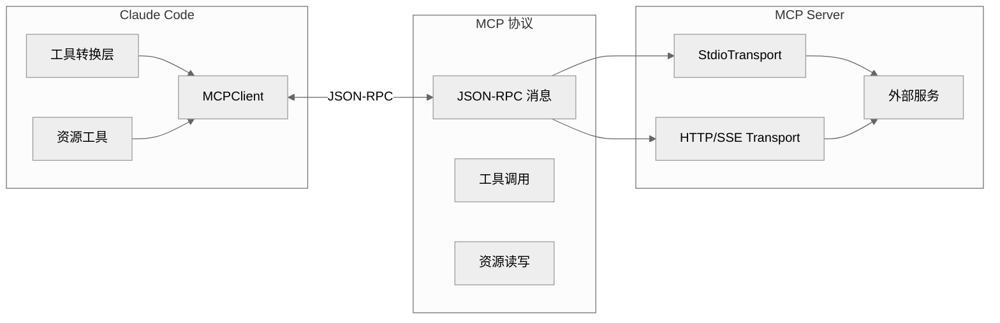

## 2. MCP 客户端

**位置**: `src/services/mcp/client.ts`

### 2.1 MCP 连接接口

```typescript
export interface MCPServerConnection {
  readonly name: string                    // 服务器名称
  readonly type: 'stdio' | 'http'        // 连接类型

  // 工具
  listTools(): Promise<McpTool[]>
  callTool(name: string, args: Record<string, unknown>): Promise<ToolResult>

  // 资源
  listResources(): Promise<ServerResource[]>
  readResource(uri: string): Promise<ResourceContent>

  // 提示
  listPrompts(): Promise<Prompt[]>
  getPrompt(name: string, args?: Record<string, string>): Promise<GetPromptResult>

  // 生命周期
  close(): void
}
```

### 2.2 MCP 客户端实现

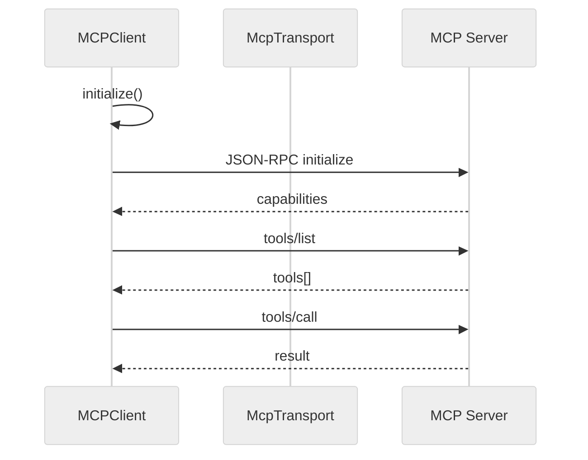

## 3. MCP 传输

### 3.1 Stdio 传输

**位置**: `src/services/mcp/InProcessTransport.ts`

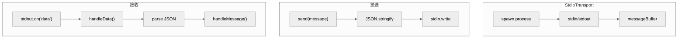

### 3.2 HTTP 传输 (SSE)

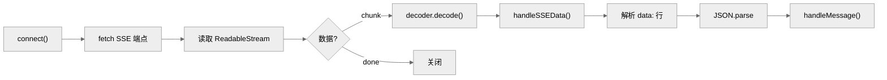

## 4. MCP 工具集成

### 4.1 工具转换为 Claude Tools

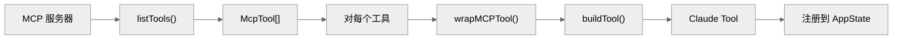

### 4.2 工具注册

```typescript
export async function loadMcpTools(
  clients: MCPServerConnection[]
): Promise<Tools> {
  const tools: Tools = []

  for (const client of clients) {
    try {
      const mcpTools = await client.listTools()

      for (const mcpTool of mcpTools) {
        tools.push(wrapMCPTool(client, mcpTool))
      }
    } catch (error) {
      console.error(`Failed to load tools from ${client.name}:`, error)
    }
  }

  return tools
}
```

## 5. MCP 资源

### 5.1 资源定义

```typescript
export interface ServerResource {
  uri: string
  name: string
  description?: string
  mimeType?: string
}

export interface ResourceContent {
  uri: string
  mimeType: string
  content: string | Uint8Array
}
```

### 5.2 资源工具

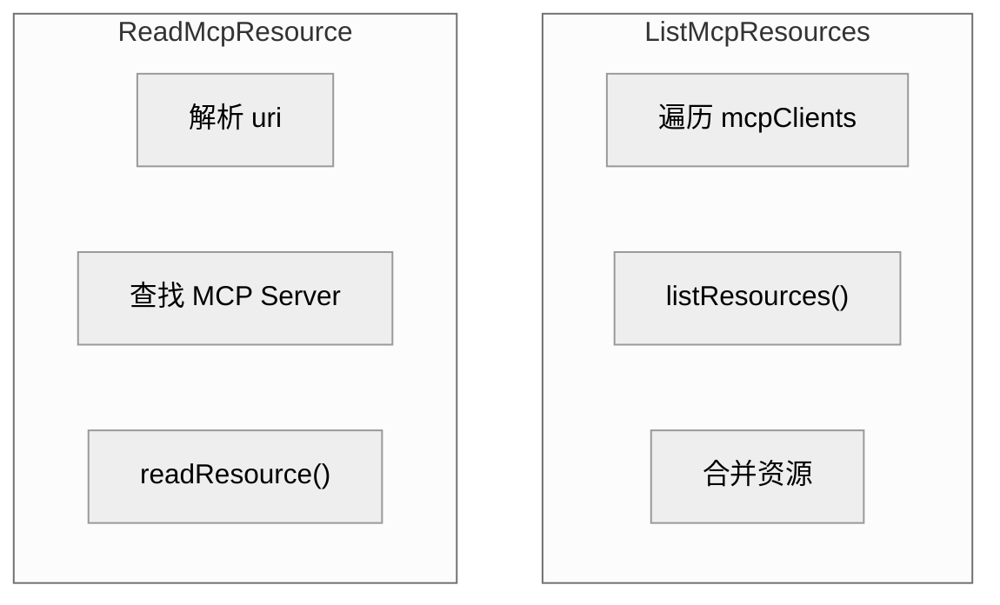

## 6. MCP 配置

### 6.1 配置格式

**位置**: `src/services/mcp/config.ts`

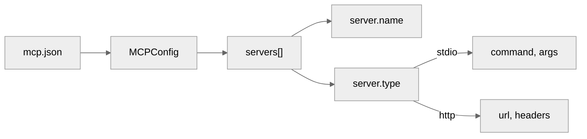

### 6.2 配置加载

```typescript
export function loadMCPConfig(): MCPConfig {
  // 尝试多个位置
  const locations = [
    path.join(cwd, 'mcp.json'),
    path.join(getConfigDir(), 'mcp.json'),
  ]

  for (const location of locations) {
    if (existsSync(location)) {
      const content = readFileSync(location, 'utf-8')
      return JSON.parse(content)
    }
  }

  return { servers: [] }
}
```

## 7. MCP 权限

### 7.1 权限检查

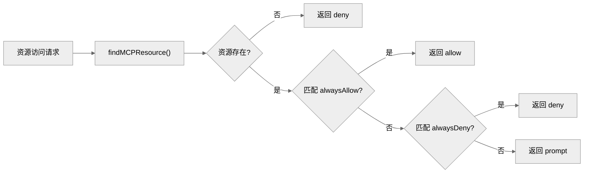

## 8. MCP 状态管理

### 8.1 连接状态

```typescript
export type MCPConnectionState =
  | { status: 'connecting' }
  | { status: 'connected' }
  | { status: 'disconnected'; error?: string }
  | { status: 'error'; error: string }
```

### 8.2 状态更新

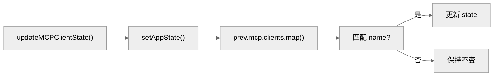

## 9. MCP 生命周期

### 9.1 启动流程

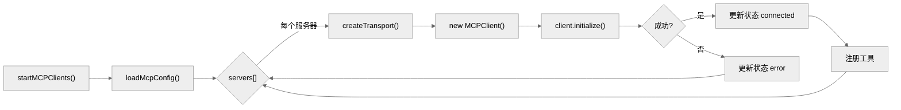

### 9.2 关闭流程

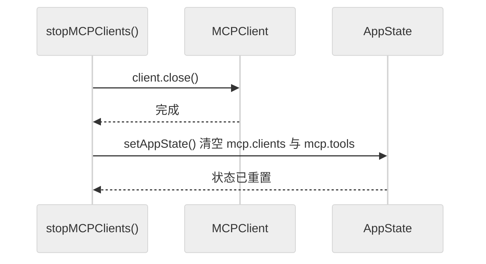

## 10. MCP 提示 (Prompts)

### 10.1 提示定义

```typescript
export interface MCPPrompt {
  name: string
  description?: string
  arguments?: {
    name: string
    description?: string
    required?: boolean
  }[]
}
```

### 10.2 提示工具

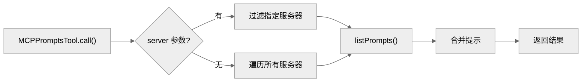

## 13. 补充：关键实现细节

### 13.1 MCP 认证体系

MCP 认证是这个子系统中最复杂的部分（auth.ts 88KB）：
- XAA (eXternal Auth for Anthropic)：Anthropic 自有的认证扩展
- XAA-IDP：通过身份提供商的间接认证
- OAuth 2.0：标准的授权码流程
- Bearer Token：简单的令牌认证

URL 诱导协议（URL Elicitation）允许 MCP 服务器在连接过程中请求用户输入 URL 或凭证，带有重试逻辑。

### 13.2 MCP 传输类型

实际支持 6 种传输：
1. stdio：spawn 子进程，stdin/stdout 通信
2. SSE：HTTP Server-Sent Events
3. HTTP：标准 HTTP POST（streamable-http）
4. claudeai-proxy：通过 claude.ai 代理
5. WebSocket：WS 连接
6. in-process（SDK 模式）：SdkControlClientTransport

### 13.3 工具调用超时

MCP 工具调用有超时竞赛机制。如果工具执行超时，会返回超时错误而非无限等待。超时期间会记录 progress 日志。

### 13.4 JSON-RPC 消息格式

所有 MCP 通信使用 JSON-RPC 2.0：
- 请求：{ jsonrpc: "2.0", id: number, method: string, params: object }
- 响应：{ jsonrpc: "2.0", id: number, result: object }
- 通知：{ jsonrpc: "2.0", method: string, params: object }（无 id）

消息缓冲器处理分帧：JSON 消息可能跨多个 chunk 到达，缓冲器负责拼接和解析。

### 13.5 Schema 转换

JSON Schema → Zod schema 的转换不是通用的。它处理常见的 JSON Schema 结构（object、string、number、boolean、array、enum），但对于高度复杂的 schema（如 allOf/anyOf 嵌套）可能降级为 z.any()。

---

*文档版本: 1.0*
*分析日期: 2026-03-31*
