# Claude Code 源码分析：上下文压缩系统

## 1. 上下文压缩概述

Claude Code 实现了多层次的上下文压缩系统，以管理对话历史带来的令牌消耗。

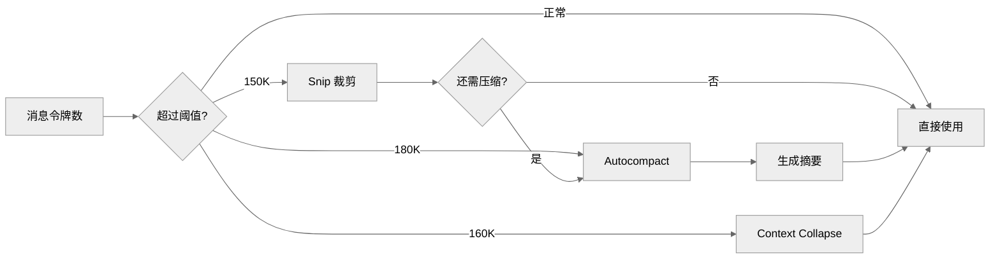

## 2. Snip (裁剪)

**位置**: `src/services/compact/snipCompact.ts`

### 2.1 设计原理

Snip 通过分析消息内容，移除对当前对话贡献最小的消息：

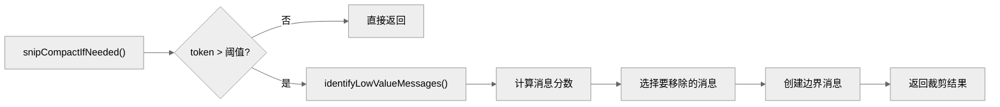

### 2.2 低价值消息识别

```typescript
function identifyLowValueMessages(messages: Message[]): ScoredMessage[] {
  return messages
    .map((msg, index) => ({
      message: msg,
      index,
      score: calculateMessageValue(msg, {
        position: index / messages.length,      // 位置权重
        isToolResult: msg.type === 'user',       // 工具结果权重低
        hasUserContent: hasUserContent(msg),     // 用户内容权重高
        isAssistantReasoning: isReasoning(msg), // 思考过程权重低
      })
    }))
    .filter scored => scored.score < VALUE_THRESHOLD
    .sort((a, b) => a.score - b.score)  // 低分在前
}
```

## 3. Microcompact (微压缩)

**位置**: `src/services/compact/microCompact.ts`

### 3.1 设计原理

Microcompact 合并连续的工具调用和结果，生成简洁的摘要：

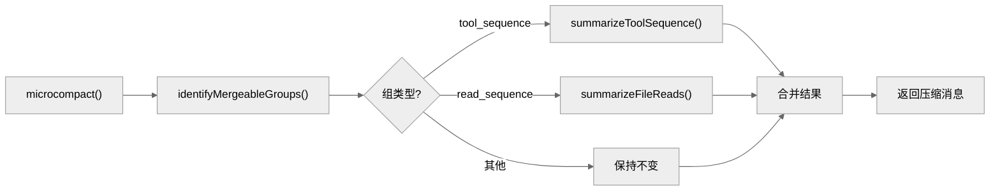

### 3.2 工具序列摘要

```typescript
async function summarizeToolSequence(
  messages: Message[]
): Promise<SystemMessage> {
  const toolCalls = messages
    .filter(m => m.type === 'assistant')
    .flatMap(m => m.message.content.filter(c => c.type === 'tool_use'))

  const toolResults = messages
    .filter(m => m.type === 'user')
    .flatMap(m => m.message.content.filter(c => c.type === 'tool_result'))

  // 生成摘要
  const summary = toolCalls.map((call, i) => {
    const result = toolResults[i]
    return `${call.name}(${JSON.stringify(call.input)}) → ${truncate(result.content, 100)}`
  }).join('\n')

  return createSystemMessage(
    `Executed ${toolCalls.length} operations:\n${summary}`,
    'compact_summary'
  )
}
```

## 4. Autocompact (自动压缩)

**位置**: `src/services/compact/autoCompact.ts`

### 4.1 触发条件

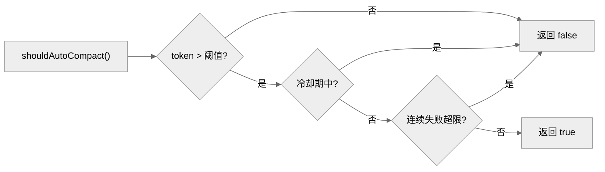

### 4.2 压缩执行

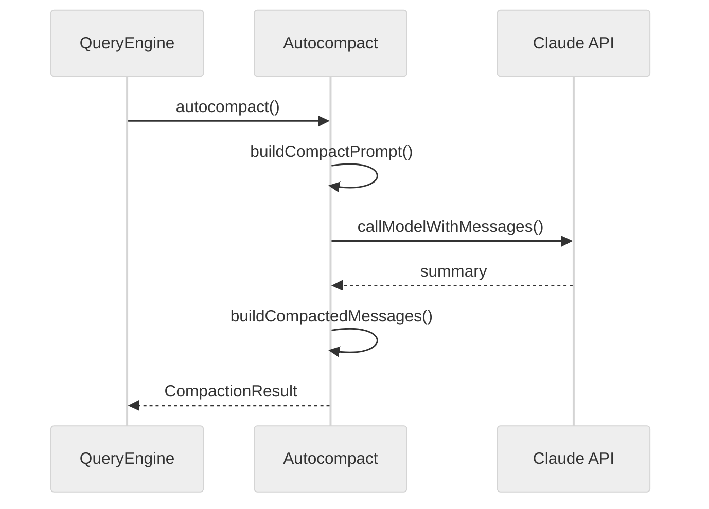

## 5. Context Collapse (上下文折叠)

**位置**: `src/services/contextCollapse/index.ts`

### 5.1 设计原理

Context Collapse 通过选择性折叠次要消息来管理上下文：

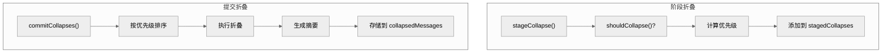

### 5.2 恢复折叠

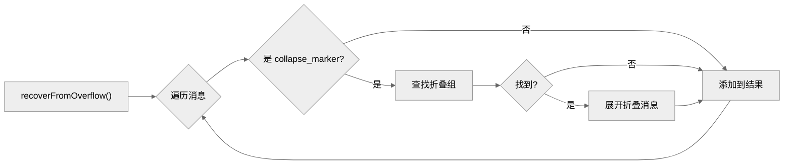

## 6. 缓存管理

### 6.1 缓存令牌

**位置**: `src/services/api/promptCacheBreakDetection.ts`

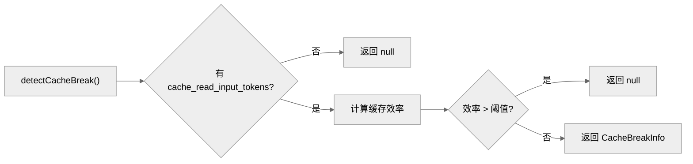

### 6.2 缓存感知压缩

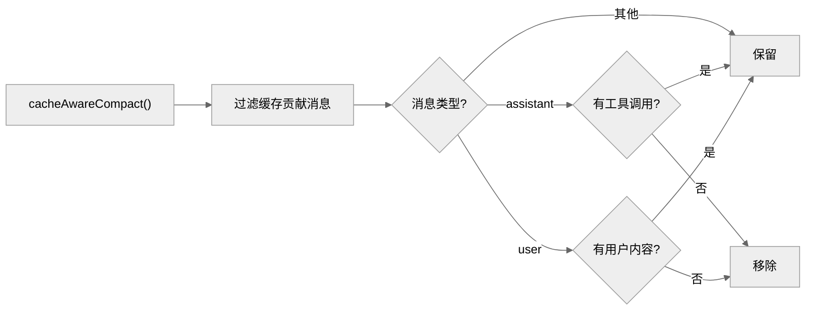

## 7. 压缩配置

### 7.1 配置参数

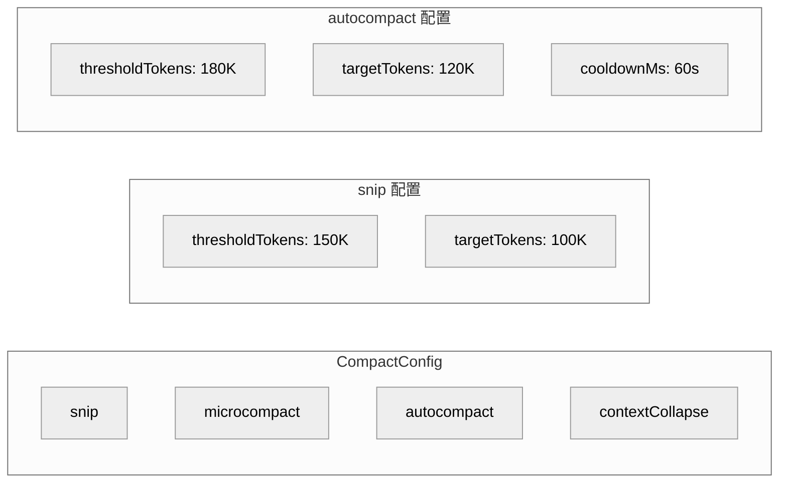

## 8. 压缩事件

### 8.1 事件跟踪

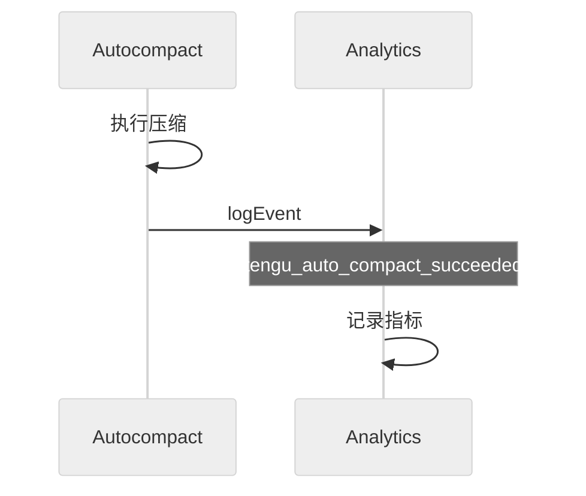

### 7. 补充：Microcompact 双路径详解

路径 1 - 时间触发（行 401-530）：距上次 assistant 消息 > 60 分钟时触发。content-clear 而非删除，保留最近 5 个结果。标记 '[Old tool result content cleared]'。

路径 2 - 缓存编辑（行 305-399）：feature flag 门控。排队 cache_edits 给 API 层，不修改本地数据。支持工具：FILE_READ, SHELL, GREP, GLOB, WEB_SEARCH, WEB_FETCH, FILE_EDIT, FILE_WRITE。

Token 估算：图片 2000 flat rate，文本 roughTokenCountEstimation()，乘 4/3 保守填充。

### 8. 补充：Autocompact 精确阈值

| 参数 | 值 |
|------|------|
| AUTOCOMPACT_BUFFER_TOKENS | 13,000 |
| MAX_OUTPUT_TOKENS_FOR_SUMMARY | 20,000 |
| MAX_CONSECUTIVE_FAILURES | 3 |

触发公式：tokens >= contextWindow - 13,000
先走 SessionMemory 快速路径，失败才走完整 compactConversation。

### 9. 补充：CompactionResult 结构

包含 boundaryMarker, summaryMessages, attachments, hookResults, messagesToKeep, pre/postCompactTokenCount。

Full vs Partial：Full 总结所有，Partial 'from' 从 pivot 后总结，Partial 'up_to' pivot 前总结。

重试：最多 3 次，丢弃最旧的 API-round groups。

### 10. 补充：Prompt Cache Break Detection

双阶段检测（728 行文件）。Phase 1 快照状态，Phase 2 比较 cache_read_tokens。判据：>5% drop AND >= 2,000 tokens。12+ 种变化类别解释。

---

*文档版本: 1.0*
*分析日期: 2026-03-31*
