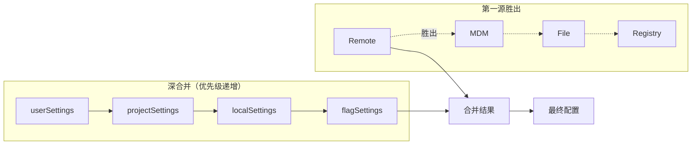
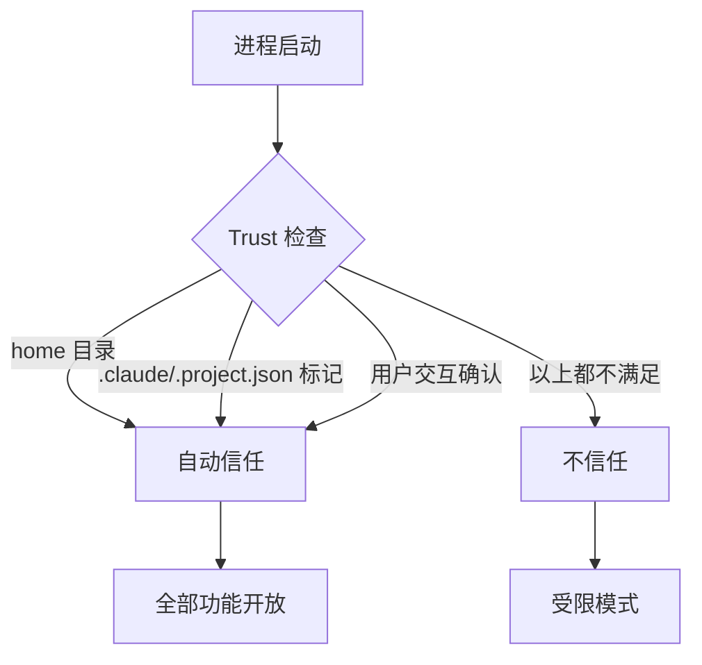
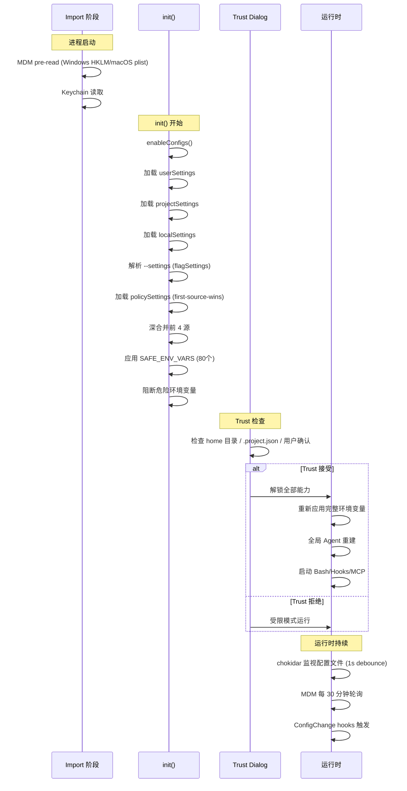

# Claude Code 源码分析：配置系统、策略管理与环境变量

## 1. 为什么配置系统这么复杂

Claude Code 的配置系统不是一个简单的"读 JSON 文件"。它要同时服务三类场景：

- **个人开发者**：在家目录放一个 settings.json，偶尔通过 CLI 传参
- **企业团队**：项目里 checked-in 一份配置，每个成员可以本地覆盖
- **企业 IT 管理员**：通过 MDM（Mobile Device Management）远程下发策略，员工不能绕过

这三类场景的安全要求完全不同。个人配置随便改，企业策略必须强制执行。这就导致了一个看起来过度设计、实际上合理的多源合并系统。

## 2. 配置源与优先级

### 2.1 五个配置源

系统按以下优先级从低到高加载配置：

| 优先级 | 源名称 | 文件位置 | 说明 |
|--------|--------|---------|------|
| 1 | userSettings | ~/.claude/settings.json | 用户全局配置 |
| 2 | projectSettings | .claude/settings.json | 项目级配置（可 check in） |
| 3 | localSettings | .claude/settings.local.json | 本地覆盖（不 check in） |
| 4 | flagSettings | CLI --settings 参数 | 命令行传入 |
| 5 | policySettings | 企业托管策略 | 最高优先级 |

### 2.2 合并策略

前 4 个源使用**深合并（deep-merge）**：对象递归合并，数组去重拼接。后一个源的同名字段覆盖前一个源。

但 policySettings 完全不同——它使用**第一源胜出（first-source-wins）**策略。这是一个关键的设计差异，下面详细说明。



### 2.3 --setting-sources CLI 标志

`--setting-sources user,project,local` 控制启用哪些源。但有两个源**始终生效**，不能被禁用：

- **flagSettings**：CLI 传入的参数本身不能被 CLI 禁用
- **policySettings**：企业策略不允许用户绕过

这意味着即使传入 `--setting-sources user`，企业策略和 CLI 参数仍然会被应用。

## 3. Policy Settings 层级

policySettings 是这套系统中最特殊的部分。它不走深合并，而是只取**第一个可用的源**：

### 3.1 四级策略源（优先级从高到低）

| 优先级 | 源 | 说明 |
|--------|------|------|
| 1 | Remote | ~/.claude/remote-settings.json，由服务端同步 |
| 2 | Admin-only MDM | Windows HKLM、macOS plist（仅管理员可写） |
| 3 | File-based | /etc/claude-code/managed-settings.json + drop-in 目录 |
| 4 | User Registry | Windows HKCU（用户可写，最低优先级） |

### 3.2 为什么是 first-source-wins

深合并对策略不合适。考虑这个场景：Remote 策略禁止了某个功能，但 File-based 策略允许。如果深合并，File-based 会覆盖 Remote 的禁止，导致安全策略被绕过。

first-source-wins 确保：只要 Remote 策略存在，就完全忽略其他策略源。

### 3.3 MDM 轮询机制

MDM 策略不是一次性读取。初始读取发生在 import 阶段（进程启动时），之后每 30 分钟轮询一次更新。这意味着 IT 管理员推送策略变更后，最多 30 分钟内所有正在运行的 Claude Code 实例都会生效。

策略变更会触发 ConfigChange hooks，允许系统做出响应（比如重新加载工具池）。

## 4. Trust 边界

### 4.1 二元信任模型

Trust 是一个二值状态：要么信任，要么不信任。没有中间态。



### 4.2 Trust 前后的能力差异

| 能力 | Trust 前 | Trust 后 |
|------|---------|---------|
| Bash 工具执行 | 阻断 | 允许 |
| 所有 Hooks 运行 | 跳过 | 执行 |
| 危险环境变量 | 阻断 | 注入 |
| MCP 服务器连接 | 阻断 | 允许 |
| Shell-execution settings | 阻断 | 允许 |
| 项目配置深度加载 | 阻断 | 允许 |

### 4.3 关键安全设计：projectSettings 排除

这是一个容易被忽略但极其重要的设计：某些安全敏感的配置项在检查时**跳过 projectSettings**。

比如 `hasSkipDangerousModePermissionPrompt()` 检查 user/local/flag/policy，但**不检查 project**。原因是：projectSettings 是 checked-in 到仓库的。如果恶意代码在仓库中放置一个 `.claude/settings.json`，自动跳过安全提示，用户 clone 下来就被 RCE 了。

通过排除 projectSettings，这个攻击向量被封堵。

## 5. 环境变量注入

### 5.1 SAFE_ENV_VARS（80 个）

代码中定义了约 80 个"安全"环境变量，在 Trust 对话**之前**就已经生效：

```
ANTHROPIC_MODEL, CLAUDE_CODE_MAX_TOKENS, CLAUDE_CODE_DISABLE_NONESSENTIAL_TRAFFIC,
ANTHROPIC_LOG_LEVEL, CLAUDE_CODE_USE_BEDROCK, CLAUDE_CODE_USE_VERTEX, ...
```

这些变量的共同特点是：它们控制模型路由、日志级别、行为开关等，**不涉及安全边界**。

### 5.2 危险变量（Trust 后才注入）

以下类型的变量在 Trust 之前被阻断：

- **Endpoint URLs**：API_BASE_URL 等，防止流量重定向
- **Auth Tokens**：API_KEY、OAuth Token 等
- **TLS Bypass**：NODE_TLS_REJECT_UNAUTHORIZED 等
- **Shell Execution**：apiKeyHelper、awsAuthRefresh 等 6 个 shell-execution settings

### 5.3 Trust 后的重新应用

当 Trust 被接受后，系统会重新应用完整的环境变量集，并触发全局 Agent 重建。这确保之前被阻断的变量在信任建立后立即生效。

## 6. 配置文件监视与热重载

### 6.1 文件监视机制

系统使用 chokidar 监视配置文件变化，带有 1 秒稳定阈值（debounce）。这意味着快速连续保存只会触发一次重载。

### 6.2 内部写入跟踪

当 Claude Code 自己修改配置文件时（比如保存权限规则），会打开一个 5 秒的"内部写入窗口"。在此窗口内的文件变更不会触发热重载通知，防止文件监视循环。

### 6.3 缓存重置时序

配置变更时的处理顺序很关键：**缓存重置发生在通知监听器之前**。如果反过来，监听器可能读到过时的缓存数据，导致 N-way thrashing（多个监听器互相触发更新）。

### 6.4 ConfigChange Hooks

配置变更会触发 ConfigChange 事件（27 种 Hook 事件之一），匹配器支持：
- `source: user_settings` — 用户配置变更
- `source: project_settings` — 项目配置变更
- `source: local_settings` — 本地配置变更
- `source: policy_settings` — 策略变更
- `source: skills` — 技能配置变更

Hook 可以返回 `watchPaths` 影响后续的文件监视范围。

### 6.5 删除宽限期

文件删除检测有一个宽限期。这是因为某些编辑器（如 VS Code）在保存文件时会先删除再创建，如果没有宽限期，每次保存都会触发"文件删除"事件。

## 7. Settings 临时文件与 Prompt Cache

一个不直观的关联：`--settings` 参数传入的配置会写入临时文件，而**临时文件路径使用内容哈希**（不是随机 UUID）。

为什么这很重要？因为 settings 临时路径会出现在 Bash 工具的 sandbox 白名单中，而 sandbox 白名单是系统 prompt 的一部分。如果用随机 UUID，每次启动的 prompt 都不同，prompt cache 命中率会大幅下降。用内容哈希则确保：相同配置 → 相同路径 → 相同 prompt → 高缓存命中率。

## 8. 关键源码锚点

| 文件 | 行号 | 职责 |
|------|------|------|
| src/utils/settings/constants.ts | 7-170 | 配置常量定义，SETTING_SOURCES 枚举 |
| src/utils/settings/settings.ts | 645-868 | 配置加载与深合并逻辑 |
| src/utils/settings/settings.ts | 319-407 | Policy 层级实现（first-source-wins） |
| src/utils/settings/mdm/settings.ts | 全文 | MDM/Registry 读取，30 分钟轮询 |
| src/utils/settings/changeDetector.ts | 1-489 | 文件监视与变更检测 |
| src/utils/managedEnvConstants.ts | 108-191 | SAFE_ENV_VARS 完整列表 |
| src/utils/config.ts | 697-750 | Trust 检查逻辑 |
| src/components/TrustDialog/ | 全目录 | Trust 对话 UI |

## 9. 配置加载的完整流程

将上述所有机制串在一起，配置加载的完整流程如下：



### 9.1 加载时序的关键约束

几个必须保证的时序关系：

1. **MDM 读取必须在 import 阶段启动**：因为 MDM 读取可能涉及系统调用（Windows Registry、macOS defaults），延迟读取会拖慢启动
2. **SAFE_ENV_VARS 在 Trust 前应用**：模型路由等配置不能等 Trust，否则用户可能连 API 都调不通
3. **settings 临时文件路径使用内容哈希**：影响 Bash sandbox 列表进而影响 prompt cache key
4. **缓存重置在监听器通知前执行**：防止 N-way thrashing

### 9.2 企业托管的特殊行为

当 policySettings 包含以下标志时，行为会发生根本改变：

| 策略标志 | 效果 |
|---------|------|
| `disableAllHooks` | 所有 hooks 被禁用（包括用户配置的） |
| `allowManagedHooksOnly` | 只允许策略定义的 hooks 运行 |
| `strictPluginOnlyCustomization` | 阻止 user/project/local hooks |
| `disableAllHooks` (非 managed) | managed hooks 仍然运行（用户不能覆盖） |

这套机制确保企业 IT 管理员可以完全控制 hooks 的执行，防止用户通过配置绕过安全策略。

## 10. 设计判断

### 9.1 安全优先于便利

整个配置系统的设计思路是"安全优先"。很多看起来不方便的设计（比如 projectSettings 排除、Trust 二元模型）都是为了封堵特定的攻击向量。

### 9.2 可观测性

配置系统是可观测的。ConfigChange hooks + 变更检测器 + 遥测事件 + 调试日志，使得"为什么我的配置没生效"这类问题可以被追踪。

### 9.3 向后兼容

新增配置源时（比如 Remote policy），系统通过 first-source-wins 和源优先级确保旧配置不被破坏。已有的 File-based 策略在 Remote 策略不可用时仍然生效。

---

*文档版本: 1.0*
*分析日期: 2026-04-02*
