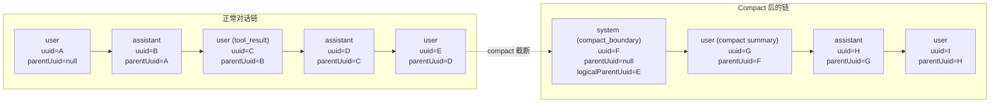
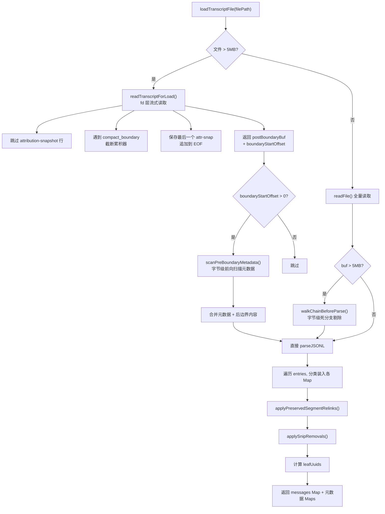
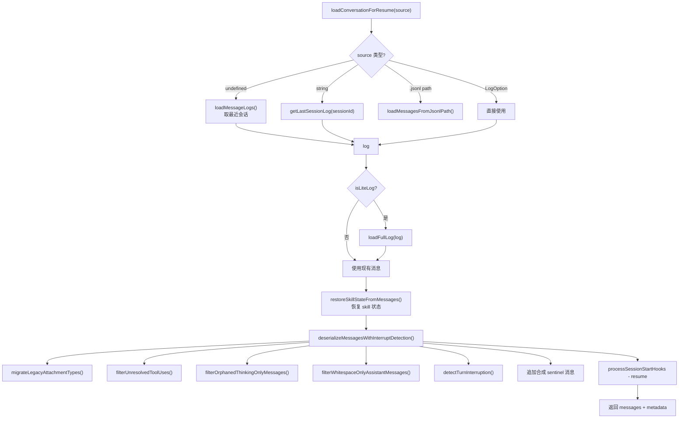
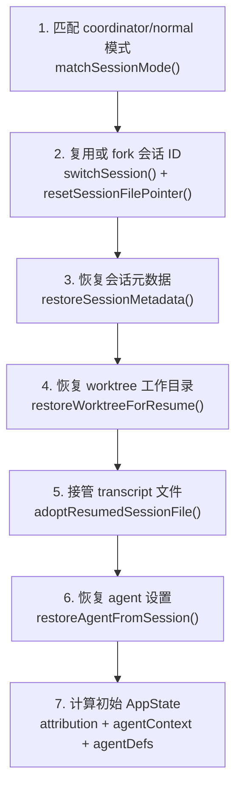

# 12. 会话存储与恢复

Claude Code 的每次对话都会被持久化到磁盘上的 JSONL 文件中。这不是简单的"日志记录"——它是一个精心设计的 append-only 链式结构，支持分支、压缩、子代理隔离和崩溃恢复。本文从写入、读取、恢复三条路径出发，解剖这套系统的完整运作方式。

## 1. Transcript 文件结构

### 物理存储

每个会话对应一个 JSONL 文件，路径规则：

```
~/.config/claude/projects/{sanitizePath(projectDir)}/{sessionId}.jsonl
```

- `sanitizePath()` 将路径中所有非字母数字字符替换为连字符，超过 200 字符时截断并附加哈希后缀
- 子代理的 transcript 写入同一文件，通过 `isSidechain: true` 和 `agentId` 字段隔离
- 文件只追加，不删改（tombstone 是例外，见后文）

每行是一个独立的 JSON 对象。文件中混杂着两大类条目：

| 类别 | Entry type | 说明 |
|------|-----------|------|
| **消息** | `user`, `assistant`, `attachment`, `system` | 参与 parentUuid 链的对话消息 |
| **元数据** | `summary`, `custom-title`, `ai-title`, `tag`, `agent-name`, `agent-setting`, `mode`, `pr-link`, `worktree-state`, `file-history-snapshot`, `attribution-snapshot`, `content-replacement`, `last-prompt`, `task-summary` 等 | 会话级别的辅助信息，不参与链 |

### Entry 类型全景

完整的 `Entry` 联合类型定义在 `types/logs.ts` 中，是 `TranscriptMessage | SummaryMessage | CustomTitleMessage | ...` 近 20 种类型的联合。`isTranscriptMessage()` 是判断"是否参与对话链"的唯一 source of truth：

```typescript
// sessionStorage.ts
export function isTranscriptMessage(entry: Entry): entry is TranscriptMessage {
  return (
    entry.type === 'user' ||
    entry.type === 'assistant' ||
    entry.type === 'attachment' ||
    entry.type === 'system'
  )
}
```

注意 `progress` 类型被排除在外。这是一个从血泪教训中得来的设计——早期 progress 也参与链，导致了链分叉和孤立消息的 bug（#14373, #23537）。现在 progress 被定义为 `isEphemeralToolProgress()`——它们仍然可以写入 JSONL（历史兼容），但不参与 parentUuid 链构建（`isChainParticipant()` 返回 `false`）。

### SerializedMessage 基础字段

每条消息写入时携带一组标准字段：

| 字段 | 来源 | 说明 |
|------|------|------|
| `cwd` | `getCwd()` | 当时的工作目录 |
| `userType` | `process.env.USER_TYPE` | 用户类型（external/internal） |
| `entrypoint` | `CLAUDE_CODE_ENTRYPOINT` | 入口点标识（cli/sdk-ts/sdk-py） |
| `sessionId` | `getSessionId()` | 会话 ID（在 `--fork-session` 时重新打戳） |
| `timestamp` | `new Date().toISOString()` | 写入时间 |
| `version` | `MACRO.VERSION` | CLI 版本号 |
| `gitBranch` | `getBranch()` | 当时的 git 分支 |
| `slug` | `getPlanSlugCache()` | plan 文件关联的 slug |

这些字段在 `insertMessageChain()` 中被追加到每条消息上，且 **必须排在对象展开之后**——因为 `--fork-session` 和 `--resume` 传入的消息已经携带了源会话的 sessionId/cwd，如果不重新打戳，`loadFullLog()` 的 sessionId 键控查找会找不到对应的 `contentReplacements`。

## 2. TranscriptMessage 关键字段

`TranscriptMessage` 在 `SerializedMessage` 基础上扩展了链式结构字段：

```typescript
export type TranscriptMessage = SerializedMessage & {
  parentUuid: UUID | null       // 指向父消息，null 表示 compact 边界
  logicalParentUuid?: UUID | null  // compact 时保存逻辑父关系
  isSidechain: boolean          // true = 子代理消息
  agentId?: string              // 子代理 ID
  teamName?: string             // 团队名称
  agentName?: string            // 代理别名
  promptId?: string             // OTel 关联 ID
}
```

三个关键字段的语义值得仔细理解：

**`parentUuid`** —— 物理链接。每条消息指向它的前一条消息，形成单链表。`null` 有特殊含义：这里是一个 compact 边界（压缩发生过），之前的内容已经被摘要替代。

**`logicalParentUuid`** —— 逻辑链接。仅在 compact boundary 消息上存在。compact 时 `parentUuid` 被置为 `null` 以截断链，但逻辑上的父消息 UUID 保存在这里，用于恢复时的跨边界处理。

**`isSidechain`** —— 隔离标记。子代理的消息和主对话共存于同一个 JSONL 文件中，但通过这个字段隔离。`loadTranscriptFile()` 计算 leaf UUID 时跳过 sidechain 消息，确保 `--resume` 总是恢复主对话。

### parentUuid 链示意图



## 3. 写入路径

### 延迟物化

Claude Code 不会在会话开始时立即创建 JSONL 文件。`Project` 类维护一个 `pendingEntries` 缓冲区和一个 `sessionFile: string | null` 指针：

1. 会话开始时 `sessionFile` 为 `null`，所有 `appendEntry()` 调用的条目进入 `pendingEntries`
2. 当 `insertMessageChain()` 检测到有 `user` 或 `assistant` 类型的消息时，才调用 `materializeSessionFile()`
3. 物化过程：创建文件、写入 `reAppendSessionMetadata()`、刷出所有 `pendingEntries`

这个设计意味着纯 hook/attachment 消息不会创建空会话文件，减少了 `~/.config/claude/projects/` 下的垃圾文件。

### insertMessageChain()

这是写入对话消息的核心方法。它将一个消息数组按序写入 JSONL 并维护 parentUuid 链：

```
insertMessageChain(messages, isSidechain, agentId, startingParentUuid)
  |
  +-- 检查 sessionFile 是否为 null -> 触发 materializeSessionFile()
  +-- 获取 git branch 和 plan slug
  |
  +-- for each message:
       +-- compact boundary? -> parentUuid = null, logicalParentUuid = 当前 parent
       +-- tool_result 且有 sourceToolAssistantUUID? -> parentUuid = 那个 assistant
       +-- 否则 -> parentUuid = 上一条链消息的 uuid
       |
       +-- 组装 TranscriptMessage（加上 cwd, sessionId, timestamp, version 等）
       +-- 调用 appendEntry() 写入
       +-- isChainParticipant(message)? -> 更新 parentUuid 游标
```

`tool_result` 消息的 `parentUuid` 指向的不是"上一条消息"，而是其对应的 assistant 消息（通过 `sourceToolAssistantUUID`）。这在并行工具调用时构成 DAG 而非简单链表——这是后面 `recoverOrphanedParallelToolResults()` 需要处理的根源。

### recordTranscript() 去重层

`recordTranscript()` 是 `insertMessageChain()` 之上的去重包装：

```typescript
export async function recordTranscript(
  messages: Message[],
  teamInfo?: TeamInfo,
  startingParentUuidHint?: UUID,
): Promise<UUID | null> {
  const messageSet = await getSessionMessages(sessionId)  // 已有 UUID 集合
  const newMessages = []
  for (const m of cleanedMessages) {
    if (messageSet.has(m.uuid)) {
      // 只跟踪前缀中的已录制消息
      if (!seenNewMessage && isChainParticipant(m)) {
        startingParentUuid = m.uuid
      }
    } else {
      newMessages.push(m)
      seenNewMessage = true
    }
  }
  if (newMessages.length > 0) {
    await getProject().insertMessageChain(newMessages, ...)
  }
}
```

为什么需要"前缀跟踪"这个看似古怪的逻辑？因为 compaction 之后，`messagesToKeep`（保留的旧消息）和新的 compact boundary / summary 一起传入。如果跟踪所有已录制消息的 UUID 作为 parent，新消息会链接到 compact 之前的 UUID 上，而不是 compact boundary 之后的 summary 上——这会孤立整个 compact 边界。

### 物理写入

最终的写入通过 `enqueueWrite()` 进入一个队列化的 `appendFile` 调用。序列化使用 `jsonStringify`（内部是 `JSON.stringify`），每条记录后追加换行符。`cleanMessagesForLogging()` 在写入前清理消息（去除内部 skill 元数据、处理工具结果缓存等）。

### Tombstone 删除

作为 append-only 规则的唯一例外，`removeMessageByUuid()` 支持从 JSONL 中物理删除一条消息。这用于清理流式传输失败后的孤立消息（orphaned messages）。

实现很精巧：先读取文件尾部 64KB（消息通常是最近追加的），在字节级别定位 `"uuid":"<targetUuid>"` 所在的行，然后用 `ftruncate` + 尾部重写完成原子删除。对于尾部找不到的情况（罕见——需要很多大条目在写入和 tombstone 之间追加），回退到全文件读写，但有 50MB 上限保护（`MAX_TOMBSTONE_REWRITE_BYTES`）防止 OOM。

## 4. 读取路径

### loadTranscriptFile() —— 不只是解析器

`loadTranscriptFile()` 是整个存储系统中最复杂的函数（约 350 行），与其说它是一个"JSONL 解析器"，不如说它是一个**链重建算法**：



#### 大文件优化

对于大于 5MB 的文件（`SKIP_PRECOMPACT_THRESHOLD`），系统使用三层优化：

1. **fd 层跳过**：`readTranscriptForLoad()` 以 1MB 为块逐块读取文件，在字节级别：
   - 识别 `attribution-snapshot` 行并跳过（这些行可能占文件体积的 84%+）
   - 遇到 `compact_boundary` 行则清空累积器——因为边界之前的消息已经被摘要替代
   - 保留最后一个 attr-snap 追加到输出末尾

2. **死分支剔除**：`walkChainBeforeParse()` 在 JSON 解析之前，用字节级扫描找到所有消息的 UUID 和 parentUuid，从最新的 leaf 反向 walk 标记活跃消息，然后只保留活跃消息行和元数据行。实测效果：41MB / 99% 死分支的文件，parseJSONL 从 56ms 降到 3.9ms。

3. **元数据恢复**：`scanPreBoundaryMetadata()` 对 compact boundary 之前的文件区域做一次轻量前向扫描，只提取元数据行（agent-setting, mode, tag 等），避免丢失 compact 前写入的会话设置。

#### Legacy Progress 桥接

PR #24099 之后 progress 类型不再参与链，但历史文件中的 progress 仍然占据 parentUuid 链上的位置。`loadTranscriptFile()` 通过 `progressBridge` Map 实现透明桥接：

```
A -> progress(P1) -> progress(P2) -> B
         | 桥接后
A -> B (B.parentUuid 被重写为 A)
```

#### 并行工具结果恢复

`buildConversationChain()` 从 leaf 沿 parentUuid 向根方向 walk，但在并行工具调用场景下，多个 assistant 消息共享同一个 `message.id`（streaming 时每个 content_block_stop 生成一个独立的 AssistantMessage），形成 DAG 而非链表。单向 walk 会丢失分支。

`recoverOrphanedParallelToolResults()` 作为 `buildConversationChain()` 的后处理步骤，找回被遗漏的兄弟 assistant 和对应 tool_result，按时间戳排序后插入正确位置。

#### Leaf UUID 计算

`loadTranscriptFile()` 的最后阶段计算 `leafUuids`——没有子消息指向它们的消息集合。算法是：

1. 收集所有 `parentUuid` 构成 `parentUuids` 集合
2. 找出不在 `parentUuids` 中的终端消息（`terminalMessages`）
3. 从每个终端消息沿 parentUuid 向根 walk，找到最近的 `user` 或 `assistant` 类型消息作为 leaf
4. 跳过 `isSidechain: true` 的消息

leaf 计算有一个额外的优化开关 `tengu_pebble_leaf_prune`：如果启用，会额外跳过已经有 user/assistant 子消息的祖先节点，避免将中间节点误判为 leaf（例如一个 assistant 的 progress 子消息是终端的，但 assistant 本身还有 tool_result 子消息继续对话）。

## 5. 会话恢复流程

当用户运行 `claude --resume` 或 `claude --continue` 时，恢复流程涉及两个核心函数：

### loadConversationForResume() —— 加载与反序列化



### processResumedConversation() —— 状态重建 7 步



每一步的作用：

1. **模式匹配**：如果恢复的会话处于 coordinator 模式而当前不是（或反过来），插入一条警告消息
2. **会话 ID 处理**：非 fork 场景下，`switchSession()` 切换到恢复会话的 ID，重命名 asciicast 录制文件，恢复 cost 状态。fork 场景下保留新 ID 但需要补录 `contentReplacements`
3. **元数据恢复**：`restoreSessionMetadata()` 将 agentName、customTitle、tag、worktreeSession 等缓存到 Project 实例
4. **Worktree 恢复**：如果会话在 worktree 中退出，`process.chdir()` 回到那个目录；目录不存在则清除缓存
5. **文件接管**：`adoptResumedSessionFile()` 将 `Project.sessionFile` 指向恢复的 JSONL 文件，后续写入追加到原文件
6. **Agent 恢复**：如果会话使用了自定义 agent，恢复其 model override 和 agent type
7. **状态计算**：组装初始 `AppState`，包含 attribution、standaloneAgentContext、刷新后的 agentDefinitions

### 反序列化中的自动修复

`deserializeMessagesWithInterruptDetection()` 不只是"反序列化"，它包含一系列自动修复逻辑：

- **Legacy attachment 迁移**：`new_file` -> `file`，`new_directory` -> `directory`，补填 `displayPath`
- **无效 permissionMode 清理**：不在当前 build 合法值集合中的 mode 被置为 `undefined`
- **未闭合工具调用过滤**：`filterUnresolvedToolUses()` 移除没有对应 `tool_result` 的 `tool_use`
- **孤立 thinking 消息过滤**：只含 thinking block 的 assistant 消息在恢复时会导致 API 错误
- **空白 assistant 消息过滤**：用户在 thinking 后取消，只留下 `\n\n` 的消息被移除
- **尾部 sentinel 插入**：如果最后一条消息是 user 类型，追加一个 `NO_RESPONSE_REQUESTED` 的 assistant 消息确保 API 合法性

## 6. 中断检测

`detectTurnInterruption()` 分析恢复后消息的尾部状态，返回三种结果之一：

| 场景 | 最后相关消息 | 返回 |
|------|------------|------|
| 正常结束 | assistant（非 API error） | `none` |
| 用户输入未处理 | user（纯文本） | `interrupted_prompt` |
| 工具调用中断 | user（tool_result） | `interrupted_turn` |
| 附件未处理 | attachment | `interrupted_turn` |
| 系统/进度消息 | 跳过，继续向前找 | - |

`interrupted_turn` 最终被转换为 `interrupted_prompt`：系统自动注入一条 "Continue from where you left off." 的 user 消息。调用者只需处理 `interrupted_prompt` 一种情况。

有一个精妙的特殊处理：如果 `tool_result` 对应的 `tool_use` 是 `SendUserMessage`（Brief 模式的终端工具），则认为轮次正常结束而非中断。这通过 `isTerminalToolResult()` 反向查找 tool_use 的 name 来判断。

### 一致性检查

`checkResumeConsistency()` 在恢复时运行，检查磁盘上的链重建结果与会话内记录的 `messageCount` 是否一致。它从恢复的消息尾部找到最后一个 `turn_duration` 系统消息（内含 `messageCount` 字段），将其位置与链中的 index 比较：

- `delta > 0`：恢复加载了比会话内更多的消息（常见故障模式——compact/snip 操作修改了内存状态但 parentUuid walk 重建了不同的集合）
- `delta < 0`：恢复丢失了消息（链截断类 bug）
- `delta = 0`：完全一致

这个检查纯粹是诊断性的——它不阻塞恢复，只向 BigQuery 发送 `tengu_resume_consistency_delta` 事件，帮助工程团队监控写入→读取往返的漂移。

## 7. Compact Boundary 编码

当对话过长触发上下文压缩（compact）时，系统不会删除历史消息——它们仍然保留在 JSONL 文件中。取而代之的是：

1. 插入一条 `type: 'system', subtype: 'compact_boundary'` 的消息
2. 这条消息的 **`parentUuid` 被设为 `null`**——这是"断链"信号
3. 原始的父 UUID 保存在 `logicalParentUuid` 中

```typescript
// insertMessageChain() 中的关键逻辑
const transcriptMessage: TranscriptMessage = {
  parentUuid: isCompactBoundary ? null : effectiveParentUuid,
  logicalParentUuid: isCompactBoundary ? parentUuid : undefined,
  // ...
}
```

恢复时，`buildConversationChain()` 从 leaf 向根 walk，遇到 `parentUuid === null` 就停止。这意味着 compact boundary 之前的所有消息天然被排除——无需任何特殊过滤逻辑。

### scanPreBoundaryMetadata —— 跨边界恢复元数据

compact 断链解决了消息的问题，但会话级元数据（agent-setting, mode, tag, pr-link 等）可能在 boundary 之前写入。如果不恢复它们，恢复后的会话会丢失 agent 设置或模式信息。

`scanPreBoundaryMetadata()` 解决这个问题：它对 `[0, boundaryStartOffset)` 区间做一次字节级前向扫描，通过预编译的 `METADATA_MARKER_BUFS`（如 `"agent-setting"`, `"mode"` 等的 Buffer 表示）快速定位元数据行并全量解析。大多数数据块（包含对话消息内容的）一个 marker 都不包含，整块跳过。

### Preserved Segment

某些 compact 场景需要保留 boundary 之前的一段消息（`preservedSegment`）。`readTranscriptForLoad()` 遇到带 `preservedSegment` 的 boundary 时不截断累积器，因为被保留的消息物理上在 boundary 之前但逻辑上仍需参与链重建。

`applyPreservedSegmentRelinks()` 在 `loadTranscriptFile()` 的后处理阶段完成重新链接。它的工作方式是：从 `preservedSegment.tailUuid` 沿 parentUuid walk 到 `headUuid`，收集所有保留消息的 UUID 集合；然后将 head 的 parentUuid 重写为 anchor（通常是最后一个 summary 消息），并清理边界之前的非保留消息。如果 walk 中断（某个 UUID 不在 transcript 中），则跳过整个 relink——这让恢复退回到加载完整历史的安全路径。

## 8. 子代理 Transcript

子代理（AgentTool）的消息与主对话共存于同一个 JSONL 文件中，通过以下机制隔离：

- **写入**：`recordSidechainTranscript()` 调用 `insertMessageChain(messages, true, agentId)` —— `isSidechain` 为 `true`
- **agentId 标记**：每条 sidechain 消息携带 `agentId` 字段，标识所属子代理
- **分组目录**：部分子代理（如 workflow）通过 `setAgentTranscriptSubdir()` 将元数据写入分组子目录
- **leaf 计算排除**：`loadTranscriptFile()` 计算 leaf 时跳过 `isSidechain: true` 的消息，确保 `--resume` 不会误恢复到子代理的对话分支

子代理的 `contentReplacements` 通过 `agentId` 键入独立的 `agentContentReplacements` Map，与主线程的 replacements 隔离。恢复子代理时，`resumeAgent.ts` 读取对应 agentId 的 replacement 记录重建缓存状态。

写入时机也值得注意：`runAgent()` 在启动子代理时立即录制初始消息（`recordSidechainTranscript(initialMessages, agentId)`），之后每条新消息增量录制，parent 指针由 `lastRecordedUuid` 跟踪。这保证了即使子代理中途崩溃，已完成的工具调用也不会丢失。

## 9. 写入队列与一致性

`Project` 类通过 `enqueueWrite()` 将所有写入排入队列，串行执行 `appendFile()`。这避免了并发写入导致的 JSONL 行交错问题。`trackWrite()` 包装所有写操作，维护一个 `pendingWrites` 计数器，`flush()` 方法等待所有排队写入完成——在进程退出时调用。

退出清理流程中，`reAppendSessionMetadata()` 将 customTitle、tag、agent-name 等元数据重新追加到文件末尾。这看起来像是重复写入，但有其必要性：`readLiteMetadata()` 只读取文件尾部 64KB（`LITE_READ_BUF_SIZE`），如果大量消息追加后 metadata 被推出窗口，`--resume` 列表中就看不到会话标题了。

值得一提的是 `reAppendSessionMetadata()` 对 SDK 可变字段（customTitle、tag）的处理：在重新追加之前，它先同步读取文件尾部，检查是否有 SDK 进程（如 VS Code 扩展的 `renameSession()`）写入了更新的值。如果有，用 SDK 的值覆盖内存缓存后再追加，避免 CLI 的陈旧值覆盖 SDK 的新值。

### Lite 元数据读取

`--resume` 的会话列表不需要加载每个 JSONL 的全部消息——那可能是 GB 级别的 I/O。`readLiteMetadata()` 只读取每个文件的 head（前 64KB）和 tail（后 64KB），从中提取：

- head：`firstPrompt`（第一条有意义的用户消息文本）、`sessionId`、`isSidechain`
- tail：`customTitle`、`tag`、`agentName`、`agentColor`、`summary`、`lastPrompt`、`mode` 等

这种头尾读取策略依赖于 `reAppendSessionMetadata()` 在退出时将关键元数据追加到文件末尾的保证。`readHeadAndTail()` 共享一个 Buffer 避免 per-file 分配开销，小文件（head 覆盖 tail）直接复用同一次读取结果。

## 10. 总结

Claude Code 的会话存储设计折射出一个核心权衡：**append-only 写入换取崩溃安全性，读取时用算法补偿结构复杂性**。parentUuid 链、compact boundary 断链、sidechain 隔离、死分支剔除——这些机制层层叠加，把一个简单的 JSONL 文件变成了一个支持分支/合并/压缩/恢复的微型数据库。代价是 `loadTranscriptFile()` 成为了一个约 350 行的算法，而 `processResumedConversation()` 需要 7 步才能把磁盘状态映射回内存。但好处也是明确的：即使进程被 kill -9，下次 `--resume` 总能恢复到一个一致的对话状态。
