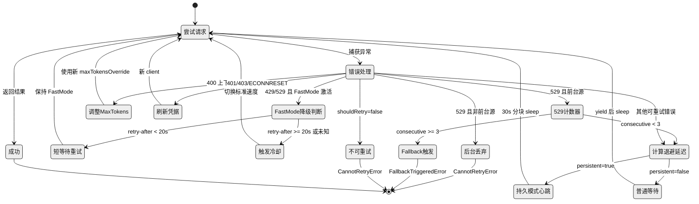

# Claude Code 源码分析：API Provider 路由、重试与错误治理

## 1. 概述

Claude Code 的 API 调用层不只是"发请求、拿结果"这么简单。它要处理四种不同的云 Provider、20 多种错误模式、Fast Mode 降级、持久模式无限重试、Beta Header 会话级锁定等一系列复杂场景。整个系统的核心设计哲学是：**前台请求尽一切可能重试成功，后台请求宁可丢弃也不放大故障**。

本篇聚焦 `src/services/api/` 目录，尤其是 `withRetry.ts`、`errors.ts`、`errorUtils.ts`、`claude.ts` 以及 `src/utils/model/providers.ts` 和 `src/utils/fastMode.ts`。

## 2. Provider 路由

### 2.1 四种 Provider

Claude Code 支持四种 API Provider，通过环境变量选择，优先级如下：

```
CLAUDE_CODE_USE_BEDROCK=1  →  bedrock
CLAUDE_CODE_USE_VERTEX=1   →  vertex
CLAUDE_CODE_USE_FOUNDRY=1  →  foundry
（以上都没设）              →  firstParty
```

路由逻辑在 `src/utils/model/providers.ts` 的 `getAPIProvider()` 中实现，是一个简单的 if-else 链，**Bedrock 优先级最高**：如果同时设置了 `CLAUDE_CODE_USE_BEDROCK` 和 `CLAUDE_CODE_USE_VERTEX`，Bedrock 胜出。

```typescript
export function getAPIProvider(): APIProvider {
  return isEnvTruthy(process.env.CLAUDE_CODE_USE_BEDROCK)
    ? 'bedrock'
    : isEnvTruthy(process.env.CLAUDE_CODE_USE_VERTEX)
      ? 'vertex'
      : isEnvTruthy(process.env.CLAUDE_CODE_USE_FOUNDRY)
        ? 'foundry'
        : 'firstParty'
}
```

### 2.2 Provider 差异对重试的影响

不同 Provider 在认证刷新、错误码语义和 Beta Header 支持上存在显著差异：

| 维度 | firstParty | Bedrock | Vertex | Foundry |
|------|-----------|---------|--------|---------|
| 认证方式 | OAuth / API Key | AWS IAM / STS | GCP OAuth | 自定义 |
| 凭据过期处理 | 401 → OAuth refresh | CredentialsProviderError 或 403 | Could not load/refresh credentials 或 401 | — |
| Fast Mode | ✅ 支持 | ❌ 不可用 | ❌ 不可用 | ❌ 不可用 |
| Beta Header 透传 | 直接传 betas 数组 | 通过 extraBodyParams 传递 | 直接传 | 直接传 |
| x-should-retry | 尊重 | N/A | N/A | N/A |

## 3. 请求构建管线

### 3.1 paramsFromContext 的三次调用

`claude.ts` 中定义的 `paramsFromContext(retryContext)` 是请求参数的核心构造函数。一次 API 调用周期中，它会被调用**至少 3 次**：

1. **日志/遥测调用**：在发请求前记录请求参数快照
2. **实际请求调用**：构建流式 API 请求的参数
3. **重试时再次调用**：每次重试都用新的 RetryContext 重新构建参数

这就是为什么一些消耗性资源（如 Cache Edits）必须在 `paramsFromContext` 定义之前就消费掉——如果放在里面，第一次调用就会"偷走"后续调用需要的数据：

```typescript
// Consume pending cache edits ONCE before paramsFromContext is defined.
// paramsFromContext is called multiple times (logging, retries), so consuming
// inside it would cause the first call to steal edits from subsequent calls.
const consumedCacheEdits = cachedMCEnabled ? consumePendingCacheEdits() : null
```

### 3.2 动态 max_tokens 调整

当 API 返回 400 错误 "input length and `max_tokens` exceed context limit" 时，重试逻辑会动态调整 maxTokensOverride：

```
availableContext = contextLimit - inputTokens - 1000(安全缓冲)
adjustedMaxTokens = max(FLOOR_OUTPUT_TOKENS, availableContext, thinkingBudget + 1)
```

**关键约束**：`FLOOR_OUTPUT_TOKENS = 3000`。即使上下文快满了，也至少保留 3000 tokens 给输出。如果连 3000 都不够，直接报错退出而不是白白重试。

## 4. 重试状态机

### 4.1 withRetry Generator 模式

`withRetry` 是一个 **AsyncGenerator**，不是普通的 async 函数。这个设计允许它在等待重试时通过 `yield` 向上游报告状态（比如显示"正在重试，预计等待 X 秒"的消息），而不是让调用方完全失去控制。

```typescript
export async function* withRetry<T>(
  getClient: () => Promise<Anthropic>,
  operation: (client: Anthropic, attempt: number, context: RetryContext) => Promise<T>,
  options: RetryOptions,
): AsyncGenerator<SystemAPIErrorMessage, T> {
  // ...
}
```

### 4.2 重试状态机流程图



### 4.3 指数退避策略

```typescript
const baseDelay = Math.min(BASE_DELAY_MS * Math.pow(2, attempt - 1), maxDelayMs)
const jitter = Math.random() * 0.25 * baseDelay
return baseDelay + jitter
```

- **BASE_DELAY_MS = 500ms**
- **默认上限 = 32s**（普通模式）
- **持久模式上限 = 5min**
- 在 base 延迟上叠加 0-25% 的随机抖动，避免"惊群效应"

退避序列示例（不含抖动）：500ms → 1s → 2s → 4s → 8s → 16s → 32s（封顶）

### 4.4 529 Fallback 机制

**MAX_529_RETRIES = 3**：连续 3 次 529 错误触发模型降级。

降级路径：
1. 如果配置了 `fallbackModel` → 抛 `FallbackTriggeredError`，上层切换到备用模型
2. 如果是外部用户且没有 fallback → 抛 `CannotRetryError`，显示 "Repeated 529 Overloaded errors"
3. 如果是持久模式 → 不触发 fallback，继续无限重试

一个重要细节：`initialConsecutive529Errors` 选项允许调用方**预填** 529 计数器。当流式请求遇到 529 后降级为非流式请求时，流式阶段的 529 次数会带过来，确保总 fallback 阈值一致。

## 5. 错误分类管线

### 5.1 错误分类全景

`classifyAPIError()` 函数负责将任何错误映射为标准化的字符串标签。这些标签用于遥测 / Datadog 打点。以下是完整的分类清单：

| 分类标签 | 触发条件 | 是否可重试 |
|---------|---------|-----------|
| `aborted` | Request was aborted. | ❌ |
| `api_timeout` | APIConnectionTimeoutError 或消息含 timeout | ❌ |
| `repeated_529` | 消息含 Repeated 529 Overloaded errors | ❌ |
| `capacity_off_switch` | 消息含 off-switch 文案 | ❌ |
| `rate_limit` | HTTP 429 | 有条件 |
| `server_overload` | HTTP 529 或消息含 overloaded_error | ✅ |
| `prompt_too_long` | 消息含 prompt is too long | ❌ |
| `pdf_too_large` | 匹配 maximum of N PDF pages | ❌ |
| `pdf_password_protected` | 消息含 password protected | ❌ |
| `image_too_large` | 400 + image exceeds 或 image dimensions exceed | ❌ |
| `tool_use_mismatch` | 400 + tool_use ids without tool_result | ❌ |
| `unexpected_tool_result` | 400 + unexpected tool_use_id | ❌ |
| `duplicate_tool_use_id` | 400 + tool_use ids must be unique | ❌ |
| `invalid_model` | 400 + invalid model name | ❌ |
| `credit_balance_low` | 消息含 Credit balance is too low | ❌ |
| `invalid_api_key` | 消息含 x-api-key | ❌ |
| `token_revoked` | 403 + OAuth token has been revoked | ✅（刷新后） |
| `oauth_org_not_allowed` | 401/403 + org 不允许 | ❌ |
| `auth_error` | 其他 401/403 | ✅（刷新后） |
| `bedrock_model_access` | Bedrock + 消息含 model id | ❌ |
| `server_error` | HTTP 5xx | ✅ |
| `client_error` | HTTP 4xx（兜底） | ❌ |
| `ssl_cert_error` | SSL 错误码 | ❌ |
| `connection_error` | APIConnectionError | ✅ |
| `unknown` | 无法分类 | ❌ |

### 5.2 shouldRetry 决策链

`shouldRetry()` 的决策逻辑值得单独展开，因为它包含多个用户类型门控：

1. **Mock 错误** → 永不重试（测试用）
2. **持久模式** → 429/529 永远重试（绕过所有门控）
3. **CCR 模式** → 401/403 视为瞬态错误重试
4. **overloaded_error 文本** → 重试（SDK 有时丢失 529 状态码）
5. **上下文溢出 400** → 重试（调整 max_tokens）
6. **x-should-retry: true** → 非订阅用户或企业用户重试
7. **x-should-retry: false** → 仅 Ant 的 5xx 忽略此 header
8. **连接错误** → 重试
9. **408/409** → 重试
10. **429** → 非订阅用户或企业用户重试
11. **401** → 清缓存后重试
12. **OAuth 403** → 刷新 token 后重试
13. **5xx** → 重试

## 6. Fast Mode 降级

### 6.1 降级决策

Fast Mode 是 Claude Code 的"加速模式"（内部代号 Penguin Mode），仅在 firstParty Provider 上可用。遇到 429/529 时有两条路径：

**路径一：短等待重试（保持 Fast Mode）**

当 `retry-after` 响应头的值**小于 20 秒**（`SHORT_RETRY_THRESHOLD_MS`）时，直接等待该时长后重试，**不切换模型**。这样做的目的是保持 prompt cache——相同模型名意味着缓存命中。

**路径二：触发冷却（降级到标准速度）**

当 `retry-after >= 20秒` 或没有此 header 时：
- 冷却时长 = `max(retry-after, MIN_COOLDOWN_MS=600000ms)`
- 默认冷却 = `DEFAULT_FAST_MODE_FALLBACK_HOLD_MS = 30分钟`
- **最低保底 = 10 分钟**（`MIN_COOLDOWN_MS`），防止反复切换导致缓存颠簸

冷却期间，`retryContext.fastMode` 被设为 `false`，后续请求自动使用标准速度模型。冷却到期后自动恢复。

### 6.2 Overage 拒绝

当 429 响应包含 `anthropic-ratelimit-unified-overage-disabled-reason` header 时，说明不是暂时的限速，而是计费层面不支持 Fast Mode。此时**永久禁用** Fast Mode（除非是额度耗尽的情况，那只是暂时禁用）。

### 6.3 API 层面的拒绝

当 API 返回 400 "Fast mode is not enabled" 时，说明组织根本没开启 Fast Mode。此时也永久禁用，并更新本地配置。

## 7. Beta Headers 与 Sticky Latches

### 7.1 问题背景

Claude API 的服务端对请求做 prompt caching，缓存键包含 Beta Headers。如果会话中途某个 header 突然出现或消失（比如用户切换了 auto mode），缓存键就变了，已缓存的 ~50-70K tokens 全部作废。

### 7.2 Sticky Latch 机制

解决方案是**会话级单向锁定**（sticky-on latches）：一旦某个 beta header 在某次请求中被发送过，它就会在整个会话剩余时间内**持续发送**。

四个 Sticky Latch：

| Latch | 对应 Header | 锁定条件 |
|-------|------------|---------|
| `fastModeHeaderLatched` | Fast Mode beta | Fast Mode 首次激活 |
| `afkHeaderLatched` | AFK Mode beta | Auto Mode 首次激活（仅 agentic 查询） |
| `cacheEditingHeaderLatched` | Cache Editing beta | Cached Microcompact 首次启用 |
| `thinkingClearLatched` | Thinking Clear beta | 上次 API 响应超过 1 小时前 |

**锁定方向**：只能从 off → on，不能反向。

**清除时机**：`/clear` 和 `/compact` 命令会调用 `clearBetaHeaderLatches()`，因为这些操作本身就会让缓存失效。

### 7.3 非 Agentic 查询的隔离

一个精妙的细节：Sticky Latch 只从 agentic 查询（主线程交互）中锁定，分类器等非 agentic 查询不会触发锁定。这保证了分类器调用有自己稳定的 header 集合，不会意外改变主线程的缓存键。

## 8. 529：前台 vs 后台

### 8.1 设计原则

这是整个重试系统中最有工程洞察的设计之一。

在 API 过载（529）时，每一次重试对后端来说都是额外的 3-10 倍请求放大（经过网关、负载均衡、重试链路）。如果所有后台任务也跟着重试，系统会陷入"级联雪崩"。

### 8.2 前台/后台分类

```typescript
const FOREGROUND_529_RETRY_SOURCES = new Set<QuerySource>([
  'repl_main_thread',                     // 主交互线程
  'repl_main_thread:outputStyle:custom',   // 自定义输出风格
  'repl_main_thread:outputStyle:Explanatory',
  'repl_main_thread:outputStyle:Learning',
  'sdk',                                   // SDK 调用
  'agent:custom', 'agent:default', 'agent:builtin',  // Agent 工具
  'compact',                               // 上下文压缩
  'hook_agent', 'hook_prompt',             // Hook 系统
  'verification_agent',                    // 验证 Agent
  'side_question',                         // 侧边问题
  'auto_mode',                             // 安全分类器
])
```

**不在这个集合中的**（title 生成、suggestion 生成、摘要等后台任务）→ 529 时**立即丢弃**，不重试。

设计很克制：新增的 `QuerySource` 默认是不重试的，必须显式加入白名单才行。这种"默认安全"的策略避免了新功能意外引入重试放大。

### 8.3 遥测跟踪

后台丢弃时会发 `tengu_api_529_background_dropped` 事件，附带 `query_source`，方便事后分析哪些后台任务受影响最多。

## 9. 持久模式

### 9.1 启用条件

通过 `CLAUDE_CODE_UNATTENDED_RETRY=1` 环境变量启用（还需要 `UNATTENDED_RETRY` feature flag 为真，但这是 Ant-only 功能）。

### 9.2 行为差异

持久模式的核心区别：

- **429/529 永远可重试**：绕过 `shouldRetry` 的所有门控
- **不触发 fallback**：即使 529 超过 3 次也不切模型
- **不使用 Fast Mode 降级路径**：直接走持久退避
- **循环不终止**：通过 `attempt = maxRetries` 钳位，让 for 循环永不退出

### 9.3 30 秒心跳

持久模式的长等待期间，每 30 秒 yield 一次 `SystemAPIErrorMessage`。这不是为了好看——宿主环境（CI/CD、远程容器）会监控 stdout 活动，超过一定时间没输出就判定进程 idle 并杀掉。30 秒心跳确保进程看起来"还活着"。

```typescript
let remaining = delayMs
while (remaining > 0) {
  if (options.signal?.aborted) throw new APIUserAbortError()
  yield createSystemAPIErrorMessage(error, remaining, reportedAttempt, maxRetries)
  const chunk = Math.min(remaining, HEARTBEAT_INTERVAL_MS)  // 30s
  await sleep(chunk, options.signal, { abortError })
  remaining -= chunk
}
```

### 9.4 429 窗口限制处理

对于 429 限速，持久模式会检查 `anthropic-ratelimit-unified-reset` header（Unix 时间戳），计算距离重置的精确毫秒数，直接等到重置时刻而不是盲目指数退避。5 小时 Max/Pro 配额限速就靠这个机制等到配额刷新。

**安全上限**：`PERSISTENT_RESET_CAP_MS = 6小时`，无论 header 说多久，最多等 6 小时。

## 10. 凭据刷新与连接修复

### 10.1 凭据失败时的客户端重建

`withRetry` 会在以下情况重新获取 API 客户端（`getClient()`）：

- **首次调用**（`client === null`）
- **OAuth 401**：token 过期 → 调用 `handleOAuth401Error` 刷新
- **OAuth 403**："token revoked" → 同上
- **Bedrock 403**：IAM 凭据过期 → `clearAwsCredentialsCache()`
- **Vertex 401**：GCP 凭据过期 → `clearGcpCredentialsCache()`
- **ECONNRESET/EPIPE**：长连接断了 → `disableKeepAlive()` 然后重连

### 10.2 ECONNRESET 处理

Keep-alive 连接有时会被中间代理静默断开。检测到 `ECONNRESET` 或 `EPIPE` 后，系统会**永久关闭 HTTP 连接池**，后续请求都走短连接。这是一个不可逆操作，宁可牺牲性能也要保证可靠性。

## 11. 关键阈值表

| 常量 | 值 | 含义 |
|-----|---|------|
| `DEFAULT_MAX_RETRIES` | 10 | 默认最大重试次数 |
| `BASE_DELAY_MS` | 500ms | 指数退避基础延迟 |
| `FLOOR_OUTPUT_TOKENS` | 3000 | max_tokens 下限 |
| `MAX_529_RETRIES` | 3 | 连续 529 触发 fallback |
| `SHORT_RETRY_THRESHOLD_MS` | 20,000ms (20s) | Fast Mode 短等待/冷却分界 |
| `MIN_COOLDOWN_MS` | 600,000ms (10min) | Fast Mode 最低冷却时间 |
| `DEFAULT_FAST_MODE_FALLBACK_HOLD_MS` | 1,800,000ms (30min) | Fast Mode 默认冷却时间 |
| `PERSISTENT_MAX_BACKOFF_MS` | 300,000ms (5min) | 持久模式最大退避 |
| `PERSISTENT_RESET_CAP_MS` | 21,600,000ms (6h) | 持久模式等待上限 |
| `HEARTBEAT_INTERVAL_MS` | 30,000ms (30s) | 持久模式心跳间隔 |
| `maxDelayMs`（默认） | 32,000ms (32s) | 普通模式退避上限 |
| `CACHE_TTL_1HOUR_MS` | 3,600,000ms (1h) | Thinking Clear latch 门槛 |

## 12. 错误消息构建

### 12.1 用户可见消息

`getAssistantMessageFromError()` 是将原始 API 错误转化为用户可见消息的"翻译层"。它的复杂度来源于需要为不同场景（交互式/非交互式、Ant/外部用户、不同 Provider）生成不同的提示文案。

几个值得注意的设计：

- **非交互式模式**下不会建议"按 ESC"之类的键盘操作
- **Bedrock 403 错误**会在消息中包含实际模型名，因为原始错误不带
- **组织被禁用**时会检测 API Key 来源，区分"环境变量覆盖了 OAuth"和"真的被禁用了"这两种情况
- **429 限速消息**会解析多种 rate limit headers（`unified-representative-claim`、`overage-status`、`unified-reset`）来生成精确的限速说明

### 12.2 HTML 清洗

API 返回的错误有时会包含 CloudFlare 的 HTML 错误页面。`sanitizeMessageHTML()` 会检测 `<!DOCTYPE html>` 或 `<html>` 标签，提取 `<title>` 作为用户可见消息，避免在终端里渲染一整个 HTML 页面。

## 13. 总结

Claude Code 的重试与错误治理体系体现了几个成熟的工程判断：

1. **前台/后台分治**：不是所有请求都值得重试。后台请求在过载时立即丢弃，避免了级联放大这个分布式系统的经典陷阱。

2. **缓存键稳定性**：Sticky Latch 机制牺牲了灵活性换取缓存命中率。50-70K tokens 的 prompt cache 价值很高，一次缓存未命中意味着额外的延迟和成本。

3. **分层降级**：Fast Mode → 标准速度 → Fallback 模型 → 持久等待，每一层都有明确的触发条件和恢复路径。

4. **默认安全**：新增的 `QuerySource` 默认不重试 529，新增的 Beta Header 默认不锁定。需要显式 opt-in 才能改变行为。

5. **可观测性**：每个关键决策点（fallback 触发、后台丢弃、Fast Mode 冷却、持久等待）都有对应的遥测事件，运营团队能在 Datadog 上看到完整的决策链路。
