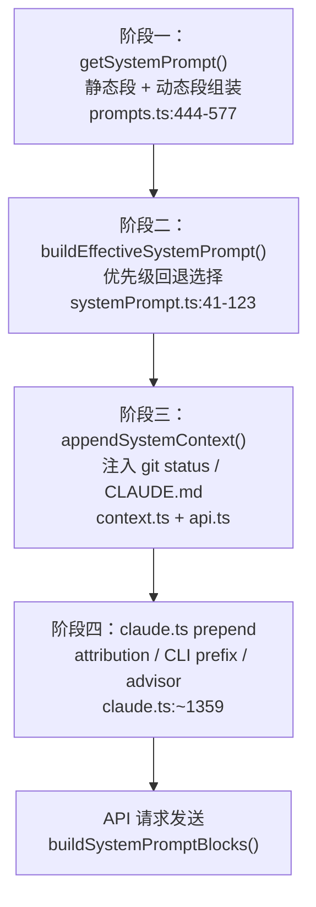

# 14. Prompt 系统——多阶段编译与缓存稳定性

Claude Code 的 prompt 系统是整个产品的灵魂。它不是一个简单的字符串拼接，而是一个分阶段编译、有明确缓存边界、按职责分层的 prompt 工程体系。理解这套系统，等于理解了 Claude Code "为什么这样做"的核心逻辑。

本文从主 prompt 的编译流水线出发，逐层拆解静态段与动态段的设计、缓存边界的工程考量、工具级 prompt 的微控制策略、Slash 命令的任务脚本化、Agent prompt 的继承体系，以及压缩和二级模型的 prompt 设计。

---

## 1. 系统 Prompt 的多阶段编译

一条完整的系统 prompt 从用户启动 CLI 到最终发送给 API，要经过四个阶段的编译。每个阶段有不同的职责和数据来源。

### 阶段一：getSystemPrompt() — 主体构建

入口在 `src/constants/prompts.ts:444-577`。这个函数负责组装系统 prompt 的主体结构，它把内容分为两大区域：

```typescript
return [
  // --- 静态内容（可缓存） ---
  getSimpleIntroSection(outputStyleConfig),
  getSimpleSystemSection(),
  getSimpleDoingTasksSection(),
  getActionsSection(),
  getUsingYourToolsSection(enabledTools),
  getSimpleToneAndStyleSection(),
  getOutputEfficiencySection(),
  // === 边界标记 ===
  ...(shouldUseGlobalCacheScope() ? [SYSTEM_PROMPT_DYNAMIC_BOUNDARY] : []),
  // --- 动态内容（注册表管理） ---
  ...resolvedDynamicSections,
].filter(s => s !== null)
```

这个结构看起来简单，但它蕴含了一个关键的工程决策：静态内容和动态内容之间有一条显式边界，这条边界直接决定了 API 层面的缓存策略。

### 阶段二：buildEffectiveSystemPrompt() — 优先级回退

入口在 `src/utils/systemPrompt.ts:41-123`。这个阶段负责决定"用谁的 prompt"，有五个优先级：

1. **Override**（最高优先级）：loop 模式下的临时覆盖，直接替换一切
2. **Coordinator**：coordinator 模式的专用 prompt（`feature('COORDINATOR_MODE')` 控制，当前关闭）
3. **Agent**：主线程 Agent 定义的 prompt（内置 Agent 用 `getSystemPrompt()` 获取）
4. **Custom**：用户通过 `--system-prompt` 传入的自定义 prompt
5. **Default**：标准 Claude Code prompt（即阶段一构建的结果）

实际上对于绝大多数用户，走的都是第 5 条路径。但这套优先级设计保证了在 Agent 模式、SDK 嵌入等场景下，prompt 可以被精确替换而不是粗暴覆盖。

```typescript
return asSystemPrompt([
  ...(agentSystemPrompt
    ? [agentSystemPrompt]
    : customSystemPrompt
      ? [customSystemPrompt]
      : defaultSystemPrompt),
  ...(appendSystemPrompt ? [appendSystemPrompt] : []),
])
```

注意 `appendSystemPrompt` 始终追加在末尾，不受优先级影响。这为 SDK 调用方提供了一个"无论怎么选 prompt 基座，我都能注入额外指令"的钩子。

### 阶段三：appendSystemContext() — 运行时上下文注入

入口在 `src/utils/api.ts:437`。这个阶段把运行时环境信息追加到系统 prompt 数组末尾：

```typescript
export function appendSystemContext(
  systemPrompt: SystemPrompt,
  context: { [k: string]: string },
): string[] {
  return [
    ...systemPrompt,
    Object.entries(context)
      .map(([key, value]) => `${key}: ${value}`)
      .join('\n'),
  ].filter(Boolean)
}
```

`getSystemContext()` 提供的内容包括：

- **Git 状态**：当前分支、主分支、最近 5 条 commit、`git status --short` 输出（截断到 2000 字符）
- **Cache Breaker**：仅 ant 内部用户可用的缓存强制刷新标记

`getUserContext()` 则通过 `prependUserContext()` 注入到用户消息前面，提供：

- **CLAUDE.md 内容**：从项目层级发现并加载的所有 CLAUDE.md 文件
- **当前日期**：`Today's date is YYYY-MM-DD.`

这两类上下文用了 `memoize` 缓存，整个会话只计算一次。这意味着 git 状态是快照，不会在对话过程中更新——prompt 里也明确说了这一点。

### 阶段四：claude.ts prepend — API 请求最终组装

入口在 `src/services/api/claude.ts:1359`。在实际发送 API 请求前，还有最后一轮前置拼接：

```typescript
systemPrompt = asSystemPrompt(
  [
    getAttributionHeader(fingerprint),     // 计费归因头
    getCLISyspromptPrefix({...}),          // CLI 身份前缀
    ...systemPrompt,                       // 前三阶段的结果
    ...(advisorModel ? [ADVISOR_TOOL_INSTRUCTIONS] : []),
    ...(injectChromeHere ? [CHROME_TOOL_SEARCH_INSTRUCTIONS] : []),
  ].filter(Boolean),
)
```

这里注入了四种额外内容：

- **Attribution Header**：格式为 `x-anthropic-billing-header: cc_version=...`，用于服务端计费和归因
- **CLI Prefix**：三种变体——默认 `"You are Claude Code, Anthropic's official CLI for Claude."`、Agent SDK Preset、Agent SDK，根据是否非交互式和是否有 appendSystemPrompt 选择
- **Advisor Instructions**：当启用 advisor 模型时注入的指令
- **Chrome Tool Instructions**：当检测到 Chrome MCP 工具时注入的搜索指令

### 四阶段流程图



---

## 2. 缓存边界设计

Claude Code 的 prompt 缓存设计是整套系统中最精妙的工程决策之一。核心问题是：系统 prompt 有大量内容对所有用户都是相同的，如何最大化缓存命中率？

### SYSTEM_PROMPT_DYNAMIC_BOUNDARY 标记

在 `src/constants/prompts.ts:114` 定义了这个关键常量：

```typescript
export const SYSTEM_PROMPT_DYNAMIC_BOUNDARY =
  '__SYSTEM_PROMPT_DYNAMIC_BOUNDARY__'
```

这个标记是一个显式的分割线，把系统 prompt 分成两半：

- **标记前（静态段）**：所有用户、所有会话都完全相同的内容
- **标记后（动态段）**：包含用户/会话特定信息的内容

### splitSysPromptPrefix() 的分割逻辑

`src/utils/api.ts:321` 的 `splitSysPromptPrefix()` 函数负责在这条边界上切割 prompt，并为每个块标注缓存作用域。当启用全局缓存时，它返回四个块：

1. **Attribution Header**：`cacheScope=null`（不缓存，每次都不同）
2. **CLI Prefix**：`cacheScope=null`（有三个变体，不适合全局缓存）
3. **静态内容**：`cacheScope='global'`（跨组织复用，这是命中率最高的块）
4. **动态内容**：`cacheScope=null`（每会话不同）

当全局缓存功能不可用时（3P 提供商或边界标记缺失），退回到 org 级别缓存：

```typescript
// 降级路径：org 级缓存
if (attributionHeader)
  result.push({ text: attributionHeader, cacheScope: null })
if (systemPromptPrefix)
  result.push({ text: systemPromptPrefix, cacheScope: 'org' })
const restJoined = rest.join('\n\n')
if (restJoined) result.push({ text: restJoined, cacheScope: 'org' })
```

### buildSystemPromptBlocks() 的最终转换

`src/services/api/claude.ts:3214` 把分割结果转换为 API 需要的 `TextBlockParam[]`：

```typescript
export function buildSystemPromptBlocks(
  systemPrompt: SystemPrompt,
  enablePromptCaching: boolean,
  options?: {...},
): TextBlockParam[] {
  return splitSysPromptPrefix(systemPrompt, {...}).map(block => ({
    type: 'text' as const,
    text: block.text,
    ...(enablePromptCaching && {
      cache_control: getCacheControl({
        scope: block.cacheScope ?? undefined,
        querySource: options?.querySource,
      }),
    }),
  }))
}
```

### 为什么条件逻辑要放在边界后？

这是一个反复出现的 bug 模式，代码注释里记录了教训（PR #24490、#24171）。问题在于：如果在静态段里引入条件分支，比如"工具集 A 启用时显示这段话，否则显示另一段"，那么静态段就不再是全局唯一的了。每个条件组合 = 一个不同的 Blake2b 哈希 = 一个独立的缓存条目。N 个布尔条件意味着 2^N 个缓存变体，命中率会断崖式下降。

所以 `getSessionSpecificGuidanceSection()` 被明确放在边界之后：

```
// 注释原文：
// Session-variant guidance that would fragment the cacheScope:'global'
// prefix if placed before SYSTEM_PROMPT_DYNAMIC_BOUNDARY. Each conditional
// here is a runtime bit that would otherwise multiply the Blake2b prefix
// hash variants (2^N).
```

---

## 3. 静态段组成（7 段，边界前）

静态段是所有用户共享的、不随会话变化的核心指令。按顺序依次是：

### (1) Intro — 角色定位

```
You are an interactive agent that helps users with software engineering tasks.
```

这一段很短，但有两个重要的安全指令：CYBER_RISK_INSTRUCTION（禁止生成恶意代码）和 URL 生成限制。如果用户配置了 Output Style，角色描述会相应调整。

### (2) System — 系统环境感知

涵盖六条关键行为规则：输出格式（GitHub Markdown）、权限模式说明、`<system-reminder>` 标签处理规则、prompt 注入防御、hooks 交互规则、自动压缩说明。

### (3) Doing Tasks — 任务执行规范

这是最长的静态段，包含大量编码风格约束：不加不必要的功能、不过度抽象、不添加投机性的错误处理。ant 内部用户会额外得到注释编写规范和验证完成度的要求。

### (4) Actions — 行为准则

核心原则是"测量两次，切割一次"。详细列出了需要用户确认的危险操作类型：破坏性操作、不可逆操作、影响共享状态的操作。

### (5) Using Tools — 工具使用方法论

指导模型优先使用专用工具（Read/Edit/Write/Glob/Grep）而非 Bash，以及并行调用的规则。

### (6) Tone & Style — 语气风格

禁用 emoji（除非用户主动要求）、引用代码时包含 `file_path:line_number` 格式、GitHub issue 用 `owner/repo#123` 格式。

### (7) Output Efficiency — 输出效率优化

ant 用户和外部用户看到的内容完全不同。外部用户得到的是简短的"Go straight to the point"，ant 用户得到的是一篇关于"如何写好用户可见文本"的详细指南，强调倒金字塔结构和线性可读性。

---

## 4. 动态段组成（13+ 段，边界后）

动态段通过 `systemPromptSection()` 和 `DANGEROUS_uncachedSystemPromptSection()` 注册，由 `resolveSystemPromptSections()` 统一解析。

### 缓存与非缓存段的区分

```typescript
// 缓存段：计算一次，/clear 或 /compact 时重置
export function systemPromptSection(name, compute): SystemPromptSection {
  return { name, compute, cacheBreak: false }
}

// 非缓存段：每轮重新计算，会破坏 prompt 缓存
export function DANGEROUS_uncachedSystemPromptSection(
  name, compute, reason
): SystemPromptSection {
  return { name, compute, cacheBreak: true }
}
```

`DANGEROUS_` 前缀不是虚张声势——每次值变化都意味着几万 token 的缓存失效成本。目前只有 `mcp_instructions` 使用了这个变体，因为 MCP 服务器确实可能在会话中途连接或断开。

### 主要动态段清单

| 段名 | 内容 | 缓存策略 |
|------|------|---------|
| session_guidance | Agent 工具指引、Explore/Plan 代理、Skill 调用规则、Verification 代理合同 | 缓存 |
| memory | 记忆系统 prompt（MEMORY.md 内容） | 缓存 |
| ant_model_override | ant 内部模型行为覆盖 | 缓存 |
| env_info_simple | 模型名称、CWD、OS、日期 | 缓存 |
| language | 语言偏好（如 `Always respond in 中文`） | 缓存 |
| output_style | 自定义输出风格 prompt | 缓存 |
| mcp_instructions | MCP 服务器提供的工具使用说明 | 非缓存 |
| scratchpad | 临时文件目录使用指南 | 缓存 |
| frc | Function Result Clearing 指令 | 缓存 |
| summarize_tool_results | 工具结果摘要指令 | 缓存 |
| numeric_length_anchors | 输出长度锚定（ant 内部实验） | 缓存 |
| token_budget | Token 预算指令 | 缓存 |
| brief | Brief 工具段（KAIROS 模式） | 缓存 |

---

## 5. 工具 Prompt 层

每个工具都有自己的 prompt（通常在 `tools/<ToolName>/prompt.ts`），它们构成了一个"微控制层"——把具体的操作规范推到离执行点最近的位置，而不是全部堆在系统 prompt 里。

### Bash Tool：369 行迷你策略

`src/tools/BashTool/prompt.ts:275-369` 是最复杂的工具 prompt，堪称一部微型操作手册：

- **工具优先级**：明确列出 Read/Edit/Write/Glob/Grep 比 Bash 优先
- **Git 安全规则**：优先新建 commit、不跳过 hooks、不用 `--no-verify`
- **Sandbox 约束**：详细说明沙箱环境下的限制
- **后台任务**：`run_in_background` 的使用场景和注意事项
- **Heredoc 要求**：提交 commit message 必须用 heredoc 格式
- **Sleep 限制**：禁止无意义的 sleep 循环，引导使用 check 命令
- **多命令编排**：独立命令并行、依赖命令用 `&&` 串联、不用换行分隔命令

### Agent Tool：强调"不要外包理解"

Agent 工具的 prompt 根据 fork 模式和普通子代理模式有不同的措辞。fork 模式下强调"如果你就是 fork，直接执行，不要再委托"，普通模式下强调不要重复子代理已经做过的工作。

### WebSearch：强制 Sources 节

WebSearch 的 prompt 有一个硬性要求——回答后必须附加 `Sources:` 节列出所有引用的 URL。这不是建议，是 `CRITICAL REQUIREMENT`。

### WebFetch：引用限制

非预授权域的内容引用限制在 125 字符以内。这是版权合规方面的约束。

### Skill Tool：阻塞性调用要求

当 Skill 匹配到用户请求时，必须先调用 Skill Tool 再生成其他响应——这是一个阻塞性要求（`BLOCKING REQUIREMENT`）。设计意图是防止模型"自作主张"先回答一大段话再调用 Skill。

---

## 6. Slash 命令 Prompt

Slash 命令（如 `/commit`、`/review`、`/security-review`）不只是快捷方式——它们是完整的任务脚本，编译为 `Command` 对象，携带 `allowedTools`、`model`、`effort` 等元数据。

### /commit 的任务脚本

`/commit` 的 prompt 定义了一个完整的提交工作流：先查看 untracked 文件和 diff，分析变更性质，草拟 commit message，然后并行执行 add + commit + status 验证。它甚至包含了 pre-commit hook 失败后的处理策略。

### /security-review 的极端设计

`/security-review` 是最极端的 Slash 命令 prompt：

- 显式 denylist：列出所有必须检查的漏洞类型（OWASP Top 10）
- 子代理管线：先用 Agent 查找潜在漏洞，然后过滤误报
- 结构化输出：要求按严重程度分级报告

这些命令的 prompt 本质上是"把一个高级工程师的操作流程编码成指令"——不是告诉模型"写好代码"，而是告诉它具体该执行哪些步骤、按什么顺序、怎么验证。

---

## 7. Agent Prompt 体系

Agent 系统有两条 prompt 路径：内置 Agent 和用户自定义 Agent。

### 内置 Agent

在 `src/tools/AgentTool/built-in/` 下定义了若干内置 Agent：

| Agent | 类型 | 特点 |
|-------|------|------|
| Explore | 只读搜索 | 禁止 Agent/Edit/Write 工具，强调并行搜索效率，omitClaudeMd 加速启动 |
| Plan | 只读 + 结构化计划 | 输出 JSON 格式的任务计划 |
| Verification | 对抗性测试 | 独立验证实现是否正确，分配 PASS/FAIL/PARTIAL 评定 |
| claude-code-guide | 知识检索 | 查阅 Claude Code 文档回答使用问题 |

每个内置 Agent 都通过 `disallowedTools` 限制了工具集。Explore Agent 尤其典型——它通过 `omitClaudeMd: true` 跳过 CLAUDE.md 加载，因为作为只读搜索代理，它不需要项目的提交规范或编码风格指南，省去这些加载也减少了启动延迟。

### AGENT_CREATION_SYSTEM_PROMPT

`src/components/agents/generateAgent.ts:25` 定义了一个"元提示"——用于根据用户描述生成自定义 Agent 配置。这个元提示指导模型提取核心意图、设计专家角色、架构指令体系、优化决策框架，最终输出 `identifier`、`whenToUse`、`systemPrompt` 三元组。

它甚至包含了示例对话，展示 Agent 应该在什么场景下被自动触发——比如一个 test-runner agent 在"写完一段逻辑代码后"自动启动。

### Agent Fork 的缓存一致性

当 Agent 以 fork 方式运行时，它精确复制父进程的系统 prompt（cache-identical prefix）。这不是偶然——fork 复用父 prompt 可以命中已有的 prompt 缓存，避免为每个子代理单独缓存一份系统 prompt。这种设计在大量并发子代理时能显著降低 API 成本。

---

## 8. 记忆相关 Prompt

### 记忆规则嵌入主 Prompt

记忆系统的规则不是作为外部系统存在的，而是直接嵌入到主系统 prompt 的动态段中。`loadMemoryPrompt()` 加载 `MEMORY.md` 索引内容，作为 `memory` 段注入。这意味着模型在每轮对话中都能看到自己的记忆索引。

### KAIROS 的 Daily Log Prompt

在 KAIROS 模式下（当前通过 feature flag 关闭），记忆系统切换到 daily log prompt，采用 append-only 模式——只追加新条目，不维护索引。这种设计适合长期运行的自主代理场景，避免了频繁的索引重建开销。

### extractMemories 的受约束 Fork

`src/services/extractMemories/prompts.ts:29-154` 定义了记忆提取子代理的 prompt。这个子代理有严格的约束：

- **工具限制**：只能用 Read、Grep、Glob、只读 Bash（ls/find/cat/stat/wc/head/tail），以及仅限记忆目录的 Edit/Write
- **轮次预算**：有限的 turn budget，要求第 1 轮并行读取所有可能更新的文件，第 2 轮并行写入
- **禁止调查**：不允许去 grep 源码或 git 操作来验证信息，必须只基于最近的对话消息

```
You MUST only use content from the last ~N messages to update
your persistent memories. Do not waste any turns attempting to
investigate or verify that content further.
```

这是一个很有判断力的设计：记忆提取需要快速、廉价、不干扰主对话。允许它"调查验证"会大幅增加延迟和成本，而且从对话中提取的事实本身就是一手信息，不需要二次确认。

### SessionMemory 结构化模板

SessionMemory 使用了一个八段式模板（State/Workflow/Files/Errors/Codebase/Learnings/Results/Worklog），为会话级别的状态保持提供结构化框架。这与记忆系统的持久化存储不同——SessionMemory 只在当前会话内有效。

---

## 9. 压缩 Prompt

当对话超过上下文窗口时，Claude Code 使用压缩系统来精简历史。压缩 prompt 本身就是一个精心设计的指令。

### 结构化输出要求

`src/services/compact/prompt.ts` 定义了压缩 prompt，它要求模型输出 `<analysis>` + `<summary>` 两段结构：

- `<analysis>` 是思考草稿——按时间顺序分析每条消息，确保技术细节不遗漏
- `<summary>` 是最终摘要——9 个固定节（Primary Request、Key Concepts、Files、Errors、Problem Solving、User Messages、Pending Tasks、Current Work、Optional Next Step）

`formatCompactSummary()` 会剥离 `<analysis>` 块（它只是提升摘要质量的脚手架，没有信息价值），只保留 `<summary>` 的内容。

### 三种压缩变体

压缩 prompt 有三个变体，适应不同的压缩场景：

1. **BASE_COMPACT_PROMPT**：全量压缩，涵盖整个对话
2. **PARTIAL_COMPACT_PROMPT (from)**：部分压缩，只摘要最近的消息，保留更早的上下文
3. **PARTIAL_COMPACT_UP_TO_PROMPT**：部分压缩的反向变体，摘要前半段，为后续保留的消息提供上下文衔接

### 工具调用的绝对禁止

压缩 prompt 的开头和结尾都有显式的 NO_TOOLS 指令：

```
CRITICAL: Respond with TEXT ONLY. Do NOT call any tools.
Tool calls will be REJECTED and will waste your only turn —
you will fail the task.
```

为什么这么强调？因为压缩 fork 继承了父进程的完整工具集（为了缓存命中），在 Sonnet 4.6+ 上模型有时会尝试调用工具。由于 `maxTurns: 1` 的限制，一次被拒绝的工具调用 = 没有文本输出 = 压缩失败。代码注释显示这个问题在 4.6 上的发生率是 2.79%，远高于 4.5 的 0.01%。

### toolUseSummary 的 Git 风格标签

`src/services/toolUseSummary/toolUseSummaryGenerator.ts` 用小模型生成工具调用的单行摘要，风格类似 git commit subject——过去时动词 + 最具辨识度的名词，控制在 30 字符以内截断。这些摘要用于移动端 UI 的工具调用折叠行。

### 会话标题生成

压缩后的会话可能需要一个人类可读的标题。系统用小模型 + JSON Schema 输出格式来生成简短的会话标题，用于会话列表显示。

---

## 10. 二级模型 Prompt

除了主对话模型外，Claude Code 还在多个场景使用小模型（通常是 Haiku）处理辅助任务：

### WebFetch 内容提取

当用 WebFetch 获取网页内容时，会用小模型根据用户提供的 prompt 从 HTML 转换后的 Markdown 中提取信息。这个模型只做信息提取，不参与对话。

### 日期解析器

将用户输入的自然语言日期（如"last week"、"yesterday"）解析为结构化日期格式。

### Shell 前缀分类器

判断用户输入是否以 `!` 前缀开头（表示要直接执行 shell 命令），以及如何解析后续内容。

### Hook Prompt 和 Hook Agent

Hooks 系统的 prompt 处理 `<user-prompt-submit-hook>` 等标签中的反馈信息。当 hook 阻止了某个工具调用时，模型需要理解阻止原因并调整策略——prompt 中的指导是"treat feedback from hooks as coming from the user"。

---

## 关键源码锚点

| 文件 | 职责 |
|------|------|
| `src/constants/prompts.ts:444-577` | 主 prompt 构建，静态段 + 动态段组装 |
| `src/constants/prompts.ts:114` | SYSTEM_PROMPT_DYNAMIC_BOUNDARY 定义 |
| `src/constants/systemPromptSections.ts` | 动态段注册/缓存/解析框架 |
| `src/utils/systemPrompt.ts:41-123` | 优先级回退逻辑 |
| `src/utils/api.ts:321-435` | splitSysPromptPrefix 缓存分割 |
| `src/context.ts:36-189` | Git 状态 + CLAUDE.md 上下文收集 |
| `src/constants/system.ts` | CLI prefix 和 attribution header |
| `src/services/api/claude.ts:1359` | API 请求最终组装 |
| `src/services/api/claude.ts:3214` | buildSystemPromptBlocks 缓存标注 |
| `src/tools/BashTool/prompt.ts:275-369` | Bash 工具 prompt |
| `src/services/extractMemories/prompts.ts:29-154` | 记忆提取 prompt |
| `src/services/compact/prompt.ts` | 压缩 prompt 模板 |
| `src/services/toolUseSummary/toolUseSummaryGenerator.ts` | 工具摘要生成 prompt |
| `src/components/agents/generateAgent.ts:25` | Agent 创建元提示 |

---

## 设计观察与总结

回顾整套 prompt 系统，有几个值得深思的设计选择：

**分层而非扁平**。prompt 不是一个巨大的字符串，而是按职责分成了系统级、工具级、命令级、Agent 级四层。每层只关心自己的职责范围，通过组合而非继承来构建最终指令。这使得修改某个工具的行为不需要触碰系统 prompt。

**缓存是一等公民**。SYSTEM_PROMPT_DYNAMIC_BOUNDARY 不是事后优化，而是在架构层面就做出的决策。所有条件逻辑被严格限制在边界之后，这需要开发者持续的纪律性——每次有人想在静态段加一个 `if`，都需要评估对缓存命中率的影响。

**约束比自由更重要**。整套 prompt 系统中，"不要做 X"的指令远多于"请做 Y"。从 Bash 的 `--no-verify` 禁令，到压缩的 NO_TOOLS 指令，到记忆提取的"禁止调查"，每一条约束背后都有一个曾经出过的 bug 或一个观察到的模型行为偏差。

**prompt 是活文档**。代码注释中大量引用了 PR 编号（#24490、#24171、#21577），说明这套系统在不断演进。`@[MODEL LAUNCH]` 标记提醒开发者在新模型发布时更新相关内容。`feature()` 门控则确保了内部实验和外部发布的隔离。

这套 prompt 系统的复杂度，某种意义上反映了"让 LLM 可靠地完成软件工程任务"这个目标本身的复杂度。每一条看似冗余的指令，背后都是一次模型行为失控的教训。
