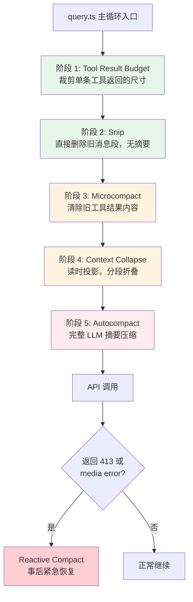
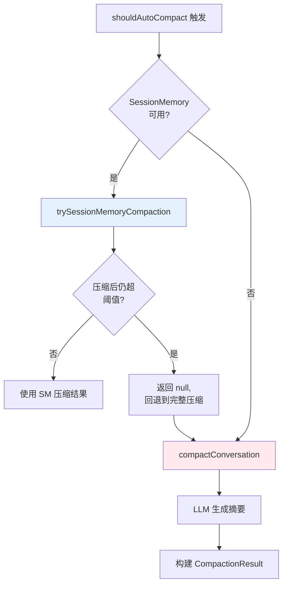
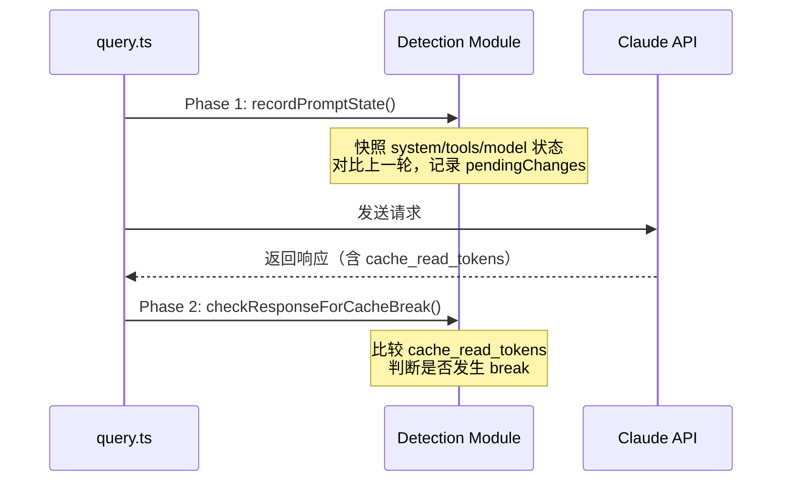
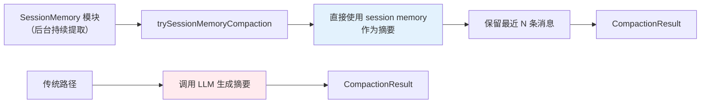

# 16. 上下文管理——梯度压缩管线

## 设计哲学：梯度按需升级

Claude Code 的上下文管理不是一个"到了阈值就压缩"的单步操作，而是一条精心设计的梯度管线。它的核心思路是：轻量手段先上，重量级手段最后。每一轮 query 主循环迭代都会完整经过这条管线，但大多数时候只有前一两个阶段会实际执行，后面的阶段因为条件不满足而直接跳过。

这个设计背后的判断很清晰——压缩是有代价的。越重的压缩手段（比如调用一次完整的 LLM 做摘要），耗费的时间和 token 越多，丢失的上下文细节也越多。所以管线的逻辑是"能不压就不压，非压不可就从最轻的开始"。



这条管线从绿色（轻量）到红色（重量级）排列，每个阶段的"代价"递增：Budget 只是截断字符串，Snip 是删消息，Microcompact 是清内容，Collapse 是读时投影，Autocompact 要调 LLM，Reactive 是最后的应急手段。

---

## 管线执行顺序

### 阶段 1 -- Tool Result Budget（query.ts 行 369-394）

这是管线的第一道关卡，也是最轻量的一道。`applyToolResultBudget()` 对工具返回内容按尺寸预算进行裁剪。

它的执行时机值得注意：在 microcompact 之前。源码注释明确说明了原因——cached microcompact 是按 `tool_use_id` 操作的，从不检查 content 本身，所以 Budget 阶段替换了 content 不会影响 cached MC 的逻辑，两者可以干净地组合。

```typescript
// 行 369-394 核心逻辑
const persistReplacements =
  querySource.startsWith('agent:') ||
  querySource.startsWith('repl_main_thread')

messagesForQuery = await applyToolResultBudget(
  messagesForQuery,
  toolUseContext.contentReplacementState,
  persistReplacements
    ? records =>
        void recordContentReplacement(
          records, toolUseContext.agentId,
        ).catch(logError)
    : undefined,
  new Set(
    toolUseContext.options.tools
      .filter(t => !Number.isFinite(t.maxResultSizeChars))
      .map(t => t.name),
  ),
)
```

这里有一个细节：只有来自 `agent:*` 或 `repl_main_thread` 的 querySource 才会持久化替换记录。原因是这些来源需要在 resume 时回放记录，而像 `runForkedAgent` 这类临时调用者不需要持久化。

第四个参数是一个"豁免集合"——那些 `maxResultSizeChars` 为非有限值的工具不受裁剪。

### 阶段 2 -- Snip（query.ts 行 396-410）

Snip 是一种比 Microcompact 更激进但比 Autocompact 更轻的手段：它直接删除旧的消息段，不做摘要，纯粹地物理删除。

```typescript
// 行 396-410
let snipTokensFreed = 0
if (feature('HISTORY_SNIP')) {
  const snipResult = snipModule!.snipCompactIfNeeded(messagesForQuery)
  messagesForQuery = snipResult.messages
  snipTokensFreed = snipResult.tokensFreed
  if (snipResult.boundaryMessage) {
    yield snipResult.boundaryMessage
  }
}
```

几个关键点：

1. **feature gate 门控**：整个 Snip 阶段被 `feature('HISTORY_SNIP')` 门控。在反编译版本中 feature() 始终返回 false，所以这段代码实际上是死代码。但从设计角度看，Snip 是管线中不可或缺的一环。

2. **与 Microcompact 不互斥**：源码注释明确写了 "both may run -- they are not mutually exclusive"。Snip 先跑，Microcompact 后跑，两者可以在同一轮同时生效。

3. **tokensFreed 传递给 Autocompact**：Snip 释放的 token 数会传给后面的 Autocompact 阶段。原因是 Autocompact 的阈值检测依赖 `tokenCountWithEstimation`，但这个函数读取的是最后一个 assistant 消息的 usage，而 Snip 删除的消息不会反映在那个 usage 上。所以必须把 snipTokensFreed 单独扣除。

4. **parentUuid 重新链接**：被删消息之间的链式关系通过 parentUuid 重新连接，保证对话的逻辑链条不断裂。

### 阶段 3 -- Microcompact（query.ts 行 412-426）

Microcompact 是管线中最精巧的阶段，它有两条完全不同的路径。

```typescript
// 行 412-426
const microcompactResult = await deps.microcompact(
  messagesForQuery, toolUseContext, querySource,
)
messagesForQuery = microcompactResult.messages

const pendingCacheEdits = feature('CACHED_MICROCOMPACT')
  ? microcompactResult.compactionInfo?.pendingCacheEdits
  : undefined
```

#### 路径一：时间触发（Time-Based Microcompact）

当距离上一条 assistant 消息超过配置阈值（默认 60 分钟）时触发。

逻辑很直白：服务端 prompt cache 的 TTL 是 1 小时，超过这个时间间隔意味着缓存肯定已经过期了。既然整个 prefix 都会被重写，不如趁机把旧的工具结果清掉，减少重写体积。

```typescript
// microCompact.ts 中的时间触发检测
const gapMinutes =
  (Date.now() - new Date(lastAssistant.timestamp).getTime()) / 60_000
if (!Number.isFinite(gapMinutes) || gapMinutes < config.gapThresholdMinutes) {
  return null
}
```

具体做法：
- 收集所有 COMPACTABLE_TOOLS 的 tool_use_id
- 保留最近 N 个（默认 keepRecent = 5），其余全部 content-clear
- 内容替换为 `[Old tool result content cleared]`
- COMPACTABLE_TOOLS 包含：FileRead、Shell、Grep、Glob、WebSearch、WebFetch、FileEdit、FileWrite

这条路径是直接修改消息内容的"硬操作"。执行后会重置 cachedMCState 并通知 cache break detection 预期 drop。

#### 路径二：缓存编辑（Cached Microcompact）

这条路径更加精妙。它不修改本地消息内容，而是生成 `cache_edits` 指令交给 API 层，让服务端直接在缓存中删除旧的工具结果。

```typescript
// cachedMicrocompactPath 核心逻辑
const toolsToDelete = mod.getToolResultsToDelete(state)
if (toolsToDelete.length > 0) {
  const cacheEdits = mod.createCacheEditsBlock(state, toolsToDelete)
  pendingCacheEdits = cacheEdits  // 队列给 API 层

  // 消息内容不变！
  return {
    messages,  // 原样返回
    compactionInfo: { pendingCacheEdits: { ... } },
  }
}
```

优势显而易见：不修改本地消息意味着 transcript 和 session storage 保持完整。代价是依赖服务端 API 支持 cache_edits 特性（通过 `CACHED_MICROCOMPACT` feature gate 控制）。

两条路径的优先级关系是：时间触发先检查，触发就短路返回（因为缓存已经冷了，编辑也没意义）；时间触发不触发，才走缓存编辑路径。

#### Token 估算

Microcompact 中的 token 估算使用 `estimateMessageTokens()`，其逻辑是：
- 图片和文档类型：固定 2000 tokens（`IMAGE_MAX_TOKEN_SIZE`）
- 文本类型：使用 `roughTokenCountEstimation()` 进行粗略计算
- 最终结果乘以 4/3 做保守填充（因为是近似值）

```typescript
// 关键的 4/3 保守填充
return Math.ceil(totalTokens * (4 / 3))
```

### 阶段 4 -- Context Collapse（query.ts 行 440-447）

Context Collapse 是一个与前几个阶段有本质区别的机制。

```typescript
// 行 440-447
if (feature('CONTEXT_COLLAPSE') && contextCollapse) {
  const collapseResult = await contextCollapse.applyCollapsesIfNeeded(
    messagesForQuery, toolUseContext, querySource,
  )
  messagesForQuery = collapseResult.messages
}
```

关键特征：

1. **读时投影，不是物理删除**：Collapse 不修改消息数组。它维护一个独立的 collapse store（提交日志），`projectView()` 在每次进入时重放这个日志，把已折叠的消息替换为摘要投影。摘要消息住在 collapse store 里，不住在 REPL 的消息数组中。

2. **抑制 Autocompact**：当 Context Collapse 启用时，它会抑制 proactive autocompact。源码注释解释得很清楚——Collapse 本身就是上下文管理系统，它在 90% 水位触发 commit、95% 水位触发 blocking-spawn。Autocompact 的 13K buffer 阈值（约 93%）恰好卡在两者之间，会与 Collapse 竞争并通常胜出，从而用粗暴的全量摘要替代 Collapse 更精细的分段保存。

3. **在 Autocompact 之前执行**：这样设计的好处是，如果 Collapse 已经把上下文压到了 Autocompact 阈值以下，Autocompact 就什么都不用做。保留了更精细的上下文颗粒度。

4. **feature gate 门控**：被 `feature('CONTEXT_COLLAPSE')` 门控，同样在反编译版本中是死代码。

### 阶段 5 -- Autocompact（query.ts 行 453-543）

这是管线中最重量级的主动压缩手段。

```typescript
// 行 453-468
const { compactionResult, consecutiveFailures } = await deps.autocompact(
  messagesForQuery, toolUseContext,
  { systemPrompt, userContext, systemContext, toolUseContext,
    forkContextMessages: messagesForQuery },
  querySource, tracking, snipTokensFreed,
)
```

#### 触发条件

```typescript
// autoCompact.ts 中的阈值计算
const AUTOCOMPACT_BUFFER_TOKENS = 13_000
const MAX_OUTPUT_TOKENS_FOR_SUMMARY = 20_000

function getAutoCompactThreshold(model) {
  const effectiveContextWindow = getEffectiveContextWindowSize(model)
  // effectiveContextWindow = contextWindow - min(maxOutputTokens, 20_000)
  return effectiveContextWindow - AUTOCOMPACT_BUFFER_TOKENS
}
```

简单来说：当当前 token 数 >= (上下文窗口 - maxOutputTokens 留量 - 13,000 buffer) 时触发。

#### 执行路径：SessionMemory 快速路径优先



SessionMemory 快速路径的核心思路是：如果系统已经有了一份持续更新的会话记忆（由 SessionMemory 模块维护），那就不需要再调一次 LLM 做摘要了。直接把 SessionMemory 的内容当作摘要，保留最近的消息，就完事了。

具体的消息保留策略在 `calculateMessagesToKeepIndex()` 中：
- 从 `lastSummarizedMessageId` 之后开始保留
- 至少保留 minTokens（默认 10,000）个 token
- 至少保留 minTextBlockMessages（默认 5）条有文本内容的消息
- 不超过 maxTokens（默认 40,000）个 token
- 不拆分 tool_use/tool_result 对（通过 `adjustIndexToPreserveAPIInvariants()` 保证）

只有在 SessionMemory 快速路径失败（没有 session memory、内容为空模板、压缩后仍超阈值）时，才走完整的 `compactConversation()` 路径。

#### 熔断器

```typescript
const MAX_CONSECUTIVE_AUTOCOMPACT_FAILURES = 3
```

连续失败 3 次后，autocompact 会停止重试。源码注释提到一个真实的问题：曾经有 1,279 个会话出现了 50 次以上连续失败（最高到 3,272 次），每天浪费约 25 万次 API 调用。熔断器就是为了解决这个问题。

#### 压缩后的状态重置

```typescript
// 行 521-526
tracking = {
  compacted: true,
  turnId: deps.uuid(),
  turnCounter: 0,
  consecutiveFailures: 0,
}
```

每次成功压缩后重置 tracking 状态：标记已压缩、生成新的 turnId、归零计数器和失败次数。

---

## Reactive Compact（事后恢复）

前面 5 个阶段都是"主动"的——在 API 调用之前执行。Reactive Compact 则是"被动"的——在 API 返回 413（prompt too long）或 media error 之后触发。

### Context Collapse Drain 优先（query.ts 行 1088-1121）

```typescript
if (feature('CONTEXT_COLLAPSE') && contextCollapse &&
    state.transition?.reason !== 'collapse_drain_retry') {
  const drained = contextCollapse.recoverFromOverflow(
    messagesForQuery, querySource,
  )
  if (drained.committed > 0) {
    state = {
      ...next,
      transition: {
        reason: 'collapse_drain_retry',
        committed: drained.committed,
      },
    }
    continue  // 重试
  }
}
```

在 Collapse 模式下，收到 413 时先尝试"排空"所有已暂存的 collapse。如果上一次已经是 collapse_drain_retry 但仍然 413，才 fall through 到真正的 Reactive Compact。

### Reactive Compact 本体（query.ts 行 1122-1169）

```typescript
if ((isWithheld413 || isWithheldMedia) && reactiveCompact) {
  const compacted = await reactiveCompact.tryReactiveCompact({
    hasAttempted: hasAttemptedReactiveCompact,
    querySource,
    aborted: toolUseContext.abortController.signal.aborted,
    messages: messagesForQuery,
    cacheSafeParams: { ... },
  })
  // ...
  hasAttemptedReactiveCompact = true  // 防止无限循环
}
```

关键的防循环机制：`hasAttemptedReactiveCompact` 标志位确保每轮只尝试一次 reactive compact。如果压缩后重试仍然 413，就放弃并把错误抛给用户。

压缩成功后，设置 transition reason 为 `'reactive_compact_retry'` 并 continue 主循环，用压缩后的消息重新发起 API 调用。

---

## Compact Boundary 与 Transcript 耦合

压缩不是在真空中发生的。每次压缩的结果需要正确编码到会话的 transcript 中，以支持 resume、undo 等操作。

### CompactionResult 结构

```typescript
interface CompactionResult {
  boundaryMarker: SystemMessage          // 压缩边界标记
  summaryMessages: UserMessage[]         // 摘要消息
  attachments: AttachmentMessage[]       // 附件（文件状态、plan 等）
  hookResults: HookResultMessage[]       // Hook 结果
  messagesToKeep?: Message[]             // 保留的原始消息
  preCompactTokenCount?: number          // 压缩前 token 数
  postCompactTokenCount?: number         // 压缩 API 调用的 token 使用量
  truePostCompactTokenCount?: number     // 压缩后实际上下文大小
  compactionUsage?: TokenUsage           // 压缩调用的详细 usage
}
```

### 消息构建顺序

`buildPostCompactMessages()` 的顺序是固定的：

```
boundaryMarker -> summaryMessages -> messagesToKeep -> attachments -> hookResults
```

这个顺序不是随意的：boundary 必须在最前面作为分界标记；summary 紧随其后提供上下文摘要；messagesToKeep 是保留的原始消息尾巴；attachments 重新注入文件状态等上下文；hookResults 是 SessionStart hooks 重新执行的结果。

### ParentUuid 重新链接

`annotateBoundaryWithPreservedSegment()` 在 boundary marker 上存储三个 UUID：

```typescript
preservedSegment: {
  headUuid: keep[0]!.uuid,       // 保留段的第一条消息
  anchorUuid,                     // 保留段的锚点（通常是最后一条 summary 消息）
  tailUuid: keep.at(-1)!.uuid,   // 保留段的最后一条消息
}
```

这些元数据让 transcript loader 能正确重建消息链：
- **suffix-preserving**（reactive/session-memory 路径）：anchor 是最后一条 summary 消息
- **prefix-preserving**（partial compact 路径）：anchor 是 boundary 本身

Transcript 需要这些信息来正确恢复 snip/collapse 的结果。被保留的消息在磁盘上保持原始的 parentUuid（因为去重跳过了），loader 用 preservedSegment 来修补 head->anchor 和 anchor-children->tail 的链接。

---

## Prompt Cache Break Detection

压缩操作会改变发送给 API 的 prompt 内容，导致服务端 prompt cache 失效。这是一个预期的副作用，但系统需要区分"预期的 cache miss"和"意外的 cache break"。这就是 `promptCacheBreakDetection.ts`（728 行）的职责。

### 双阶段检测



**Phase 1 -- recordPromptState()**：在 API 调用之前，对当前的 system prompt、tool schemas、model、betas 等全部状态做快照，然后与上一次的快照比较，记录所有变化到 `pendingChanges` 中。

快照覆盖的维度非常全面：systemHash、toolsHash、cacheControlHash、model、fastMode、globalCacheStrategy、betas、autoModeActive、isUsingOverage、cachedMCEnabled、effortValue、extraBodyHash。

**Phase 2 -- checkResponseForCacheBreak()**：在 API 响应返回后，检查 `cache_read_tokens` 是否发生了显著下降。

### 判断阈值

```typescript
const MIN_CACHE_MISS_TOKENS = 2_000

// 判断 cache break 的条件：
// 1. cache_read 下降超过 5%
// 2. 绝对下降量 >= 2,000 tokens
const tokenDrop = prevCacheRead - cacheReadTokens
if (
  cacheReadTokens >= prevCacheRead * 0.95 ||
  tokenDrop < MIN_CACHE_MISS_TOKENS
) {
  // 不是 cache break
  return
}
```

两个条件必须同时满足：相对下降超过 5% AND 绝对下降 >= 2,000 tokens。这样可以过滤掉正常的小波动。

### 与压缩的协调

两个关键函数确保压缩操作不会触发误报：

- **notifyCacheDeletion()**：Cached Microcompact 和 Time-based Microcompact 在执行删除操作后调用，标记 `cacheDeletionsPending = true`。Phase 2 检测到这个标记后，直接跳过本轮检查，因为 cache read 下降是预期行为。

- **notifyCompaction()**：完整的 compactConversation() 和 SessionMemory 压缩完成后调用。它重置 `prevCacheReadTokens` baseline，这样压缩后的第一次 API 调用不会因为 cache read 从高值变低而被错误地标记为 break。

---

## SessionMemory 与压缩的关系

需要明确一点：SessionMemory 不是一个独立的长期记忆后端。在压缩管线的语境下，它是 Autocompact 的一个优化层。

### 快速路径的优势

传统的 `compactConversation()` 需要调用一次 LLM 来生成摘要，这意味着额外的延迟和 token 消耗。而 SessionMemory 快速路径跳过了这个步骤——如果 SessionMemory 模块已经在后台持续提取了会话记忆，那么这份记忆本身就可以充当摘要。



### 回退条件

SessionMemory 快速路径会在以下情况回退到传统路径：
1. SessionMemory 功能未启用（feature flag 或配置）
2. session memory 文件不存在
3. session memory 内容是空模板（没有实际提取的内容）
4. 压缩后的 token 数仍然超过 autocompact 阈值
5. `lastSummarizedMessageId` 在消息数组中找不到

第 4 点特别值得注意——SessionMemory 快速路径会计算压缩后的预估 token 数，如果仍然超标，就知道自己的摘要不够"狠"，主动让位给能做更激进压缩的传统路径。

### 消息保留的 API 不变量

保留消息时必须维护一个关键不变量：tool_use 和 tool_result 不能拆分。`adjustIndexToPreserveAPIInvariants()` 处理两种场景：

1. **tool_use/tool_result 配对**：如果保留范围内有 tool_result，就必须向前扩展到包含对应的 tool_use 消息。

2. **thinking block 合并**：流式输出时，thinking、tool_use 等 content block 可能是同一个 `message.id` 的不同消息。如果保留范围切开了同一个 message.id 的消息组，normalizeMessagesForAPI 在合并时会丢失 thinking block。

---

## 关键源码锚点

| 文件 | 行号/规模 | 职责 |
|------|-----------|------|
| query.ts | 369-543 | 管线前 5 阶段的编排 |
| query.ts | 1088-1121 | Context Collapse Drain（413 恢复第一步） |
| query.ts | 1122-1169 | Reactive Compact（413 恢复第二步） |
| services/compact/microCompact.ts | 531 行 | 微压缩：时间触发 + 缓存编辑双路径 |
| services/compact/autoCompact.ts | 352 行 | 自动压缩：阈值检测 + SM 快速路径 + 熔断器 |
| services/compact/compact.ts | 1700+ 行 | 完整压缩：LLM 摘要 + 文件恢复 + Hook 执行 |
| services/compact/sessionMemoryCompact.ts | 630 行 | SM 快速路径：消息保留策略 + API 不变量保护 |
| services/compact/reactiveCompact.ts | stub | Reactive Compact（反编译版本中为 stub） |
| services/compact/snipCompact.ts | stub | Snip Compact（反编译版本中为 stub） |
| services/api/promptCacheBreakDetection.ts | 728 行 | 缓存中断检测：双阶段检测 + 误报抑制 |
| services/compact/timeBasedMCConfig.ts | 44 行 | 时间触发 MC 的配置（默认 60 分钟阈值） |

---

## 总结

Claude Code 的上下文管理是一个分层递进的系统，不是一个简单的"到了阈值就压缩"的开关。它的设计体现了几个核心原则：

**第一，代价意识**。每一层压缩手段都有明确的代价——从几乎无损的 Budget 裁剪，到纯删除的 Snip，到清内容的 Microcompact，到需要 LLM 调用的 Autocompact。管线的梯度排列确保系统总是选择"刚好够用"的最轻手段。

**第二，缓存感知**。Microcompact 的两条路径（时间触发 vs 缓存编辑）完全围绕 prompt cache 的状态设计。缓存热的时候用 cache_edits 不碰本地内容；缓存冷的时候才做内容修改。promptCacheBreakDetection 则确保压缩操作的预期 cache miss 不会被误报。

**第三，防御性设计**。Autocompact 的熔断器（3 次连续失败后停止）、Reactive Compact 的单次防循环标志、Context Collapse Drain 的先试再退——这些都是从线上问题中学来的防御手段。那个 1,279 个会话连续失败 3,272 次的故事，就是最好的教训。

**第四，可组合性**。各阶段之间的关系是精心设计的：Snip 和 Microcompact 不互斥、Collapse 会抑制 Autocompact、SessionMemory 是 Autocompact 的快速路径而不是替代品。每个组件都清楚自己在管线中的位置和边界。
