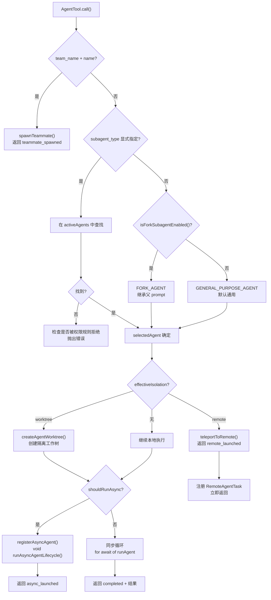
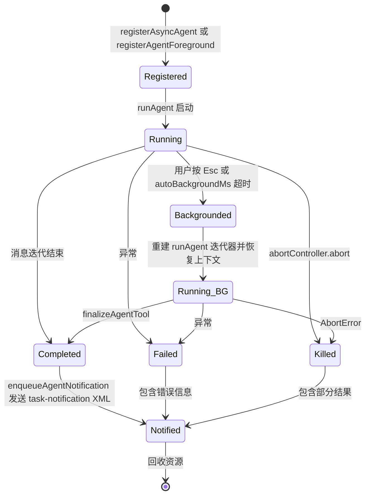
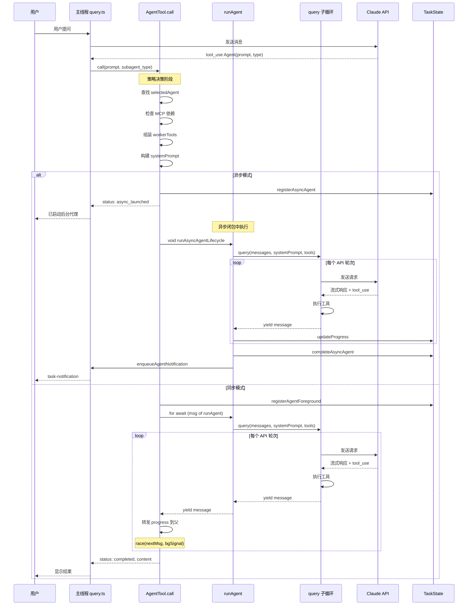

# 17. 代理、任务与远程会话

## 设计哲学：Agent 不是并行框架

Claude Code 的代理系统容易让人产生一个误解：它是一套复杂的并行编排框架。事实恰好相反——**AgentTool 只是一个普通工具**，和 BashTool、FileEditTool 一样注册在工具池中，通过 `buildTool()` 工厂函数构建，遵循相同的 `call() → { data }` 协议。

这个设计选择有深层原因。在 Claude 的 API 协议中，工具调用本质上是 LLM 的一个 `tool_use` content block，工具执行结果通过 `tool_result` 回传。AgentTool 把「启动子代理」这个动作表达为普通的工具调用，意味着：

- **不需要额外的编排层**。主循环（`query.ts`）不知道也不需要知道某个工具调用内部启动了一个完整的对话回合。
- **权限模型统一**。子代理的权限检查走的是和其他工具完全一样的 `checkPermissions()` 通道。
- **可被模型自主决定**。模型决定什么时候 spawn 子代理，就像决定什么时候 grep 一个文件一样。

这种「以工具为中心」而非「以框架为中心」的设计，让整个系统保持了令人惊讶的扁平：没有独立的 Agent Manager、没有 DAG 调度器、没有任务队列。复杂度全部被下推到了具体的 AgentTool 实现中。

## AgentTool 调用流程

AgentTool 的 `call()` 函数是整个代理系统的入口点，大约 1100 行代码。在真正调用 `runAgent()` 之前，它执行了一系列精心设计的策略逻辑。

### Spawn 前的策略决策



几个关键的决策点值得展开：

**MCP 服务器等待**：如果 selectedAgent 声明了 `requiredMcpServers`，AgentTool 会轮询最多 30 秒等待这些服务器就绪。这是一个极其实际的设计——MCP 服务器连接是异步的，在代理启动时可能仍处于 `pending` 状态。

**异步判定逻辑**：`shouldRunAsync` 的计算考虑了 5 个独立条件的 OR：
1. `run_in_background === true`（用户显式指定）
2. `selectedAgent.background === true`（Agent 定义强制后台）
3. `isCoordinatorMode()`（Coordinator 模式下所有 worker 都是异步的）
4. `isForkSubagentEnabled()`（fork 实验开启时所有 spawn 都走异步）
5. `proactiveModule?.isProactiveActive()`（主动模式）

并且有一个全局开关 `isBackgroundTasksDisabled` 可以一票否决。

**工具池组装**：worker 的工具池通过 `assembleToolPool(workerPermissionContext, mcp.tools)` 独立组装，不继承父线程的限制。这里有个微妙之处——调用者（AgentTool.tsx）而非 `runAgent.ts` 负责组装工具池，目的是打破循环依赖（`runAgent` -> `tools.ts` -> `AgentTool`）。

### Fork 路径：精确复制父 Prompt

fork 子代理是一个实验性路径（由 `FORK_SUBAGENT` feature flag 控制），其核心思想是让子代理继承父代理的完整会话上下文。具体做法：

1. **复用父的系统提示**：通过 `toolUseContext.renderedSystemPrompt` 获取父代理已渲染的系统提示字节，而不是重新计算。重新计算可能因 GrowthBook 状态变化而导致字节不同，从而打破 prompt cache。
2. **构建 fork 消息**：`buildForkedMessages()` 将父的完整 assistant 消息（所有 `tool_use` block）原样保留，为每个 `tool_use` 填充相同的占位 `tool_result`（"Fork started - processing in background"），最后附加一个 per-child 的 directive text block。
3. **Cache 共享**：所有 fork 子代理产生字节相同的 API 请求前缀，只有最后的 directive 不同——最大化了 prompt cache 命中率。

子代理收到的指令模板严格限定了输出格式：必须以 `Scope:` 开头，不允许产生额外对话，不允许再次 fork（递归防护通过 `isInForkChild()` 检查消息中是否存在 `<fork-boilerplate>` 标签）。

## Agent 类型体系

### 内置 Agent

`builtInAgents.ts` 中注册的内置 Agent 列表：

| Agent | 用途 | 特殊属性 |
|-------|------|----------|
| **general-purpose** | 通用子代理，默认选项 | 无特殊限制 |
| **Explore** | 只读代码探索 | `omitClaudeMd: true`，省略 gitStatus |
| **Plan** | 制定实施计划 | `omitClaudeMd: true`，省略 gitStatus |
| **Verification** | 验证代码变更 | Feature flag 控制 |
| **claude-code-guide** | 解答 Claude Code 使用问题 | 仅非 SDK 入口点加载 |
| **statusline-setup** | 状态栏配置 | 始终加载 |
| **fork** | 继承父上下文的 fork 子代理 | 不在 builtInAgents 注册，仅在 fork 路径动态使用 |

Explore 和 Plan 被标记为 `ONE_SHOT_BUILTIN_AGENT_TYPES`，其 `tool_result` 不包含 agentId/usage 尾部，因为它们不会通过 SendMessage 被继续。这个优化每周为 Anthropic 省下约 1-2 Gtok（基于 34M+ Explore 调用量）。

### 自定义 Agent 加载

自定义 Agent 从三个来源加载，优先级从低到高：

1. **built-in**（内置）
2. **plugin**（通过 `loadPluginAgents()` 加载）
3. **userSettings / projectSettings / flagSettings / policySettings**（通过 `loadMarkdownFilesForSubdir('agents')` 从 `.claude/agents/` 目录加载 Markdown 文件）

`getActiveAgentsFromList()` 用 `Map<agentType, AgentDefinition>` 实现去重，后加入的会覆盖先加入的。这意味着 policySettings 的 Agent 定义会覆盖 projectSettings，projectSettings 覆盖 built-in。

自定义 Agent 的 Markdown 文件使用 frontmatter 声明元数据，支持 `name`、`description`、`tools`、`disallowedTools`、`model`、`effort`、`permissionMode`、`maxTurns`、`memory`、`isolation`、`background`、`hooks`、`mcpServers`、`skills`、`initialPrompt` 等字段。

值得注意的是 `memory` 字段：当设置为 `user`/`project`/`local` 时，会自动注入 Write/Edit/Read 工具以支持记忆文件的读写，并通过 `loadAgentMemoryPrompt()` 在系统提示中附加持久化记忆的内容。

## Coordinator 模式

Coordinator 模式是 Claude Code 最激进的多代理实验。它将主线程的角色从「执行者」变为「编排者」。

### 主线程工具限制

当 `CLAUDE_CODE_COORDINATOR_MODE` 环境变量为 true 时，主线程只允许使用 4 个工具：

- **AgentTool** — 启动 worker
- **TaskStopTool** — 停止 worker
- **SendMessageTool** — 向 worker 发送后续消息
- **SyntheticOutputTool** — 结构化输出

Coordinator **没有** Bash、Read、Edit、Grep 等任何直接操作工具。这是一个故意为之的强约束——迫使 LLM 把所有实际工作委派出去，而不是「我先自己看看然后再分配」。

### Worker 的二级工具过滤

Worker 拥有完整的工具池（由 `ASYNC_AGENT_ALLOWED_TOOLS` 定义），包括所有文件操作和搜索工具，但明确排除了：

- `AgentTool`（防止递归）
- `TaskOutputTool`（防止递归）
- `ExitPlanModeTool`（Plan 模式是主线程抽象）
- `TaskStopTool`（需要主线程任务状态）

对于 in-process teammate 这种特殊的 worker，还额外注入了 Task 系列工具（`TaskCreate/Get/List/Update`）和 `SendMessage`。

### Coordinator 的系统提示

`getCoordinatorSystemPrompt()` 生成约 370 行的系统提示，其核心结构是：

1. **角色定义**：你是协调器，不是执行者
2. **工具说明**：只能用 AgentTool/SendMessage/TaskStop
3. **交互模型**：worker 结果通过 `<task-notification>` XML 格式的 user 消息返回
4. **工作流阶段**：Research -> Synthesis -> Implementation -> Verification
5. **并发指导**：只读任务并行，写入任务串行
6. **Prompt 编写规范**：每个 prompt 必须自包含、包含文件路径和行号、说明完成标准

这里有一个精妙的设计：Coordinator 收到 worker 结果后，**必须自己理解结果并综合**——系统提示明确禁止「based on your findings, fix the bug」这种懒委派。Coordinator 要像一个真正的技术主管一样，在理解问题后写出具体的实施 spec。

## 任务系统 Task v2

### 5 个核心 Tool

任务系统 v2 围绕 5 个工具构建：

| Tool | 作用 | 使用者 |
|------|------|--------|
| `TaskCreate` | 创建任务，写入共享任务列表 | Teammate |
| `TaskGet` | 获取任务详情和状态 | Teammate |
| `TaskList` | 列出所有任务 | Teammate |
| `TaskUpdate` | 更新任务状态/进度 | Teammate（认领者） |
| `TaskOutput` | 读取后台代理的输出 | 主线程/Coordinator |

这些工具主要用于 in-process teammate 场景，通过 `IN_PROCESS_TEAMMATE_ALLOWED_TOOLS` 集合注入。

### LocalAgentTask 生命周期



`LocalAgentTaskState` 是任务的状态载体，它记录了：

- `agentId`：全局唯一 ID，格式由 `createAgentId()` 生成
- `abortController`：独立于父线程的中止控制器
- `isBackgrounded`：false = 前台运行中，true = 已后台化
- `pendingMessages`：通过 SendMessage 排队的消息，在工具轮次边界 drain
- `progress`：包含 toolUseCount、tokenCount、recentActivities
- `retain` / `diskLoaded`：用于 VS Code 侧边栏的面板保持逻辑

**前台到后台的转换**（AgentTool.tsx 第 686-1052 行）是整个文件中最复杂的部分。当用户按 Esc 或 auto-background 超时触发时：

1. `backgroundPromise` 赢得与 `nextMessagePromise` 的 `Promise.race`
2. 当前的同步迭代器被 `agentIterator.return()` 清理（释放 MCP 连接等）
3. 一个新的 `runAgent()` 迭代器在 `void` 异步闭包中启动，继承之前收集的消息
4. 进度跟踪器用已有消息重新初始化

这种「中途切换执行模式」的设计是相当大胆的——本质上是在运行时把同步阻塞调用拆成了异步 fire-and-forget，同时保持消息不丢失。

## 多层隔离

Claude Code 提供 4 种代理隔离栈，从轻量到重量排列：

### 1. In-Process（进程内）

`inProcessRunner.ts` 通过 `runWithTeammateContext()` 在 AsyncLocalStorage 中隔离 teammate 上下文。优势是共享内存和权限提示 UI（`canShowPermissionPrompts: true`），劣势是单进程内的所有 teammate 共享 CPU 时间。

In-process teammate 有特殊限制：不能 spawn 后台代理（生命周期绑定到 leader 进程），不能再 spawn 其他 teammate（roster 是扁平的）。

### 2. Tmux（终端多路复用）

`spawnTeammate()` 在 `TmuxBackend` 中创建新的 tmux pane，每个 teammate 是一个独立的 Claude Code 进程。进程间通过文件系统上的 mailbox JSON 通信（见下文「跨代理通信」）。

### 3. Remote（远程 CCR）

远程会话通过 Sessions API 在 Anthropic 的云端运行完整的 Claude Code 实例。本地 CLI 通过轮询 events API 获取进度，结果以 `<task-notification>` 格式注入本地对话。当 `effectiveIsolation === 'remote'` 时，AgentTool 调用 `teleportToRemote()` 创建远程会话并注册 `RemoteAgentTask`。

### 4. Worktree（Git 工作树）

`createAgentWorktree()` 创建一个 Git worktree，让代理在独立的文件系统副本中工作。这对于需要并行修改相同文件的场景至关重要。完成后如果没有变更（通过 `hasWorktreeChanges()` 检查），worktree 会被自动清理。

Worktree 可以和其他隔离模式组合——例如一个 in-process 代理可以同时有自己的 worktree。fork 子代理在 worktree 中启动时，还会注入一个 `buildWorktreeNotice()` 提示，告知子代理需要将继承上下文中的路径转换到 worktree 根目录。

## 远程会话

### teleportToRemote

`teleportToRemote()` 是远程会话的核心函数，它完成以下步骤：

1. **认证检查**：刷新 OAuth token，获取组织 UUID
2. **环境选择**：通过 `fetchEnvironments()` 获取可用环境，优先选择 `anthropic_cloud` 类型
3. **Git 源选择**：决策梯度为 GitHub clone（需要 GitHub App 安装）-> Bundle fallback（`git bundle --all` 上传）-> 空沙盒
4. **标题和分支名生成**：调用 Haiku 模型生成简洁的标题和 `claude/` 前缀的分支名
5. **创建会话**：POST `/v1/sessions`，包含 source、outcome、environment_id

Git source 的选择值得深入：函数先通过 `checkGithubAppInstalled()` 做 preflight 检查。如果 GitHub App 未安装且 bundle gate 开启，就会走 `createAndUploadGitBundle()` 路径——这条路径能捕获本地未提交的变更（通过 `refs/seed/stash`），覆盖了 54% 的 CLI 会话（只要有 `.git/` 就行）。

### WebSocket 权限隧道

远程会话的权限模式通过 `control_request` 事件设置。这些 initial events 在创建会话时作为 `events` 数组传入，被写入 threadstore，在容器连接之前就已持久化。远程 CLI 在第一个 user turn 之前就应用了 permission mode——不存在竞态问题。

权限设置事件的结构：

```json
{
  "type": "event",
  "data": {
    "type": "control_request",
    "request_id": "set-mode-<uuid>",
    "request": {
      "subtype": "set_permission_mode",
      "mode": "plan",
      "ultraplan": true
    }
  }
}
```

### /ultraplan：30 分钟远程规划

`/ultraplan` 命令创建一个远程 CCR 会话，使用 Opus 模型进行深度代码分析和计划制定。核心流程：

1. 检查远程会话资格（`checkRemoteAgentEligibility`）
2. 通过 `teleportToRemote()` 创建远程会话，设置 `ultraplan: true`
3. 注册 `RemoteAgentTask` 并启动后台轮询
4. `pollForApprovedExitPlanMode()` 最多等待 30 分钟
5. 轮询期间追踪 phase 变化：`running` -> `needs_input` -> `plan_ready`
6. 用户在浏览器中审批计划后，计划文本返回本地
7. 选择执行目标：在远程继续执行，或返回本地执行

超时时间硬编码为 `30 * 60 * 1000` 毫秒。模型选择通过 GrowthBook 配置（`tengu_ultraplan_model`），默认为 Opus。

远程会话的 prompt 被精心设计以避免自触发：prompt.txt 中避免出现裸词 "ultraplan"，因为远程 CCR CLI 的关键词检测会把它当作 `/ultraplan` 命令再次执行。

### /ultrareview：审查舰队

`/ultrareview` 是一个基于远程 CCR 的深度代码审查命令，它的特殊之处在于后端会启动一个审查舰队（5-20 个并行代理）：

- 多个并行的 bug 查找器（finding 阶段）
- 验证器确认或驳斥发现（verifying 阶段）
- 合成器汇总结果（synthesizing 阶段）

本地 CLI 只负责：
1. **计费门控**：`checkOverageGate()` 检查免费配额、Extra Usage 余额（最低 $10）
2. **启动远程会话**：`launchRemoteReview()` 调用 `teleportToRemote()` 并使用特殊的 environment
3. **注册轮询任务**：`registerRemoteAgentTask` 开始从 events API 拉取进度
4. **进度追踪**：解析 `<remote-review-progress>` 心跳，追踪 bugsFound/Verified/Refuted

`RemoteAgentTaskState` 为 ultrareview 添加了专门的 `reviewProgress` 字段，支持在 UI 中实时显示发现了多少 bug、验证了多少、驳斥了多少。Team 和 Enterprise 计划用户不受配额限制，直接通过。

## 跨代理通信

### 3 个通道

Claude Code 提供三种代理间通信机制：

#### 1. Task Notification（主通道）

后台代理完成时，`enqueueAgentNotification()` 将结果格式化为 XML 并注入主线程消息队列：

```xml
<task-notification>
  <task-id>{agentId}</task-id>
  <status>completed|failed|killed</status>
  <summary>Agent "描述" completed</summary>
  <result>代理的最终文本响应</result>
  <usage>
    <total_tokens>N</total_tokens>
    <tool_uses>N</tool_uses>
    <duration_ms>N</duration_ms>
  </usage>
</task-notification>
```

这个 XML 通过 `enqueuePendingNotification()` 注入到主线程的消息队列中，作为一条 user 角色消息被 LLM 处理。Coordinator 的系统提示中明确教育模型：这些看起来像 user 消息，但实际上是内部通知。

#### 2. SendMessage（定向通信）

`SendMessageTool` 支持多种路由：

- **name -> agentId 查找**：通过 `appState.agentNameRegistry` 解析名称到 agentId
- **本地运行中代理**：`queuePendingMessage()` 将消息推入 `pendingMessages` 数组，在下一个工具轮次边界被 drain
- **已停止代理**：自动通过 `resumeAgentBackground()` 恢复代理
- **广播**：`to: "*"` 向所有 teammate 发送
- **Bridge 跨会话**：`bridge:<session-id>` 通过 Anthropic 服务器中转到另一台机器的 Claude 实例
- **UDS 本地跨进程**：`uds:<socket-path>` 通过 Unix Domain Socket 发送

#### 3. Teammate 信箱 JSON

`writeToMailbox()` 将消息写入文件系统上的 JSON 信箱。信箱消息包含 `from`、`text`（纯文本或 JSON 字符串）、`summary`、`timestamp`、`color` 字段。

信箱支持结构化消息类型：
- `shutdown_request` / `shutdown_response`：优雅关闭协议
- `plan_approval_response`：Plan 模式下的审批流

in-process teammate 的关闭流程特别精巧：收到 shutdown_request 后，teammate 可以 approve（触发 `abortController.abort()`）或 reject（附带原因继续工作）。tmux teammate 则通过 `gracefulShutdown()` 终止整个进程。

## 异步代理：AsyncHookRegistry 跟踪

`AsyncHookRegistry` 是一个全局单例 Map（`pendingHooks`），用于追踪异步执行的 Hook 进程。虽然名字里有 "Hook"，但它的跟踪模式可以推广理解为 Claude Code 处理所有长生命周期异步操作的范式。

核心数据结构 `PendingAsyncHook` 包含：
- `processId` / `hookId`：唯一标识
- `hookEvent`：触发事件类型（SessionStart、PreToolUse 等）
- `timeout`：超时（默认 15 秒）
- `responseAttachmentSent`：防重复交付标志
- `shellCommand`：底层 shell 进程引用
- `stopProgressInterval`：进度上报的停止回调

生命周期流程：

1. **注册**：`registerPendingAsyncHook()` 创建条目并启动 `startHookProgressInterval()` 定期发送进度事件
2. **轮询**：`checkForAsyncHookResponses()` 使用 `Promise.allSettled` 遍历所有 pending hook，检查 `shellCommand.status`
3. **收割**：completed 的 hook 被解析 stdout（逐行寻找 JSON），通过 `emitHookResponse()` 发送响应
4. **清理**：`finalizePendingAsyncHooks()` 在会话结束时 kill 所有仍在运行的 hook 并清空 Map

一个容易忽略的细节：当 `SessionStart` hook 完成时，会触发 `invalidateSessionEnvCache()` 刷新环境变量缓存——因为 SessionStart hook 可能通过 env 文件注入了新的环境变量。

`checkForAsyncHookResponses` 的实现用了 `Promise.allSettled` 而非 `Promise.all`，确保一个 hook 的处理失败不会影响其他 hook 的收割——这在多个 hook 并行执行的场景下是必要的健壮性保证。

## Agent 生命周期全景图



## 资源清理

`runAgent()` 的 `finally` 块是一个资源清理清单，按顺序释放：

1. Agent 专属 MCP 服务器连接
2. Session hooks（通过 `clearSessionHooks`）
3. Prompt cache 跟踪状态
4. 克隆的 `readFileState` 缓存
5. Fork 上下文消息数组（`initialMessages.length = 0`）
6. Perfetto trace 注册
7. Transcript 子目录映射
8. AppState 中的 todos 条目
9. Agent 启动的后台 shell 任务（防止僵尸进程）
10. Monitor MCP 任务

这个清理列表看起来琐碎，但在高并发场景下（比如 Coordinator 模式 spawn 数百个 worker），每一项的遗漏都会造成内存泄漏或资源耗尽。`todos` 条目的清理就是一个真实案例——每个调用过 `TodoWrite` 的子代理完成后都会留下一个空数组的 key，在 whale session 中积累到可观的数量。

## 设计总结

Claude Code 的代理系统有几个值得学习的设计决策：

1. **Agent-as-Tool 而非 Agent-as-Framework**：把复杂的编排逻辑下推到一个普通工具的 `call()` 方法中，而不是构建独立的调度框架。这保持了系统的正交性——主循环完全不需要感知代理的存在。

2. **渐进式隔离**：从 in-process（零成本切换）到 remote（完整云端环境），让使用者根据实际需要选择隔离级别，而不是一刀切地给所有代理完全隔离。

3. **Cache-identical fork**：通过精心构造字节相同的 API 请求前缀，在并行 fork 场景下最大化 prompt cache 命中——这是一个在 token 经济学驱动下的工程优化。

4. **同步到异步的运行时切换**：前台代理可以中途切换到后台运行，这在交互式场景中比预先决定模式更灵活。代价是实现上的复杂性（迭代器重建、进度跟踪器同步），但对用户体验的提升是实质性的。

5. **Coordinator 的强约束**：通过剥夺所有直接操作工具，强迫模型学会委派——这是一个用系统设计塑造模型行为的经典案例。不是教模型「你应该委派」，而是让它「只能委派」。
