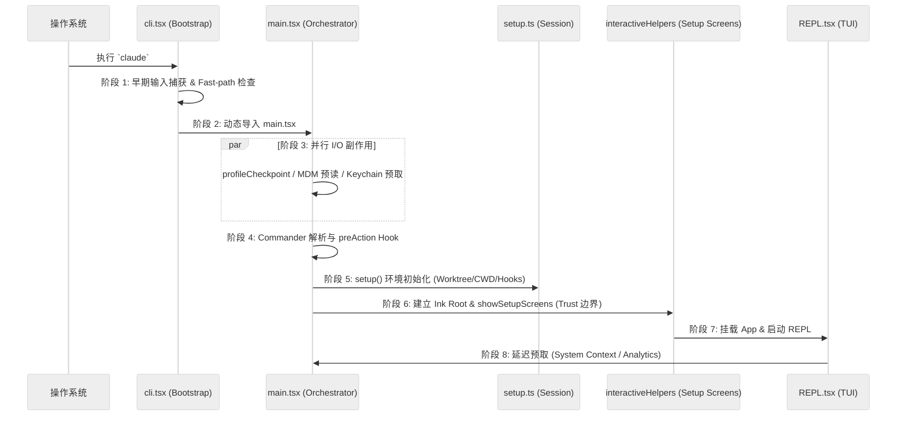

# 2. 启动流程详解：从二进制执行到 REPL 交互

本篇拆解 Claude Code CLI 从进程启动到会话可交互之间的全时序流程，揭示其如何通过异步并行与延迟加载实现极致的启动性能。

## 2.1 启动时序总览

Claude Code 的启动可以分为八个阶段：

---

## 2.2 阶段详解

### 阶段 0：物理入口与早期捕获 (`cli.tsx`)
1. **性能锚点**: 立即调用 `profileCheckpoint('cli_entry')`。
2. **Fast-path**: 检查 `--version`，若存在则直接输出并 `process.exit(0)`。
3. **输入缓冲 (`startCapturingEarlyInput`)**: 启动键盘监听。这是为了解决 Node.js 加载大型 JS 模块时的“界面卡顿感”，让用户在首屏出来前就能盲打指令。
4. **加载主逻辑**: 通过 `await import("../main.js")` 切换到业务逻辑。

### 阶段 1：全局副作用与环境初始化 (`main.tsx`)
在 `main.tsx` 顶部，有三个不计成本的并行任务：
- **MDM Raw Read**: 读取企业级托管配置（macOS Plist 或 Windows Registry）。
- **Keychain Prefetch**: 预读取密钥链中的 OAuth Token 和 API Key。
- **Warning Handler**: 尽早注册全局警告处理器，防止未处理的 Promise 拒绝导致静默失败。

### 阶段 2：命令分发与 `preAction` 挂钩
`Commander.js` 的 `program.hook('preAction', ...)` 是启动中的关键关卡：
- **等待并行任务**: 确保 MDM 和 Keychain 预读已完成。
- **`init()`**: 执行底层环境初始化、数据库迁移 (`runMigrations`)。
- **Telemetry**: 初始化 Sink 管道，准备上报埋点。
- **远程策略**: 触发 `loadRemoteManagedSettings()` 和 `loadPolicyLimits()`（异步，非阻塞）。

### 阶段 3：Session 建立与环境装配 (`setup.ts`)
`setup()` 函数定义了本次运行的物理上下文：
1. **会话 ID**: 确定 `sessionId`。
2. **Git Worktree**: 处理 `--worktree` 选项。如果启用，会执行 `process.chdir()` 切换到新创建的工作区，并重置 CWD。
3. **Hooks 捕获**: 调用 `captureHooksConfigSnapshot()`，固定本次会话的 Hooks 行为。
4. **UDS Server**: 启动 Unix Domain Socket 消息服务，用于进程间通信。

### 阶段 4：交互式 Setup Screens (`interactiveHelpers.tsx`)
在交互模式下，必须先过“信任门控”：
- **`showSetupScreens()`**: 处理 Onboarding、Trust Dialog、MCP 授权。
- **安全隔离**: 在用户未接受 Trust 之前，绝不预取任何项目级的环境变量或 `CLAUDE.md` 内容。
- **信任后动作**: 一旦 Trust 建立，立即解锁 `getSystemContext()` 和 `initializeTelemetryAfterTrust()`。

### 阶段 5：UI 挂载与 REPL 启动
- **Ink 根节点**: 调用 `createRoot` 创建终端渲染上下文。
- **组合组件**: `launchRepl` 将 `<App />` (Provider 层) 和 `<REPL />` (视图层) 结合并渲染。
- **早期输入注入**: 将 `cli.tsx` 阶段捕获的输入流注入到 REPL 的输入框缓冲区中。

### 阶段 6：延迟预取 (Deferred Prefetch)
为了极致的首屏速度，某些非核心任务被推迟到 UI 渲染出第一帧后：
- `startDeferredPrefetches()`: 包括用户信息初始化、项目文件数统计 (`countFilesRoundedRg`)、官方 MCP 列表预取、模型能力刷新等。

---

## 2.3 交互 vs 非交互模式的差异

| 特性 | 交互模式 (REPL) | 非交互模式 (`-p`) |
| --- | --- | --- |
| **Trust Dialog** | 强制执行 | 隐式信任 (由用户对 `-p` 负责) |
| **UI 框架** | React / Ink | 无 / Headless Store |
| **输入来源** | 键盘 / 早期缓冲 | 命令行参数 / Stdin |
| **执行终点** | `replLauncher.tsx` | `src/cli/print.ts` (runHeadless) |
| **性能重心** | 首屏交互时间 (TTI) | 总执行耗时 (Latency) |

---

## 2.4 关键源码锚点

| 流程节点 | 代码位置 |
| --- | --- |
| 物理入口 | `src/entrypoints/cli.tsx:main()` |
| 早期输入捕获 | `src/utils/earlyInput.ts:startCapturingEarlyInput()` |
| 并行 Side-effects | `src/main.tsx:1-20` |
| 参数重写与 SSH/Connect 处理 | `src/main.tsx:main()` 中段 |
| Commander 初始化与 Hook | `src/main.tsx:run()` |
| 工作区初始化 | `src/setup.ts:setup()` |
| 信任与配置确认屏 | `src/interactiveHelpers.tsx:showSetupScreens()` |
| REPL 界面渲染 | `src/screens/REPL.tsx` |
| 非交互式执行引擎 | `src/cli/print.ts:runHeadless()` |
