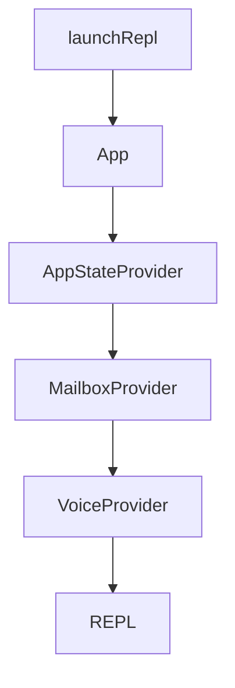

# REPL 交互中心与状态管理深度分析

`claude-code` 的核心交互体验由 `src/screens/REPL.tsx` 驱动。它不仅是一个 React 组件，更是一个复杂的“交互式主线程调度中心”，负责协调用户输入、AI 查询引擎、工具调用状态以及各种后台任务。

## 3.1. 交互控制中心：REPL.tsx

`REPL.tsx` 是整个工程在交互模式下的第二入口（第一入口是 `main.tsx`）。它的职责范围极其广泛：

- **输入管理**：通过 `PromptInput` 接收用户指令，并调用 `handlePromptSubmit` 进入调度。
- **消息流转**：维护 `messages` 数组，这是对话的“单一真理来源”。
- **查询驱动**：构造 `ToolUseContext`，封装当前 turn 的权限、工具池，并调用 `query()` 函数。
- **流式处理**：通过 `onQueryEvent` 实时消费 `query()` 产出的事件流，更新 UI 和消息状态。
- **多维接入**：集成 Sub-agent 任务通知、远程会话（Bridge）、收件箱（Inbox）等通道。

### 3.1.1. 顶层组件树架构

系统的顶层通过 `replLauncher.tsx` 启动，并包裹了一系列关键的 Provider：



这些 Provider 确保了性能指标（Stats）、全局状态（AppState）和通信能力（Mailbox）在整个会话生命周期内全局可用。

## 3.2. 状态管理体系：Zustand-like Store

`claude-code` 没有使用 Redux 等重型库，而是实现了一个轻量且框架无关的 `Store` 模式（`src/state/store.ts`）。

### 3.2.1. Store 实现原理
核心逻辑非常精简，仅包含 `getState`, `setState` 和 `subscribe`：

```typescript
// src/state/store.ts
export function createStore<T>(initialState: T, onChange?: OnChange<T>): Store<T> {
  let state = initialState
  const listeners = new Set<Listener>()

  return {
    getState: () => state,
    setState: (updater: (prev: T) => T) => {
      const prev = state
      const next = updater(prev)
      if (Object.is(next, prev)) return // 引用不变则跳过
      state = next
      onChange?.({ newState: next, oldState: prev })
      for (const listener of listeners) listener()
    },
    subscribe: (listener: Listener) => {
      listeners.add(listener)
      return () => listeners.delete(listener)
    },
  }
}
```

### 3.2.2. AppState：系统总状态表
`AppState`（定义于 `src/state/AppStateStore.ts`）是运行时的总状态，使用了 `DeepImmutable` 约束。它包含以下核心领域：

1.  **任务引擎 (`tasks`)**：以 `taskId` 为键存储任务状态，因包含函数回调而排除在 `DeepImmutable` 之外。
2.  **工具权限 (`toolPermissionContext`)**：管理权限模式（default, plan, yolo）及审批上下文。
3.  **MCP 与插件系统 (`mcp`, `plugins`)**：动态存储连接的 MCP 服务器、工具、资源及插件状态。
4.  **远程协作与桥接 (`replBridge*`)**：管理 Always-on Bridge 的连接状态、URL 及 session 信息。
5.  **预测与优化 (`speculation`, `fastMode`)**：记录 AI 预执行状态及性能模式。

## 3.3. REPL 的核心运行逻辑

### 3.3.1. 初始化能力装配
当 REPL 初始化时，它会通过一系列 Hook 建立交互通道：
- `useMergedTools`: 合并本地工具、MCP 工具及权限上下文。
- `useMergedCommands`: 合并本地 Slash 命令与插件扩展命令。
- `useQueueProcessor`: 驱动输入队列的自动处理。
- `useMailboxBridge` / `useInboxPoller`: 接驳外部消息和通知。

### 3.3.2. onQueryImpl：进入 Query 引擎的桥梁
这是交互主线程执行查询的核心入口。在调用 `src/query.ts` 之前，它负责：
1. **环境准备**：生成 `ToolUseContext`（每一轮 turn 都会根据最新的 messages 和 store 重新计算）。
2. **上下文拼装**：加载 `systemContext`、`userContext` 并构建最终的 `systemPrompt`。
3. **权限注入**：根据 Slash 命令设置的 `allowedTools` 覆写当前 turn 的权限。

### 3.3.3. onQueryEvent：流式消息的消费
`REPL` 通过监听查询事件流来更新 UI：
- **消息追加**：处理 `text_delta` 并更新 `streamingText`。
- **冗余控制**：对 `Sleep` 或 `Bash` 等产生的 `ephemeral progress` 进行“最后一条替换”而非追加，防止消息数组无限膨胀。
- **状态同步**：处理 `tombstone` 消息，在上下文压缩（Compaction）后同步 Transcript。

## 3.4. 性能与内存优化策略

为了支撑数千轮的超长会话，REPL 实施了严苛的优化：

1.  **闭包治理**：大量使用 `useRef`（如 `messagesRef`, `onSubmitRef`）来保持回调函数的稳定性，避免因消息频繁更新导致旧 scope 被闭包引用而产生的内存泄漏。
2.  **精细渲染控制**：利用 `useSyncExternalStore` 和精细的选择器（Selector）确保只有相关 UI 片段在状态变更时重绘。
3.  **虚拟化渲染**：在展示历史消息时使用自定义虚拟化逻辑，只渲染可见区域的 `MessageRow`。

## 3.5. 总结

`REPL.tsx` 是 `claude-code` 的神经中枢，它通过轻量级状态管理和高度解耦的 Hook 体系，成功地将复杂的 AI 查询循环、多进程工具执行和终端 UI 渲染集成到了一个流畅、可扩展的系统中。
