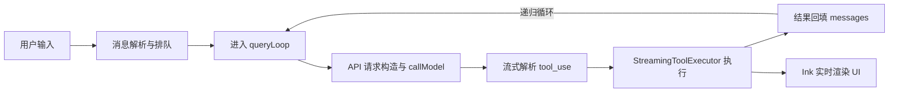

# 05. `query()` 主循环与请求构造深度解析

本篇将 `src/query.ts` 中的 `query()` 视为一个高度工程化的**多轮递归状态机**来拆解。它不仅负责单次模型调用，还集成了请求前上下文治理、流式模型响应处理、工具并行分发以及多级错误恢复策略。

## 1. 核心架构：`query()` 与 `queryLoop()`

在代码实现上，`query()`（`src/query.ts:219`）是一个外层包装器（Generator），它调用内部核心 `queryLoop()` 并负责在对话结束后更新命令队列的状态。

真正复杂的逻辑封装在 `queryLoop()` 中。它通过一个持续运行的 `while(true)` 循环，在单次用户意图（Turn）内可能触发多次模型请求（例如：模型使用工具 -> 得到结果 -> 继续思考）。

## 2. 状态机模型 (State Machine)

`queryLoop` 的核心是其维护的 `State` 结构体，这决定了它如何跨轮次保持上下文：

```typescript
// src/query.ts:263-279 (简化版)
type State = {
  messages: Message[];           // 当前对话的消息流
  toolUseContext: ToolUseContext; // 工具运行时的完整宇宙
  maxOutputTokensOverride?: number; // 动态调整的输出 Token 限制
  turnCount: number;             // 当前 Query 内部的递归轮次
  transition?: Continue;         // 记录为何进入下一轮（用于调试和策略恢复）
  hasAttemptedReactiveCompact: boolean; // 是否已尝试过针对 413 错误的压缩
  // ... 其他状态
}
```

## 3. 请求生命周期全景图

### 3.1 外部视角：从输入到渲染


### 3.2 内部视角：单次循环的工作流
在每一轮循环（Turn）开始前，`queryLoop` 会按顺序执行以下步骤：
1. **生成 Chain Tracking**: 为遥测生成 `chainId` 和 `depth`。
2. **上下文治理流水线**: 在发送给模型前，对消息历史进行“瘦身”（详见第4节）。
3. **系统提示词组装**: 获取基础 `systemPrompt` 并追加 `systemContext`（如当前目录、信任规则等）。

## 4. 请求前上下文治理 (Context Management Pipeline)

为了防止 Token 溢出并优化成本，系统在 `callModel` 之前会经过一道严密的治理流水线：

- **Compact Boundary 截断**: 只读取压缩边界之后的消息。
- **Tool Result Budget**: 对工具输出的大量文本进行预算内裁剪。
- **Snip (裁剪)**: 若历史过长，裁剪中间部分消息。
- **Microcompact**: 针对频繁的小工具调用进行合并压缩。
- **Context Collapse**: 将已经读取的文件内容折叠为引用。
- **Autocompact**: 触发 AI 驱动的摘要压缩。

## 5. 请求构造：`services/api/claude.ts`

当 `query.ts` 决定发起请求时，它调用 `deps.callModel`。在 `claude.ts` 中，请求被转化为符合 Anthropic API 的格式：

### 5.1 参数组合策略 (`paramsFromContext`)
系统会根据当前环境动态计算以下参数：
- **Thinking**: 根据模型能力开启思考块。
- **Betas**: 注入 `task-budgets-2026-03-13` 等实验性特性。
- **Context Management**: 注入 `prompt_caching` 相关的控制块。

### 5.2 系统提示词的最终拼接
在 `buildSystemPromptBlocks` 中，系统会在 System Prompt 前后追加：
- **Attribution Header**: 关于代码贡献者的元数据。
- **CLI Prefix**: 告知模型它当前处于终端环境下。
- **MCP Instructions**: 若有 MCP 工具，注入其操作指南。

## 6. 流式处理与实时工具分发

`query()` 使用流式响应以降低延迟。关键点在于 `StreamingToolExecutor`：

1. **边收流边分发**: 一旦流中出现 `tool_use` 的 JSON 块，即便消息没结束，执行器也会被初始化。
2. **并发安全调度**: 只有标记为 `isConcurrencySafe: true` 的工具可以并行跑。
3. **实时反馈**: 工具产生的标准输出（Stdout）通过 `yield` 实时推送到终端渲染层。

## 7. 异常防御与自动恢复机制

`query()` 具备强大的“容错自愈”能力：

### 7.1 输出 Token 耗尽 (Max Output Tokens Recovery)
如果模型因为达到 `max_tokens` 被强制中断：
- 系统会暂时将 `max_tokens` 从默认（如 8k）提升至上限（如 64k）。
- 自动注入一条隐式的 "Continue" 消息，让模型在不道歉、不总结的情况下直接续写。
- 通过 `MAX_OUTPUT_TOKENS_RECOVERY_LIMIT` 限制恢复次数，防止死循环。

### 7.2 413 Prompt Too Long (Reactive Compact)
如果 API 返回 413 错误：
- 系统会捕获 `PROMPT_TOO_LONG_ERROR_MESSAGE`。
- 主动触发深度压缩逻辑（Reactive Compact）。
- 标记 `hasAttemptedReactiveCompact = true` 并重试请求。

## 8. 总结：作为 Agent 内核的 `query()`

`query()` 绝非一个简单的 HTTP 客户端。它更像是一个**具有意识的循环**：它审视自己的记忆（Context Management），决定何时采取行动（Tool Execution），并在行动受阻时寻找替代路径（Recovery Strategies）。这种高度工程化的设计，正是 `claude-code` 能够处理复杂、长链路任务的基础。
