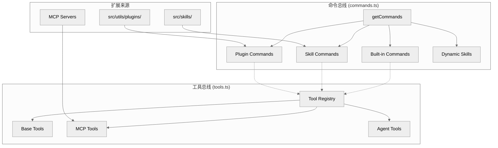

# 07. 扩展体系深度分析：技能、插件与 MCP 协议

本篇深入探讨 `claude-code` 如何通过技能 (Skills)、插件 (Plugins) 和模型上下文协议 (MCP) 构建一个开放且动态的 AI 运行时环境。这套体系不仅是简单的功能扩展，更是将 CLI 转变为“AI 操作系统”的标准化接口。

## 7.1 架构纵览：两条核心总线的统一

`claude-code` 的扩展能力极强，因为它没有将“扩展”作为边缘插件，而是直接接入了两条核心总线：

1.  **命令总线 (Command Bus)**：负责处理 `/xxx` 斜杠命令。技能和插件命令最终都会被转换成统一的 `Command` 对象。
2.  **工具总线 (Tool Bus)**：负责处理 AI 可调用的工具。MCP Server 贡献的工具、资源直接注入工具池。

## 7.2 命令装配：`commands.ts`

命令系统的总入口是 `src/commands.ts`。

-   **`COMMANDS()`**：定义了内建命令表（如 `/clear`, `/config`, `/memory`, `/mcp` 等），受 Feature Flags 和用户类型影响。
-   **`getCommands(cwd)`**：动态汇总所有可用命令。它会合并：
    -   捆绑技能 (Bundled Skills)
    -   内建插件技能 (Builtin Plugin Skills)
    -   技能目录命令 (Skill Directory Commands)
    -   工作流命令 (Workflow Commands)
    -   插件命令与技能 (Plugin Commands & Skills)
    -   动态激活的技能 (Dynamic Skills)

这种动态装配机制确保了命令集可以随上下文（如进入特定项目目录）而变化。

## 7.3 技能系统：Markdown 驱动的指令集

技能系统主要由 `src/skills/loadSkillsDir.ts` 管理。其核心思想是：**技能本质上是被编译成 `Command` 对象的提示词模板。**

### 7.3.1 技能编译流程
`createSkillCommand(...)` 将技能的 Frontmatter 和 Markdown 内容转换为 `Command` 对象，包含：
-   `name`, `description`, `allowedTools`
-   `whenToUse`: 决定 AI 何时该调用此技能。
-   `agent`: 指定运行此技能的子代理配置。
-   `context`: 注入额外的上下文。

### 7.3.2 变量替换与注入
在执行技能时，系统会进行动态替换：
-   `${CLAUDE_SKILL_DIR}`, `${CLAUDE_SESSION_ID}` 等变量。
-   **Shell 注入**：除非是来自 MCP 的不可信技能，否则系统会执行 Markdown 中的内联 Shell 命令并将其输出并入 Prompt。

### 7.3.3 条件技能激活
`activateConditionalSkillsForPaths(...)` 允许根据当前操作的文件路径动态激活技能。这使得技能系统不仅是“手动调用”，更是一种**基于工作集的条件化提示词注入系统**。

## 7.4 插件系统：命名空间与扩展边界

插件系统（`src/utils/plugins/loadPluginCommands.ts`）在技能系统的基础上增加了命名空间管理：
-   **命名规范**：插件命令通常以 `pluginName:commandName` 形式命名，避免冲突。
-   **安全隔离**：插件 Prompt 生成时会处理敏感配置（`user_config.X`），确保秘密信息不会直接泄露到 Prompt 中。

## 7.5 MCP 协议：连接万物的基石

Model Context Protocol (MCP) 是系统触达外部能力的关键。`src/services/mcp/client.ts` 实现了完整的 MCP Host 功能。

### 7.5.1 多传输层适配
系统支持多种传输协议：
-   **Stdio**: 启动本地二进制程序（如 SQLite, Filesystem）。
-   **SSE (Server-Sent Events)**: 连接远程服务。
-   **In-Process**: 允许内部服务通过 MCP 协议通信，实现架构统一。
-   **SdkControlTransport**: 专门用于 CLI 与 SDK 进程间的控制消息传输。

### 7.5.2 启发式交互 (Elicitation)
解决工具执行中途需要用户决策的问题。
-   收到 `-32042 UrlElicitationRequired` 错误时，`callMCPToolWithUrlElicitationRetry` 会暂停执行。
-   引导用户完成交互（如 OAuth 授权）后，自动重试工具调用。

### 7.5.3 大规模输出处理 (Large Output Persistence)
当工具返回内容过大（超过 100KB 或 Token 限制）时：
1.  `truncateMcpContentIfNeeded` 评估长度。
2.  内容被存入本地 `~/.claude/mcp-outputs/`。
3.  返回给 AI 指令（Large Output Instructions），引导其使用 `file_read` 逐步读取。

## 7.6 典型案例：Chicago (Computer Use)
`Chicago` 是一个高度定制的 MCP 集成，实现了计算机控制：
-   **混合传输**：结合本地 Stdio 和 `InProcessTransport` 追求极致低延迟。
-   **权限守卫**：注入了专有的屏幕截图审计和按键确认逻辑。

## 7.7 关键源码锚点

| 主题 | 代码锚点 | 说明 |
| :--- | :--- | :--- |
| 命令合并 | `src/commands.ts:getCommands` | 各类命令源的汇总中心 |
| 技能编译 | `src/skills/loadSkillsDir.ts:createSkillCommand` | Markdown -> Command 的转换逻辑 |
| 插件命令生成 | `src/utils/plugins/loadPluginCommands.ts:createPluginCommand` | 插件元数据解析与命令构建 |
| MCP 工具调用 | `src/services/mcp/client.ts:callMCPTool` | 包含超时、进度、授权重试的核心入口 |
| 交互式 Elicitation | `src/services/mcp/elicitationHandler.ts` | 交互式状态机的实现 |
| SDK MCP 接入 | `src/services/mcp/client.ts:setupSdkMcpClients` | 同进程 MCP 客户端初始化 |

## 7.8 总结
扩展体系的设计精髓在于**协议的统一**。无论是本地技能、第三方插件还是远程 MCP 服务，最终都被抽象为统一的 `Command` 和 `Tool`。这种高度的一致性使得主循环能保持极致的稳定，同时具备无限的扩展可能。
