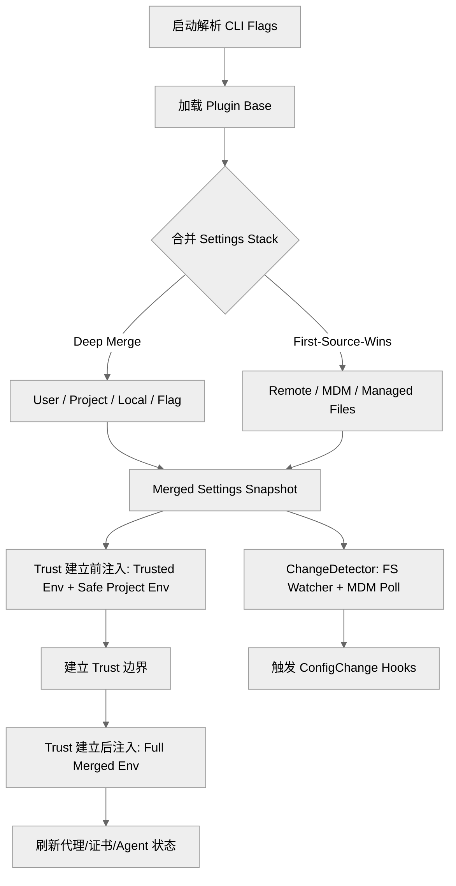

# 设置系统、托管策略与环境变量注入 (Deep Dive)

本篇梳理 Claude Code 的 `settings` 系统如何通过多源合并、企业托管策略 (MDM) 和 trust 前后分阶段环境变量注入来影响运行时的核心行为。

## 1. 设置系统的架构主线

设置系统不仅仅是读取一个 `settings.json` 文件，它是一个复杂的运行时子系统，负责：
1. **多源合并**：从用户、项目、本地、CLI 和企业策略中提取配置。
2. **策略治理**：确保企业管理的配置具有最高优先级，且不可被用户覆盖。
3. **安全隔离**：区分“受信任”和“不受信任”的配置源，限制环境污染。
4. **运行期动态感知**：通过文件监听和 MDM 轮询，实时响应配置变化。

## 2. 设置源的合并优先级栈

关键代码：`src/utils/settings/constants.ts` 定义了 `SETTING_SOURCES`：

```typescript
export const SETTING_SOURCES = [
  'userSettings',    // 全局用户设置 (~/.claude/settings.json)
  'projectSettings', // 项目共享设置 (.claude/settings.json)
  'localSettings',   // 项目本地设置 (.claude/settings.local.json，通常 gitignored)
  'flagSettings',    // CLI --settings 标志或 SDK 内联注入
  'policySettings',  // 企业托管策略 (最高优先级)
] as const
```

### 2.1 合并逻辑
- **普通源**：采用 `lodash.mergeWith` 进行深度合并。低优先级在前，高优先级在后，后者覆盖前者。
- **数组处理**：数组通常会被连接并去重 (`uniq([...target, ...source])`)。
- **插件设置**：作为最底层的 `base` 合入，然后才是文件源。

### 2.2 隔离模式 (`--setting-sources`)
通过 `--setting-sources` 标志，可以限制加载哪些普通源（如只允许 `user`），但 `flagSettings` 和 `policySettings` **始终会被强制包含**，以确保企业管控和显式 CLI 注入无法被绕过。

## 3. 企业托管策略 (`policySettings`) 的特殊性

与普通设置的深度合并不同，`policySettings` 遵循 **“首个匹配源获胜 (First source wins)”** 原则。

关键代码：`src/utils/settings/settings.ts` 中的 `getSettingsForSourceUncached`：

优先级顺序：
1. **Remote Managed Settings**：从远程 API 同步并缓存的设置。
2. **Admin MDM (HKLM / macOS plist)**：系统级注册表或 Plist 配置，由管理员下发。
3. **Managed Files**：`managed-settings.json` 以及 `managed-settings.d/*.json` 目录下的片段。
4. **HKCU (Windows Only)**：当前用户注册表下的策略。

一旦在较高优先级发现配置，后续源将不再贡献内容。这种设计确保了策略的权威性，避免了不同托管源之间的混乱合并。

## 4. 环境变量注入的两阶段模型

这是安全边界的核心。环境变量注入被明确分为 trust 建立前后的两个阶段。

关键代码：`src/utils/managedEnv.ts`

### 4.1 第一阶段：`applySafeConfigEnvironmentVariables()` (Trust 前)
在用户决定是否信任该项目之前运行，主要为了让 `ANTHROPIC_BASE_URL` 或代理配置尽早生效。

- **受信任源 (Trusted Sources)**：包括 `userSettings`、`flagSettings`、`policySettings`。来自这些源的 **所有** 环境变量都会被注入。
- **项目源 (Project Sources)**：包括 `projectSettings`、`localSettings`。**仅允许** `SAFE_ENV_VARS` 白名单中的变量注入（如 `LOG_LEVEL`），防止恶意项目通过 `LD_PRELOAD` 或修改 `PATH` 实现 RCE。

### 4.2 第二阶段：`applyConfigEnvironmentVariables()` (Trust 后)
当用户点击“Trust”后运行。
- 将合并后的 `settings.env` 全量注入 `process.env`。
- **刷新副作用**：清空 CA 证书缓存、mTLS 缓存、代理缓存，并重新配置全局代理 Agent (`configureGlobalAgents`)。

## 5. 变更检测与运行时治理 (`changeDetector`)

关键代码：`src/utils/settings/changeDetector.ts`

系统不仅仅通过 `chokidar` 监听文件变化，还实现了一套复杂的治理逻辑：
- **Internal Write Window**：Claude Code 内部修改设置文件时，会标记为内部写入，避免触发不必要的变更钩子。
- **Deletion Grace**：对抗编辑器“先删再存”的原子操作，避免误判为配置删除。
- **MDM Polling**：由于注册表/Plist 无法可靠监听，系统会定期轮询这些源。
- **ConfigChange Hooks**：允许注册钩子监听配置变化，甚至可以阻断变更应用到当前会话。

## 6. 关键安全边界：绕开项目设置

在某些涉及自动授权的敏感决策中，代码会 **有意绕开** `projectSettings`。

例如 `hasSkipDangerousModePermissionPrompt()`：
```typescript
export function hasSkipDangerousModePermissionPrompt(): boolean {
  return !!(
    getSettingsForSource('userSettings')?.skipDangerousModePermissionPrompt ||
    getSettingsForSource('localSettings')?.skipDangerousModePermissionPrompt ||
    getSettingsForSource('flagSettings')?.skipDangerousModePermissionPrompt ||
    getSettingsForSource('policySettings')?.skipDangerousModePermissionPrompt
  )
}
```
**原因**：防止恶意代码库通过提交 `.claude/settings.json` 来自动获取高危权限，保护用户不被供应链攻击。

## 7. 架构总结图



## 8. 核心代码锚点索引

| 功能模块 | 关键代码位置 |
| --- | --- |
| 设置源定义 | `src/utils/settings/constants.ts` |
| 核心合并逻辑 | `src/utils/settings/settings.ts` |
| MDM 逻辑封装 | `src/utils/settings/mdm/settings.ts` |
| 环境注入逻辑 | `src/utils/managedEnv.ts` |
| 安全环境变量列表 | `src/utils/managedEnvConstants.ts` |
| 变更监听器 | `src/utils/settings/changeDetector.ts` |
| 早期 Flag 解析 | `src/main.tsx` 中的 `loadSettingsFromFlag` |
