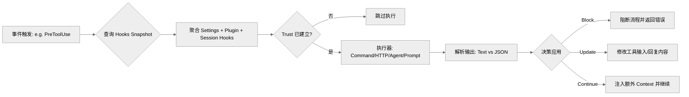

# Hooks 生命周期与运行时语义 (Deep Dive)

本篇深入剖析 Claude Code 的 Hooks 子系统，探讨其如何通过事件模型、多源注入和结构化 JSON 协议，实现对 AI 对话生命周期的深度干预与工程化治理。

## 1. 为什么 Hooks 是一个独立子系统？

在 Claude Code 中，Hooks 不仅仅是简单的脚本回调，而是一个功能完备的事件总线系统。它通过：
- **拦截能力**：在工具调用前修改参数或阻断执行。
- **反馈闭环**：在任务结束前强制运行测试，并根据结果让 AI 自愈。
- **环境塑造**：动态修改环境变量、调整文件监听列表甚至切换工作目录。
- **安全沙盒**：所有 Hook 执行都受到严格的 Trust 边界保护。

## 2. 核心事件模型 (Event Model)

关键代码：`src/utils/hooks/hooksConfigManager.ts` 定义了 Hook 事件的元数据：

- **`SessionStart / SessionEnd`**：会话级别的初始化与清理。
- **`UserPromptSubmit`**：用户输入拦截，可注入上下文或阻断处理。
- **`PreToolUse / PostToolUse`**：工具执行的前后哨。`Pre` 阶段可用于动态权限判定。
- **`Stop / StopFailure`**：Claude 尝试结束 Turn 时的质量关口。
- **`SubagentStart / SubagentStop`**：子代理（Agent Tool）的生命周期管理。
- **`ConfigChange / CwdChanged / FileChanged`**：响应运行时配置与文件系统状态变化。

## 3. Hooks 的多源注入路径

Hooks 的来源并非单一，而是从三路汇聚：

1. **设置文件 (Settings Hooks)**：用户在 `settings.json` 中配置的静态 Hook。
2. **插件/内置 (Plugin/Builtin Hooks)**：随插件下发的逻辑，通常具有更高的权限等级。
3. **会话动态 (Session Hooks)**：
   - **Frontmatter Hooks**：定义在 `.md` 技能或代理文件头部的 Hook。
   - **Function Hooks**：运行时通过代码注入的 TypeScript 回调函数。

关键逻辑：`groupHooksByEventAndMatcher` 会将这些来源的 Hook 按事件和匹配器（如特定工具名）进行聚合。

## 4. 结构化 JSON 通信协议

Hooks 不仅仅通过 stdout/stderr 输出文本，更支持强大的 **结构化 JSON 协议**。

关键逻辑：`src/utils/hooks.ts` 中的 `processHookJSONOutput`。

如果 Hook 输出以 `{` 开头且符合 Schema，系统会解析其意图：
- **`continue: false`**：阻断后续流程。
- **`decision: "block"`**：(在 PreToolUse 中) 明确拒绝工具执行。
- **`updatedInput`**：动态篡改 AI 准备发送给工具的参数。
- **`additionalContext`**：向 AI 注入额外的系统提示词或背景信息。
- **`watchPaths`**：告诉系统额外监听哪些文件的变化。
- **`retry: true`**：(在 PermissionDenied 中) 提示 AI 可以重试该操作。

## 5. 多样化的执行形态 (Execution Modes)

Hooks 系统支持四种主要的执行方式：

- **Command Hook**：传统的 Shell 脚本执行。支持跨平台的路径转换（Windows POSIX 兼容）。
- **Prompt Hook**：运行一段特殊的 Prompt 模板。
- **Agent Hook**：启动一个临时的“评估代理 (Subagent)”来判定复杂逻辑。
- **HTTP Hook**：向特定端点发送 POST 请求。内置 SSRF 防护、URL 白名单和环境变量过滤。

## 6. 异步 Hook 与后台注册器 (`AsyncHookRegistry`)

关键代码：`src/utils/hooks/AsyncHookRegistry.ts`

对于耗时较长的操作（如编译、全量扫描），Hook 可以标记为异步：
- 系统会将任务注册到 `AsyncHookRegistry`。
- 主对话流可以继续，异步 Hook 在后台运行。
- 完成后，结果会通过事件总线回传，必要时触发通知或重新激活 AI。

## 7. 安全模型与 Trust 边界

- **Trust Gate**：在交互模式下，**所有** Hook 执行都要求 Trust 已经建立。这是为了防止恶意代码库通过 Hook 实现启动即 RCE。
- **HTTP 安全**：`ssrfGuard` 严防私有 IP 探测；`allowedHttpHookUrls` 限制外联范围。
- **Snapshot 机制**：启动时会捕获 Hook 配置快照 (`captureHooksConfigSnapshot`)，确保会话内的一致性，防止配置抖动导致的安全漂移。

## 8. 架构执行流图

## 9. 核心代码锚点索引

| 功能模块 | 关键代码位置 |
| --- | --- |
| Hook 事件枚举 | `src/entrypoints/agentSdkTypes.ts` |
| 执行器核心实现 | `src/utils/hooks.ts` |
| JSON 输出协议 Schema | `src/types/hooks.ts` |
| HTTP Hook 安全防护 | `src/utils/hooks/ssrfGuard.ts` |
| 技能/动态 Hook 注册 | `src/utils/hooks/registerSkillHooks.ts` |
| 异步 Hook 注册表 | `src/utils/hooks/AsyncHookRegistry.ts` |
| 配置快照逻辑 | `src/utils/hooks/hooksConfigSnapshot.ts` |
| 事件元数据定义 | `src/utils/hooks/hooksConfigManager.ts` |
